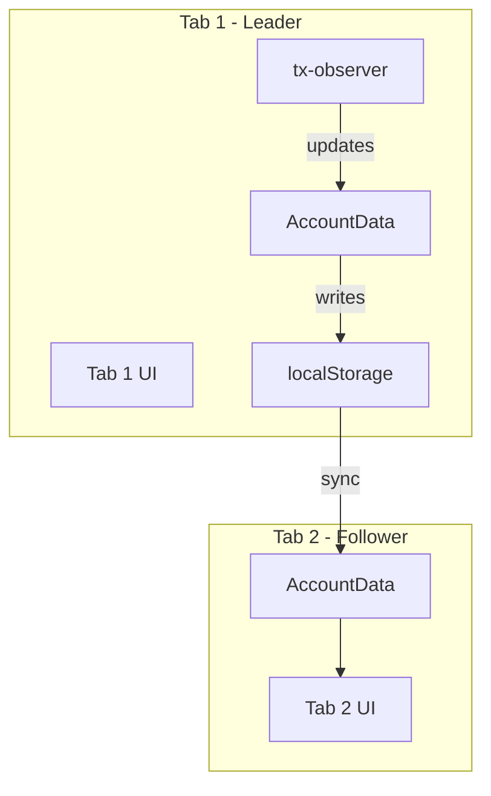

# Leader Election for Single tx-observer Across Browser Tabs

## Objective

When a user has multiple tabs open with the same app, each tab currently runs its own `tx-observer` instance. This causes redundant RPC calls and unnecessary resource usage. This epic implements a **Leader Election** pattern to ensure only one tab runs the tx-observer.

**Key simplification**: AccountData already syncs via localStorage between tabs. The tx-observer's role is to update AccountData, which then propagates to all tabs automatically. Therefore, non-leader tabs don't need to receive broadcasts—they simply don't run `process()` and rely on localStorage sync for updates.

## Key Results

- [ ] Only 1 tab makes RPC calls (verify via network tab) ([[TASK-dx7a8]], [[TASK-6jc6r]])
- [ ] Leadership handoff completes within 5 seconds ([[TASK-d9ssh]])
- [ ] All tabs see updates via existing AccountData localStorage sync ([[TASK-ci5bv]])
- [ ] TxObserverDebugOverlay only works on leader tab (acceptable tradeoff)

## Architecture



## File Structure

```
web/src/lib/core/tab-leader/
├── index.ts                    # Public exports
├── TabLeaderService.ts         # Core leader election
├── storage-lock.ts             # localStorage-based locking
├── types.ts                    # Shared types
└── __tests__/
```

## Notes

- **No VirtualTxObserver needed** - followers don't need to listen for events; AccountData localStorage sync handles it
- **No event broadcasting needed** - tx-observer → AccountData → localStorage → other tabs
- Uses BroadcastChannel for leader election coordination only (heartbeats, election)
- Leaders send heartbeats every 2s; followers assume leader gone after 5s timeout
- Graceful fallback: if BroadcastChannel unavailable, each tab runs its own observer
- [[`web/src/lib/debug/TxObserverDebugOverlay.svelte`]](web/src/lib/debug/TxObserverDebugOverlay.svelte) only shows data on leader tab
