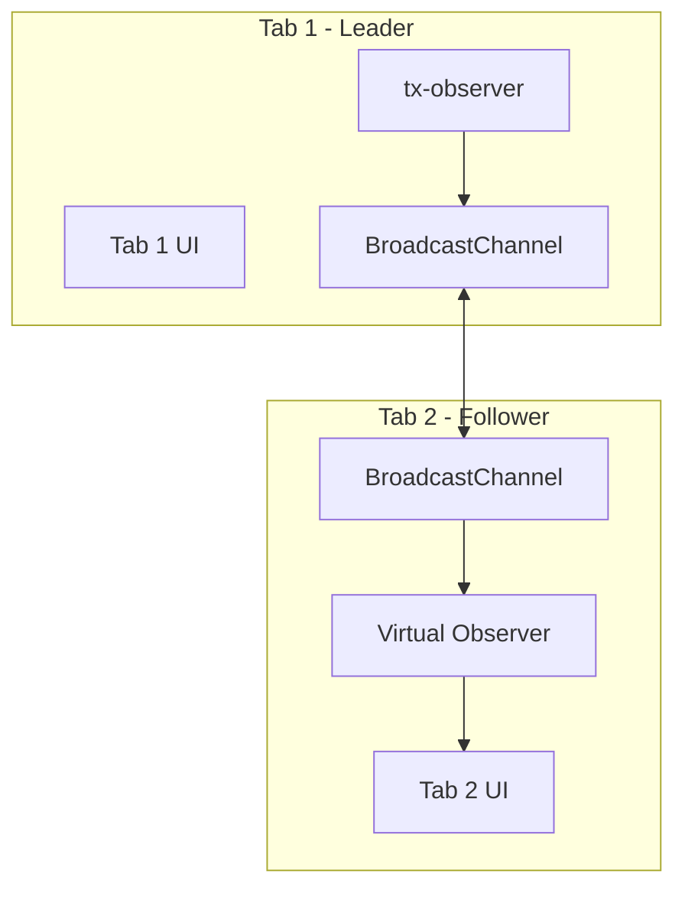

# Leader Election for Single tx-observer Across Browser Tabs

## Objective

When a user has multiple tabs open with the same app, each tab currently runs its own `tx-observer` instance. This causes redundant RPC calls, potential state conflicts, and unnecessary resource usage. This epic implements a **Leader Election** pattern using **BroadcastChannel** to ensure only one tab runs the tx-observer while other tabs receive updates via broadcast.

## Key Results

- [ ] Only 1 tab makes RPC calls (verify via network tab) ([[TASK-dx7a8]], [[TASK-6jc6r]])
- [ ] All tabs receive transaction updates within 100ms ([[TASK-d9ssh]], [[TASK-ziqsf]])
- [ ] Leadership handoff completes within 5 seconds ([[TASK-ci5bv]])
- [ ] No transaction state lost during handoff ([[TASK-gxna7]])

## Architecture



## File Structure

```
web/src/lib/core/tab-leader/
├── index.ts                    # Public exports
├── TabLeaderService.ts         # Core leader election
├── LeaderAwareTxObserver.ts    # Leader's observer wrapper
├── VirtualTxObserver.ts        # Follower's virtual observer
├── types.ts                    # Shared types
├── storage-lock.ts             # localStorage-based locking
└── __tests__/
```

## Notes

- Uses BroadcastChannel + localStorage (not SharedWorker) for better browser support
- Leaders send heartbeats every 2s; followers assume leader gone after 5s timeout
- Graceful fallback: if BroadcastChannel unavailable, each tab runs its own observer
