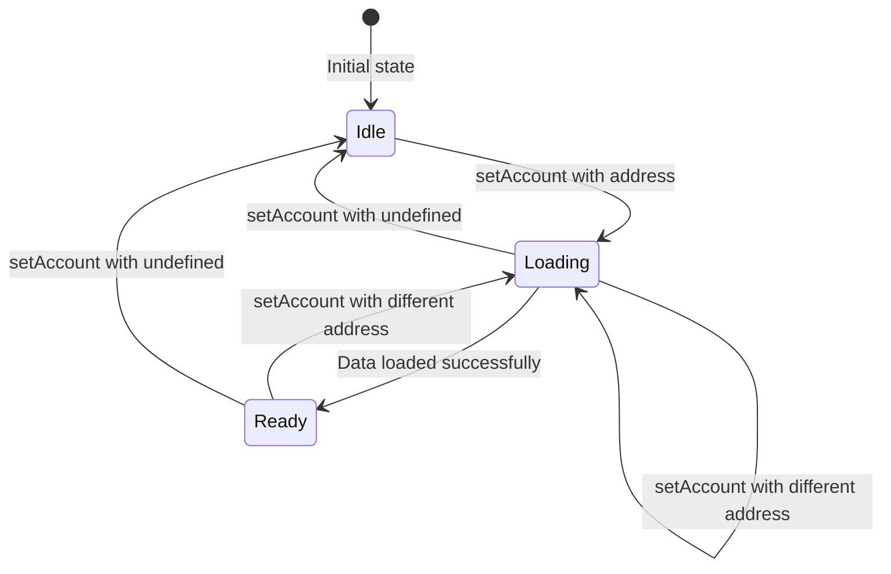

# AsyncState Implementation Plan

## Overview

Refactor the account store to use a discriminated union `AsyncState<T>` that integrates the loading status directly into the state type system.

## Goals

1. Make state access type-safe - data is only accessible when status is `ready`
2. Remove separate `loading` boolean - status is part of the state
3. Keep existing operation events for backward compatibility
4. Simplify the mental model - one state object with status

---

## Current State (Before Implementation)

### Current Files

- [`web/src/lib/core/account/createAccountStore.ts`](../web/src/lib/core/account/createAccountStore.ts) - 282 lines
- [`web/src/lib/account/AccountData.ts`](../web/src/lib/account/AccountData.ts) - 123 lines

### Current Types

```typescript
// LocalState in AccountData.ts
export type LocalState = {
    account?: `0x${string}`;
    operations: Record<number, OnchainOperation>;
};

// State constraint in createAccountStore.ts
S extends {account?: `0x${string}`}
```

### Current Problems

1. `loading` is a separate boolean, not type-integrated
2. Consumers can access `state.operations` even during loading (returns stale/default data)
3. Mental model requires tracking two things: `state` + `loading`

---

## Target State (After Implementation)

### New AsyncState Type

```typescript
/**
 * Async state wrapper for account-bound data.
 * Discriminated union ensures type-safe data access.
 */
export type AsyncState<D> = 
    | { status: 'idle'; account: undefined }
    | { status: 'loading'; account: `0x${string}` }
    | { status: 'ready'; account: `0x${string}`; data: D };
```

### Type-Safe Usage

```typescript
const state = accountData.state;

if (state.status === 'ready') {
    // TypeScript knows state.data exists
    const ops = state.data.operations;
} else if (state.status === 'loading') {
    // state.account exists, but no data
    showLoadingFor(state.account);
} else {
    // status === 'idle', no account
    showConnectWallet();
}
```

---

## Detailed Changes

### File 1: `createAccountStore.ts`

#### 1.1 Add AsyncState type (top of file, after imports)

```typescript
// ADD after line 3 (after imports)

/**
 * Async state wrapper for account-bound data.
 * Discriminated union ensures type-safe data access.
 */
export type AsyncState<D> = 
    | { status: 'idle'; account: undefined }
    | { status: 'loading'; account: `0x${string}` }
    | { status: 'ready'; account: `0x${string}`; data: D };
```

#### 1.2 Update MutationFn type (line 20-25)

```typescript
// BEFORE
export type MutationFn<
    S,
    EventKeys extends string,
    Args extends unknown[] = unknown[],
    R = unknown,
> = (state: S, ...args: Args) => MutationResult<R, EventKeys>;

// AFTER - S becomes D (data), not full state
export type MutationFn<
    D,
    EventKeys extends string,
    Args extends unknown[] = unknown[],
    R = unknown,
> = (data: D, ...args: Args) => MutationResult<R, EventKeys>;
```

#### 1.3 Update createMutations (line 44-53)

```typescript
// BEFORE
export function createMutations<S, E extends Record<string, unknown>>() {
    return <
        M extends Record<
            string,
            (state: S, ...args: any[]) => MutationResult<any, keyof E & string>
        >,
    >(
        mutations: M,
    ): M => mutations;
}

// AFTER - S becomes D (data)
export function createMutations<D, E extends Record<string, unknown>>() {
    return <
        M extends Record<
            string,
            (data: D, ...args: any[]) => MutationResult<any, keyof E & string>
        >,
    >(
        mutations: M,
    ): M => mutations;
}
```

#### 1.4 Update AccountStoreConfig (line 58-91)

```typescript
// BEFORE
type AccountStoreConfig<
    S,
    E extends Record<string, unknown>,
    M extends Record<string, MutationFn<S, keyof E & string, any[], any>>,
> = {
    /** Factory to create default state */
    defaultState: (account?: `0x${string}`) => S;
    // ...
    onLoad?: (state: S) => Array<{event: keyof E & string; data: E[keyof E]}>;
    onClear?: () => Array<{event: keyof E & string; data: E[keyof E]}>;
};

// AFTER - D is data type, account is handled separately
type AccountStoreConfig<
    D,
    E extends Record<string, unknown>,
    M extends Record<string, MutationFn<D, keyof E & string, any[], any>>,
> = {
    /** Factory to create default data for a new account */
    defaultData: () => D;

    /** Pure mutation functions - just mutate data and return result + event */
    mutations: M;

    /** Async storage adapter - stores D (data), not AsyncState */
    storage: AsyncStorage<D>;

    /** Function to generate storage key from account */
    storageKey: (account: `0x${string}`) => string;

    /** Account store to subscribe to */
    account: AccountStore;

    /**
     * Events to emit when data is loaded (account switch or initial load).
     * Receives the loaded data.
     */
    onLoad?: (data: D) => Array<{event: keyof E & string; data: E[keyof E]}>;

    /**
     * Events to emit when state is cleared (account switch).
     * Called when transitioning away from ready state.
     */
    onClear?: () => Array<{event: keyof E & string; data: E[keyof E]}>;
};
```

#### 1.5 Update createAccountStore function signature (line 103-106)

```typescript
// BEFORE
export function createAccountStore<
    S extends {account?: `0x${string}`},
    E extends Record<string, unknown>,
    M extends Record<string, MutationFn<S, keyof E & string, any[], any>>,
>(config: AccountStoreConfig<S, E, M>) {

// AFTER
export function createAccountStore<
    D,
    E extends Record<string, unknown>,
    M extends Record<string, MutationFn<D, keyof E & string, any[], any>>,
>(config: AccountStoreConfig<D, E, M>) {
```

#### 1.6 Update config destructuring (line 108-116)

```typescript
// BEFORE
const {
    defaultState,
    mutations,
    storage,
    storageKey,
    account,
    onLoad,
    onClear,
} = config;

// AFTER
const {
    defaultData,
    mutations,
    storage,
    storageKey,
    account,
    onLoad,
    onClear,
} = config;
```

#### 1.7 Update emitter type (line 118-119)

```typescript
// BEFORE
const emitter = createEmitter<E & {state: S; loading: boolean}>();

// AFTER - state is now AsyncState<D>, no loading event
const emitter = createEmitter<E & {state: AsyncState<D>}>();
```

#### 1.8 Update internal state (line 121-124)

```typescript
// BEFORE
let state = defaultState();
let loading = false;
const pendingSaves = new Map<string, Promise<void>>();
let loadGeneration = 0;

// AFTER
let asyncState: AsyncState<D> = { status: 'idle', account: undefined };
const pendingSaves = new Map<string, Promise<void>>();
let loadGeneration = 0;
```

#### 1.9 Update _load helper (line 127-128)

```typescript
// BEFORE
const _load = async (acc: `0x${string}`) =>
    (await storage.load(storageKey(acc))) ?? defaultState(acc);

// AFTER - loads D (data), not state with account
const _load = async (acc: `0x${string}`): Promise<D> =>
    (await storage.load(storageKey(acc))) ?? defaultData();
```

#### 1.10 Update _save helper (line 130-131)

```typescript
// BEFORE
const _save = async (acc: `0x${string}`, s: S) =>
    storage.save(storageKey(acc), s);

// AFTER - saves D (data)
const _save = async (acc: `0x${string}`, data: D) =>
    storage.save(storageKey(acc), data);
```

#### 1.11 Update _emitClearEvents (line 133-143)

```typescript
// BEFORE
function _emitClearEvents(): void {
    if (onClear) {
        for (const {event, data} of onClear()) {
            emitter.emit(
                event as keyof (E & {state: S; loading: boolean}),
                data as any,
            );
        }
    }
}

// AFTER
function _emitClearEvents(): void {
    if (onClear) {
        for (const {event, data} of onClear()) {
            emitter.emit(
                event as keyof (E & {state: AsyncState<D>}),
                data as any,
            );
        }
    }
}
```

#### 1.12 Update _emitLoadEvents (line 145-155)

```typescript
// BEFORE
function _emitLoadEvents(s: S): void {
    if (onLoad) {
        for (const {event, data} of onLoad(s)) {
            emitter.emit(
                event as keyof (E & {state: S; loading: boolean}),
                data as any,
            );
        }
    }
}

// AFTER - receives D (data) not S (state)
function _emitLoadEvents(data: D): void {
    if (onLoad) {
        for (const {event, data: eventData} of onLoad(data)) {
            emitter.emit(
                event as keyof (E & {state: AsyncState<D>}),
                eventData as any,
            );
        }
    }
}
```

#### 1.13 Update _withState (line 157-188)

```typescript
// BEFORE
async function _withState<T>(
    acc: `0x${string}`,
    mutation: (s: S) => MutationResult<T, keyof E & string>,
): Promise<T> {
    const isCurrentAccount = acc === state.account;

    if (isCurrentAccount) {
        const {result, event, eventData} = mutation(state);
        _save(acc, state).catch(() => {});
        if (event)
            emitter.emit(
                event as keyof (E & {state: S; loading: boolean}),
                (eventData ?? state) as any,
            );
        return result;
    }
    // ... cross-account path
}

// AFTER
async function _withState<T>(
    acc: `0x${string}`,
    mutation: (data: D) => MutationResult<T, keyof E & string>,
): Promise<T> {
    // Can only mutate current account when ready
    const isCurrentReady = asyncState.status === 'ready' && asyncState.account === acc;

    if (isCurrentReady) {
        const {result, event, eventData} = mutation(asyncState.data);
        _save(acc, asyncState.data).catch(() => {});
        if (event)
            emitter.emit(
                event as keyof (E & {state: AsyncState<D>}),
                (eventData ?? asyncState.data) as any,
            );
        return result;
    }

    // Cross-account path (unchanged logic, just D instead of S)
    const pending = pendingSaves.get(acc);
    if (pending) await pending;

    const targetData = await _load(acc);
    const {result} = mutation(targetData);

    const savePromise = _save(acc, targetData);
    pendingSaves.set(acc, savePromise);
    await savePromise;
    pendingSaves.delete(acc);

    return result;
}
```

#### 1.14 Update setAccount (line 190-242) - COMPLETE REWRITE

```typescript
// AFTER
async function setAccount(newAccount?: `0x${string}`): Promise<void> {
    // Same account - no change needed
    if (newAccount === asyncState.account) return;

    // Remember if we were ready (to emit clear events)
    const wasReady = asyncState.status === 'ready';

    // No account - transition to idle
    if (!newAccount) {
        asyncState = { status: 'idle', account: undefined };
        emitter.emit('state', asyncState);
        if (wasReady) {
            _emitClearEvents();
        }
        // Note: onLoad is NOT called for idle state (no data to load)
        return;
    }

    // Transition to loading state
    asyncState = { status: 'loading', account: newAccount };
    emitter.emit('state', asyncState);
    
    // Emit clear events after state shows loading (so listeners see clean state)
    if (wasReady) {
        _emitClearEvents();
    }

    // Track load generation for race condition handling
    loadGeneration++;
    const gen = loadGeneration;

    // Load data from storage
    const loadedData = await _load(newAccount);

    // Only apply if this is still the current load generation
    // (handles rapid account switching)
    if (gen !== loadGeneration) {
        return; // Another setAccount was called, abort this one
    }

    // Transition to ready state
    asyncState = { status: 'ready', account: newAccount, data: loadedData };
    emitter.emit('state', asyncState);
    
    // Emit load events
    _emitLoadEvents(loadedData);
}
```

#### 1.15 Update WrappedMutations type (line 244-249)

```typescript
// BEFORE
type WrappedMutations = {
    [K in keyof M]: M[K] extends MutationFn<S, any, infer Args, infer R>
        ? (account: `0x${string}`, ...args: Args) => Promise<R>
        : never;
};

// AFTER
type WrappedMutations = {
    [K in keyof M]: M[K] extends MutationFn<D, any, infer Args, infer R>
        ? (account: `0x${string}`, ...args: Args) => Promise<R>
        : never;
};
```

#### 1.16 Update return object (line 267-281)

```typescript
// BEFORE
return {
    get state() {
        return state as Readonly<S>;
    },
    get loading() {
        return loading;
    },
    ...wrappedMutations,
    on: emitter.on,
    off: emitter.off,
    start,
    stop,
};

// AFTER
return {
    /** Current async state (readonly) */
    get state(): Readonly<AsyncState<D>> {
        return asyncState;
    },
    // REMOVED: get loading() { return loading; }
    ...wrappedMutations,
    on: emitter.on,
    off: emitter.off,
    start,
    stop,
};
```

---

### File 2: `AccountData.ts`

#### 2.1 Update LocalState type (line 15-18)

```typescript
// BEFORE
export type LocalState = {
    account?: `0x${string}`;
    operations: Record<number, OnchainOperation>;
};

// AFTER - Rename and remove account (it's in AsyncState now)
export type OperationsData = {
    operations: Record<number, OnchainOperation>;
};

// Keep LocalState as alias for backward compatibility if needed
export type LocalState = OperationsData;
```

#### 2.2 Update Events type (line 28-39)

```typescript
// BEFORE
type Events = {
    'operations:added': {id: number; operation: OnchainOperation};
    'operations:removed': {id: number; operation: OnchainOperation};
    'operations:cleared': undefined;
    'operations:set': LocalState['operations'];
    operation: {id: number; operation: OnchainOperation};
};

// AFTER - Use OperationsData
type Events = {
    'operations:added': {id: number; operation: OnchainOperation};
    'operations:removed': {id: number; operation: OnchainOperation};
    'operations:cleared': undefined;
    'operations:set': OperationsData['operations'];
    operation: {id: number; operation: OnchainOperation};
};
```

#### 2.3 Update mutations (line 46-91)

```typescript
// BEFORE
const mutations = createMutations<LocalState, Events>()({
    addOperation(
        state,
        transactionIntent: TransactionIntent,
        // ...
    ) {
        // ...
        state.operations[id] = operation;
        // ...
    },
    // ...
});

// AFTER - parameter is now 'data' not 'state'
const mutations = createMutations<OperationsData, Events>()({
    addOperation(
        data,
        transactionIntent: TransactionIntent,
        description: string,
        type: OnchainOperation['type'],
    ) {
        let id = Date.now();
        while (data.operations[id]) id++;
        const operation = {type, description, transactionIntent};
        data.operations[id] = operation;
        return {
            result: id,
            event: 'operations:added',
            eventData: {id, operation},
        };
    },

    setOperation(data, id: number, operation: OnchainOperation) {
        const isNew = !data.operations[id];
        data.operations[id] = operation;
        if (isNew) {
            return {
                result: undefined,
                event: 'operations:added',
                eventData: {id, operation},
            };
        }
        return {
            result: undefined,
            event: 'operation',
            eventData: {id, operation},
        };
    },

    removeOperation(data, id: number) {
        const operation = data.operations[id];
        if (!operation) return {result: false};
        delete data.operations[id];
        return {
            result: true,
            event: 'operations:removed',
            eventData: {id, operation},
        };
    },
});
```

#### 2.4 Update createAccountData (line 93-121)

```typescript
// BEFORE
export function createAccountData(params: {
    account: AccountStore;
    deployments: TypedDeployments;
    storage?: AsyncStorage<LocalState>;
}) {
    const {
        account,
        deployments,
        storage = createLocalStorageAdapter<LocalState>(),
    } = params;

    return createAccountStore<LocalState, Events, typeof mutations>({
        account,
        storage,
        storageKey: (addr) => `__private__...`,
        defaultState: (account) => ({account, operations: {}}),
        onClear: () => [{event: 'operations:cleared', data: undefined}],
        onLoad: (state) => [{event: 'operations:set', data: state.operations}],
        mutations,
    });
}

// AFTER
export function createAccountData(params: {
    account: AccountStore;
    deployments: TypedDeployments;
    storage?: AsyncStorage<OperationsData>;
}) {
    const {
        account,
        deployments,
        storage = createLocalStorageAdapter<OperationsData>(),
    } = params;

    return createAccountStore<OperationsData, Events, typeof mutations>({
        account,
        storage,
        storageKey: (addr) =>
            `__private__${deployments.chain.id}_${deployments.chain.genesisHash}_${deployments.contracts.GreetingsRegistry.address}_${addr}`,
        defaultData: () => ({operations: {}}),
        onClear: () => [{event: 'operations:cleared', data: undefined}],
        onLoad: (data) => [{event: 'operations:set', data: data.operations}],
        mutations,
    });
}
```

---

## Storage Migration

### Important: Storage Format Changes

The storage format changes from:
```typescript
// OLD format stored in localStorage
{
    "account": "0x123...",
    "operations": { ... }
}

// NEW format stored in localStorage
{
    "operations": { ... }
}
```

**Migration strategy:** The storage already may not include account in saved data. Check `LocalStorageAdapter.ts` to confirm. If it does, either:
1. Ignore the `account` field when loading (it's redundant)
2. Or add a migration layer

---

## Edge Cases to Handle

### 1. Rapid Account Switching

```
Switch A → B → C quickly
```

The `loadGeneration` counter handles this. Each switch increments the counter, and only the latest load is applied.

### 2. Mutation During Loading

```typescript
accountData.addOperation(account, ...); // Called while loading
```

The `_withState` function checks `asyncState.status === 'ready'`. If not ready for current account, it falls back to cross-account path (load → mutate → save).

### 3. Mutation for Different Account

```typescript
// Currently on account A, but mutating B
accountData.addOperation(accountB, ...);
```

This uses the cross-account path - loads B's data, mutates, saves. No events emitted (not current account).

### 4. Disconnect During Load

```
Connect A → Start loading → Disconnect
```

The disconnect calls `setAccount(undefined)`, which sets `asyncState = { status: 'idle' }`. The pending load will be aborted via `loadGeneration` check.

---

## State Transitions Diagram



---

## Event Emission Order

### Connect to Account A
```
1. state: { status: 'loading', account: A }
2. [async load]
3. state: { status: 'ready', account: A, data: {...} }
4. operations:set: data.operations
```

### Switch A → B
```
1. state: { status: 'loading', account: B }
2. operations:cleared
3. [async load]
4. state: { status: 'ready', account: B, data: {...} }
5. operations:set: data.operations
```

### Disconnect
```
1. state: { status: 'idle', account: undefined }
2. operations:cleared  (if was ready)
```

---

## Type Exports

The new `AsyncState` type should be exported for consumers:

```typescript
// In createAccountStore.ts
export type AsyncState<D> = ...

// Consumers can import
import type { AsyncState } from '$lib/core/account/createAccountStore';
```

---

## Consumer Migration Guide

### Before
```typescript
// Accessing state
const state = accountData.state;
const ops = state.operations;

// Checking loading
if (accountData.loading) {
    showLoader();
}
```

### After
```typescript
const state = accountData.state;

if (state.status === 'ready') {
    const ops = state.data.operations;  // Type-safe access
} else if (state.status === 'loading') {
    showLoader();
} else {
    // idle - no account
}
```

---

## Implementation Checklist

- [ ] Add `AsyncState<D>` type export
- [ ] Update `MutationFn<S>` to `MutationFn<D>`
- [ ] Update `createMutations<S>` to `createMutations<D>`
- [ ] Update `AccountStoreConfig` interface
- [ ] Update `createAccountStore` function signature
- [ ] Update config destructuring (`defaultState` → `defaultData`)
- [ ] Update emitter type (remove `loading`)
- [ ] Replace `state` and `loading` with `asyncState: AsyncState<D>`
- [ ] Update `_load` helper
- [ ] Update `_save` helper
- [ ] Update `_emitClearEvents`
- [ ] Update `_emitLoadEvents`
- [ ] Update `_withState`
- [ ] Rewrite `setAccount` function
- [ ] Update `WrappedMutations` type
- [ ] Update return object (remove `loading` getter)
- [ ] Update `AccountData.ts` - rename `LocalState` to `OperationsData`
- [ ] Update `AccountData.ts` - update mutations
- [ ] Update `AccountData.ts` - update `createAccountData`
- [ ] Verify TypeScript compilation
- [ ] Test state transitions manually
