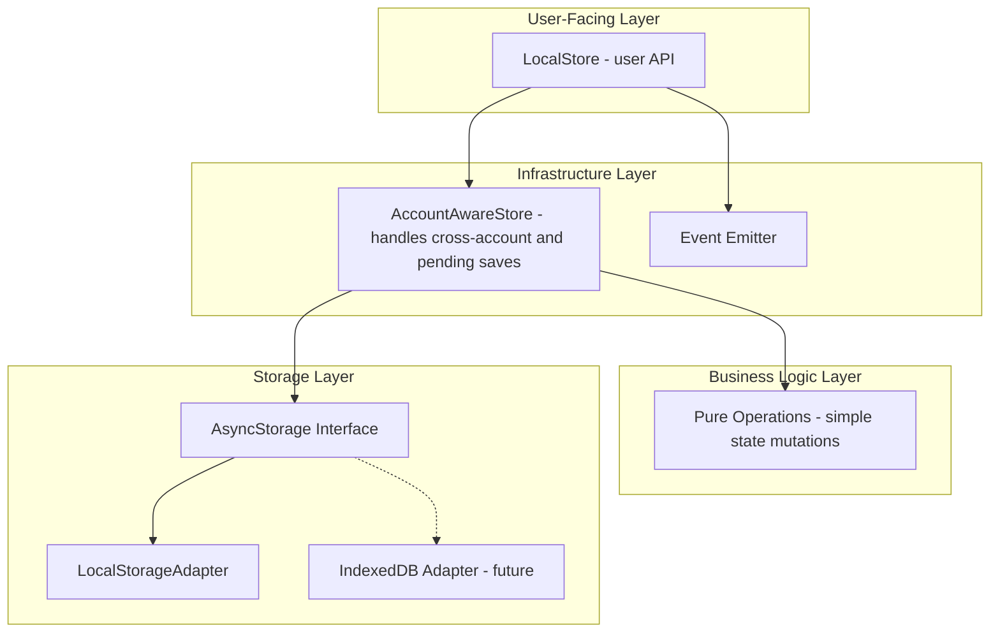
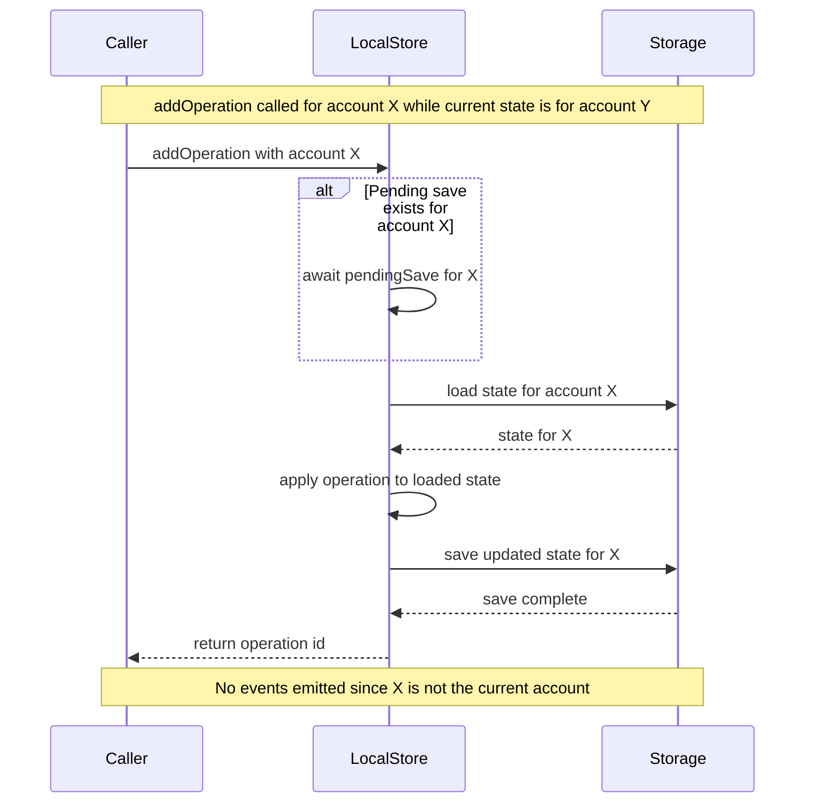

# Async Storage Extraction Plan

Extract the storage layer from [`AlternativeLocalState.ts`](web/src/lib/local/AlternativeLocalState.ts:39) into a generic async storage module with proper account-switching semantics.

## Goals

1. **Separation of concerns**: Extract storage logic into a reusable module
2. **Async-first API**: Even though localStorage is sync, the interface should be async to support future storage backends (IndexedDB, server-sync, etc.)
3. **Account-safe operations**: All state-mutating functions require account parameter and validate it matches current account
4. **Graceful account switching**: Handle pending saves/loads properly during account transitions

## Architecture Overview

**Layered architecture to separate concerns:**



**Key benefit**: The "Pure Operations" layer contains simple, testable functions that just mutate state - no async, no storage, no events. The infrastructure layer wraps them with the async/storage/event machinery.

## File Structure

All new files - existing files remain unchanged:

```
web/src/lib/
├── storage/
│   ├── index.ts                 # NEW: Public exports
│   ├── types.ts                 # NEW: AsyncStorage interface
│   └── LocalStorageAdapter.ts   # NEW: localStorage implementation
└── local/
    ├── createAccountStore.ts    # NEW: Generic factory with all infrastructure
    ├── OperationsLocalStore.ts  # NEW: Clean implementation using createAccountStore
    ├── AlternativeLocalState.ts # UNCHANGED: existing implementation
    └── LocalState.ts            # UNCHANGED: existing implementation
```

**Note**: The new `OperationsLocalStore.ts` can be used alongside the existing implementations. Once validated, you can choose to migrate or keep both.

## Detailed Design

### 1. AsyncStorage Interface

```typescript
// web/src/lib/storage/types.ts

/**
 * Generic async storage interface for key-value persistence.
 * All operations are async to support various backends.
 */
export interface AsyncStorage<T> {
  /**
   * Load data for the given key.
   * @returns The stored data, or undefined if not found
   */
  load(key: string): Promise<T | undefined>;
  
  /**
   * Save data for the given key.
   * @param key Storage key
   * @param data Data to persist
   */
  save(key: string, data: T): Promise<void>;
  
  /**
   * Remove data for the given key.
   * @param key Storage key
   */
  remove(key: string): Promise<void>;
  
  /**
   * Check if data exists for the given key.
   * @param key Storage key
   */
  exists(key: string): Promise<boolean>;
}
```

### 2. LocalStorageAdapter Implementation

```typescript
// web/src/lib/storage/LocalStorageAdapter.ts

import type { AsyncStorage } from './types';

export interface LocalStorageAdapterOptions {
  /** Optional serializer, defaults to JSON.stringify */
  serialize?: <T>(data: T) => string;
  /** Optional deserializer, defaults to JSON.parse */
  deserialize?: <T>(data: string) => T;
}

export function createLocalStorageAdapter<T>(
  options?: LocalStorageAdapterOptions
): AsyncStorage<T> {
  const serialize = options?.serialize ?? JSON.stringify;
  const deserialize = options?.deserialize ?? JSON.parse;
  
  return {
    async load(key: string): Promise<T | undefined> {
      try {
        const stored = localStorage.getItem(key);
        return stored ? deserialize<T>(stored) : undefined;
      } catch {
        return undefined;
      }
    },
    
    async save(key: string, data: T): Promise<void> {
      try {
        localStorage.setItem(key, serialize(data));
      } catch {
        // Silently fail - localStorage might be full or unavailable
      }
    },
    
    async remove(key: string): Promise<void> {
      try {
        localStorage.removeItem(key);
      } catch {
        // Silently fail
      }
    },
    
    async exists(key: string): Promise<boolean> {
      try {
        return localStorage.getItem(key) !== null;
      } catch {
        return false;
      }
    }
  };
}
```

### 3. Error Types (Optional)

Since we use load-modify-save for mismatched accounts instead of throwing, error types are minimal. These are optional and primarily for storage-level failures:

```typescript
// web/src/lib/storage/errors.ts

/**
 * Thrown when a storage operation fails (e.g., quota exceeded, permission denied).
 * The LocalStorageAdapter silently catches these, but custom adapters may throw.
 */
export class StorageError extends Error {
  constructor(
    message: string,
    public readonly key: string,
    public readonly operation: 'load' | 'save' | 'remove'
  ) {
    super(message);
    this.name = 'StorageError';
  }
}
```

**Note**: The `LoadCancelledError` is no longer needed since we use generation counters to silently ignore stale loads instead of throwing.

### 4. Generic createAccountStore Factory

A factory function that handles all the infrastructure automatically. You just provide:
- Initial state factory
- Pure mutation functions
- Storage configuration

```typescript
// web/src/lib/local/createAccountStore.ts

import type { AsyncStorage } from '$lib/storage';
import type { AccountStore } from '$lib/core/connection/types';
import { createEmitter } from 'radiate';

/**
 * Result of a state mutation.
 */
export type MutationResult<T, E extends string = string> = {
  result: T;
  event?: E;
  eventData?: unknown;
};

/**
 * A mutation function that operates on state.
 * First param is always state, rest are user-provided args.
 */
type MutationFn<S, Args extends unknown[], R, E extends string> = 
  (state: S, ...args: Args) => MutationResult<R, E>;

/**
 * Configuration for createAccountStore.
 */
type AccountStoreConfig<S, M extends Record<string, MutationFn<S, any[], any, any>>> = {
  /** Factory to create default state */
  defaultState: (account?: `0x${string}`) => S;
  
  /** Pure mutation functions - just mutate state and return result + event */
  mutations: M;
  
  /** Async storage adapter */
  storage: AsyncStorage<S>;
  
  /** Function to generate storage key from account */
  storageKey: (account: `0x${string}`) => string;
  
  /** Account store to subscribe to */
  account: AccountStore;
};

/**
 * Creates an account-aware store with automatic wiring.
 * 
 * - Current account: in-memory + fire-and-forget save + emit events
 * - Different account: load-modify-save with serialization, no events
 */
export function createAccountStore<
  S extends { account?: `0x${string}` },
  M extends Record<string, MutationFn<S, any[], any, any>>
>(config: AccountStoreConfig<S, M>) {
  const { defaultState, mutations, storage, storageKey, account } = config;
  
  // Extract event types from mutations for the emitter
  type EventNames = ReturnType<M[keyof M]>['event'];
  const emitter = createEmitter<Record<string, unknown>>();
  
  let state = defaultState();
  const pendingSaves = new Map<string, Promise<void>>();
  let loadGeneration = 0;
  
  // Storage helpers
  const _load = async (acc: `0x${string}`) => 
    (await storage.load(storageKey(acc))) ?? defaultState(acc);
  
  const _save = async (acc: `0x${string}`, s: S) => 
    storage.save(storageKey(acc), s);
  
  // Core helper
  async function _withState<T>(
    acc: `0x${string}`,
    mutation: (s: S) => MutationResult<T, string>
  ): Promise<T> {
    const isCurrentAccount = acc === state.account;
    
    if (isCurrentAccount) {
      const { result, event, eventData } = mutation(state);
      _save(acc, state).catch(() => {});
      if (event) emitter.emit(event, eventData ?? state);
      return result;
    }
    
    // Cross-account path
    const pending = pendingSaves.get(acc);
    if (pending) await pending;
    
    const targetState = await _load(acc);
    const { result } = mutation(targetState);
    
    const savePromise = _save(acc, targetState);
    pendingSaves.set(acc, savePromise);
    await savePromise;
    pendingSaves.delete(acc);
    
    return result;
  }
  
  // Account switching
  async function setAccount(newAccount?: `0x${string}`): Promise<void> {
    if (newAccount === state.account) return;
    
    if (state.account) {
      const pending = pendingSaves.get(state.account);
      if (pending) await pending;
    }
    
    loadGeneration++;
    const gen = loadGeneration;
    
    state = newAccount 
      ? await _load(newAccount).then(s => gen === loadGeneration ? s : state)
      : defaultState();
    
    emitter.emit('state', state);
  }
  
  // Auto-wrap all mutations with _withState
  type WrappedMutations = {
    [K in keyof M]: M[K] extends MutationFn<S, infer Args, infer R, any>
      ? (account: `0x${string}`, ...args: Args) => Promise<R>
      : never;
  };
  
  const wrappedMutations = {} as WrappedMutations;
  for (const [name, fn] of Object.entries(mutations)) {
    (wrappedMutations as any)[name] = (acc: `0x${string}`, ...args: unknown[]) =>
      _withState(acc, (s) => fn(s, ...args));
  }
  
  // Start/stop
  let unsub: (() => void) | undefined;
  const start = () => { unsub = account.subscribe(setAccount); return stop; };
  const stop = () => unsub?.();
  
  return {
    get state() { return state as Readonly<S>; },
    ...wrappedMutations,
    on: emitter.on,
    off: emitter.off,
    start,
    stop,
  };
}
```

### 5. Clean LocalStore Usage (OperationsLocalStore.ts)

A new file that uses the factory - **super clean**, just define the state and mutations:

```typescript
// web/src/lib/local/OperationsLocalStore.ts  (NEW FILE)

import { createAccountStore } from './createAccountStore';
import type { AsyncStorage } from '$lib/storage';
import type { AccountStore, TypedDeployments } from '$lib/core/connection/types';
import type { TransactionIntent } from '@etherkit/tx-observer';

export type OnchainOperation = {
  type: 'set-greeting' | 'default';
  description: string;
  transactionIntent: TransactionIntent;
};

export type LocalState = {
  account?: `0x${string}`;
  operations: Record<number, OnchainOperation>;
};

export function createLocalStore(params: {
  account: AccountStore;
  deployments: TypedDeployments;
  storage?: AsyncStorage<LocalState>;
}) {
  const { account, deployments, storage = createLocalStorageAdapter<LocalState>() } = params;
  
  return createAccountStore({
    account,
    storage,
    
    storageKey: (addr) => 
      `__private__${deployments.chain.id}_${deployments.chain.genesisHash}_${deployments.contracts.GreetingsRegistry.address}_${addr}`,
    
    defaultState: (account) => ({ account, operations: {} }),
    
    // Pure mutations - just business logic, no async/storage concerns!
    mutations: {
      addOperation(state, transactionIntent: TransactionIntent, description: string, type: OnchainOperation['type']) {
        let id = Date.now();
        while (state.operations[id]) id++;
        state.operations[id] = { type, description, transactionIntent };
        return { result: id, event: 'operations' };
      },
      
      setOperation(state, id: number, operation: OnchainOperation) {
        const isNew = !state.operations[id];
        state.operations[id] = operation;
        return { 
          result: undefined, 
          event: isNew ? 'operations' : 'operation',
          eventData: { id, operation }
        };
      },
      
      removeOperation(state, id: number) {
        if (!state.operations[id]) return { result: false };
        delete state.operations[id];
        return { result: true, event: 'operations' };
      }
    }
  });
}

// Usage:
// const store = createLocalStore({ account, deployments });
// await store.addOperation(account, transactionIntent, 'desc', 'default');
// await store.setOperation(account, id, operation);
// await store.removeOperation(account, id);
// store.on('operations', (operations) => { ... });
```

**Key benefits:**
- All infrastructure is hidden in `createAccountStore`
- The LocalStore file is just pure business logic
- Easy to add new mutations - just add a function
- Easy to test mutations in isolation

## Account Switching Flow

```mermaid
sequenceDiagram
    participant App
    participant LocalStore
    participant Storage
    
    Note over App,Storage: Account changes from A to B
    
    App->>LocalStore: account subscription fires with B
    
    alt Pending save for account A exists
        LocalStore->>LocalStore: await pendingSave for A
        LocalStore->>Storage: save completes for A
    end
    
    LocalStore->>LocalStore: loadGeneration++
    LocalStore->>Storage: load for account B
    
    alt Load returns before next account change
        Storage-->>LocalStore: data for B
        LocalStore->>LocalStore: check generation matches
        LocalStore->>LocalStore: update state
        LocalStore->>App: emit operations event
    else Account changes again before load completes
        Storage-->>LocalStore: data for B
        LocalStore->>LocalStore: check generation - MISMATCH
        LocalStore->>LocalStore: discard stale data
    end
```



## Cross-Account Operation Flow

When an operation targets a different account than the current in-memory state:



## API Changes Summary

### Before - Current API (Sync)

```typescript
const store = createLocalStore({ account, deployments });
store.addOperation(transactionIntent, description, type);  // void
store.setOperation(id, operation);                          // void
store.removeOperation(id);                                   // void
```

### After - Account-Safe Async API

```typescript
const store = createLocalStore({ account, deployments, storage });

// All mutating functions now:
// 1. Require account as first parameter
// 2. Return Promises (async)
// 3. Work on ANY account - loads from storage if not current account

await store.addOperation(targetAccount, transactionIntent, description, type);  // Promise<number>
await store.setOperation(targetAccount, id, operation);                          // Promise<void>
await store.removeOperation(targetAccount, id);                                   // Promise<boolean>

// No errors thrown for account mismatch - instead:
// - If targetAccount === currentAccount: operates on in-memory state, emits events
// - If targetAccount !== currentAccount: loads from storage, modifies, saves (no events)
```

## Migration Notes

1. **Breaking change**: All callers must:
   - Pass `account` as first parameter to mutating functions
   - Handle the async return values (`Promise`)
2. **Graceful degradation**: The storage parameter is optional; defaults to LocalStorageAdapter
3. **No error handling needed for account mismatch**: Operations safely work on any account
4. **Events only for current account**: When operating on a different account, no events are emitted (the UI wouldn't be showing that account's data anyway)

## Future Extensions

The `AsyncStorage` interface enables future implementations:

- **IndexedDB**: For larger data sets or offline-first apps
- **Server sync**: A separate sync service that works with the storage layer directly:
  1. Load local state via `storage.load(key)`
  2. Fetch server state
  3. Merge (app-specific logic)
  4. Save to server
  5. Clear local via `storage.remove(key)`
  Note: LocalStore stays simple; sync is a separate concern
- **Encrypted storage**: Wrap another adapter with encryption
- **Memory-only**: For testing or privacy modes

## Implementation Order

All new files - no modifications to existing code:

1. Create `web/src/lib/storage/types.ts` with AsyncStorage interface
2. Create `web/src/lib/storage/LocalStorageAdapter.ts`
3. Create `web/src/lib/storage/index.ts` to export public API
4. Create `web/src/lib/local/createAccountStore.ts` - the generic factory
5. Create `web/src/lib/local/OperationsLocalStore.ts` - clean implementation using the factory
6. (Optional) Migrate callers from AlternativeLocalState to OperationsLocalStore
