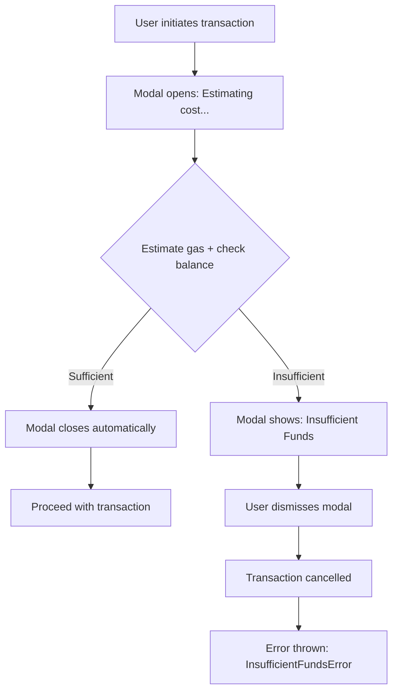

# Balance Check Before Transaction - Implementation Plan

## Overview

Add a balance check mechanism before sending transactions. When the user's balance is insufficient to cover the estimated gas cost, a modal is displayed. When dismissed, the operation is cancelled.

## User Flow



## API Design

### Function Signature

```typescript
type GasSpeed = 'slow' | 'average' | 'fast';

interface EnsureCanAffordBase {
  publicClient: PublicClient;
  balance: BalanceStore;
  gasFee: GasFeeStore;
  gasSpeed?: GasSpeed;      // defaults to 'fast' for conservative estimation
  forceUpdate?: boolean;    // force refresh balance and gas fee before checking (defaults to false)
}

// Contract call overload - preserves viem type inference
export function ensureCanAfford<
  const TAbi extends Abi | readonly unknown[],
  TFunctionName extends ContractFunctionName<TAbi, 'nonpayable' | 'payable'>,
>(
  options: EnsureCanAffordBase & {
    contract: ContractCallParams<TAbi, TFunctionName>;
  }
): Promise<ContractCallParams<TAbi, TFunctionName> & { chain: null }>;

// Raw transaction overload
export function ensureCanAfford(
  options: EnsureCanAffordBase & {
    transaction: RawTransactionParams;
  }
): Promise<RawTransactionParams & { chain: null }>;
```

### Usage Examples

```typescript
// Example 1: Contract call with default gas speed (fast)
async function setGreeting() {
  const currentConnection = await connection.ensureConnected();
  
  const contractRequest = await ensureCanAfford({
    publicClient,
    balance,
    gasFee,
    contract: {
      ...deployments.current.contracts.GreetingsRegistry,
      functionName: 'setMessage',
      args: [greetingInput],
      account: currentConnection.account.address,
    },
  });

  await walletClient.writeContract(contractRequest);
}

// Example 2: With specific gas speed
const contractRequest = await ensureCanAfford({
  publicClient,
  balance,
  gasFee,
  gasSpeed: 'average', // Use average instead of fast
  contract: { ... },
});

// Example 3: Force update balance and gas fee before checking
const contractRequest = await ensureCanAfford({
  publicClient,
  balance,
  gasFee,
  forceUpdate: true, // Fetch latest balance and gas prices first
  contract: { ... },
});

// Example 4: Raw transaction
const txRequest = await ensureCanAfford({
  publicClient,
  balance,
  gasFee,
  transaction: {
    to: recipient,
    value: parseEther('1.0'),
    account: currentConnection.account.address,
  },
});
await walletClient.sendTransaction(txRequest);
```

---

## File Structure

All new files go in `web/src/lib/core/transaction/`:

```
web/src/lib/core/transaction/
├── index.ts                           # Re-exports
├── balance-check.ts                   # ensureCanAfford function
├── balance-check.types.ts             # TypeScript types
├── balance-check-store.ts             # Modal state management
├── InsufficientFundsModal.svelte      # Modal component
└── InsufficientFundsError.ts          # Custom error class
```

---

## Implementation Details

### File 1: InsufficientFundsError.ts

**Path:** `web/src/lib/core/transaction/InsufficientFundsError.ts`

Custom error class thrown when user dismisses the insufficient funds modal.

```typescript
export class InsufficientFundsError extends Error {
  readonly code = 'INSUFFICIENT_FUNDS' as const;
  readonly balance: bigint;
  readonly estimatedCost: bigint;
  readonly shortfall: bigint;

  constructor(balance: bigint, estimatedCost: bigint) {
    const shortfall = estimatedCost - balance;
    super(`Insufficient funds: need ${shortfall} more wei`);
    this.name = 'InsufficientFundsError';
    this.balance = balance;
    this.estimatedCost = estimatedCost;
    this.shortfall = shortfall;
  }
}
```

---

### File 2: balance-check-store.ts

**Path:** `web/src/lib/core/transaction/balance-check-store.ts`

Svelte store for modal state management. Uses a discriminated union for type-safe state handling.

```typescript
import { writable } from 'svelte/store';

export type BalanceCheckState =
  | { step: 'idle' }
  | { step: 'estimating' }
  | { 
      step: 'insufficient';
      balance: bigint;
      estimatedCost: bigint;
      shortfall: bigint;
      onDismiss: () => void;
    };

function createBalanceCheckStore() {
  const { subscribe, set } = writable<BalanceCheckState>({ step: 'idle' });

  return {
    subscribe,
    startEstimating: () => set({ step: 'estimating' }),
    showInsufficientFunds: (data: {
      balance: bigint;
      estimatedCost: bigint;
      shortfall: bigint;
      onDismiss: () => void;
    }) => set({ step: 'insufficient', ...data }),
    close: () => set({ step: 'idle' }),
  };
}

export const balanceCheckStore = createBalanceCheckStore();
```

---

### File 3: balance-check.types.ts

**Path:** `web/src/lib/core/transaction/balance-check.types.ts`

TypeScript types that preserve viem's type inference for contract ABIs.

```typescript
import type { 
  PublicClient,
  Abi,
  ContractFunctionName,
  ContractFunctionArgs,
} from 'viem';
import type { BalanceStore } from '$lib/core/connection/balance';
import type { GasFeeStore } from '$lib/core/connection/gasFee';

export type GasSpeed = 'slow' | 'average' | 'fast';

export interface EnsureCanAffordBase {
  publicClient: PublicClient;
  balance: BalanceStore;
  gasFee: GasFeeStore;
  gasSpeed?: GasSpeed;
  forceUpdate?: boolean;
}

export interface RawTransactionParams {
  to?: `0x${string}`;
  data?: `0x${string}`;
  value?: bigint;
  account: `0x${string}`;
}

export interface ContractCallParams<
  TAbi extends Abi | readonly unknown[],
  TFunctionName extends ContractFunctionName<TAbi, 'nonpayable' | 'payable'>,
> {
  address: `0x${string}`;
  abi: TAbi;
  functionName: TFunctionName;
  args?: ContractFunctionArgs<TAbi, 'nonpayable' | 'payable', TFunctionName>;
  account: `0x${string}`;
  value?: bigint;
}

// Overload signatures
export interface EnsureCanAfford {
  // Contract call overload
  <
    const TAbi extends Abi | readonly unknown[],
    TFunctionName extends ContractFunctionName<TAbi, 'nonpayable' | 'payable'>,
  >(
    options: EnsureCanAffordBase & {
      contract: ContractCallParams<TAbi, TFunctionName>;
    }
  ): Promise<ContractCallParams<TAbi, TFunctionName> & { chain: null }>;

  // Raw transaction overload
  (
    options: EnsureCanAffordBase & {
      transaction: RawTransactionParams;
    }
  ): Promise<RawTransactionParams & { chain: null }>;
}
```

---

### File 4: balance-check.ts

**Path:** `web/src/lib/core/transaction/balance-check.ts`

Main implementation of the `ensureCanAfford` function.

```typescript
import { get } from 'svelte/store';
import type { PublicClient } from 'viem';
import type { BalanceStore } from '$lib/core/connection/balance';
import type { GasFeeStore } from '$lib/core/connection/gasFee';
import { balanceCheckStore } from './balance-check-store';
import { InsufficientFundsError } from './InsufficientFundsError';
import type { 
  EnsureCanAfford, 
  EnsureCanAffordBase, 
  GasSpeed,
  RawTransactionParams,
} from './balance-check.types';

function getGasPrice(gasFee: GasFeeStore, speed: GasSpeed): bigint {
  const gasFeeValue = get(gasFee);
  if (gasFeeValue.step !== 'Loaded') {
    throw new Error('Gas fee not loaded');
  }
  return gasFeeValue[speed].maxFeePerGas;
}

async function estimateContractGas(
  publicClient: PublicClient,
  params: { address: `0x${string}`; abi: any; functionName: string; args?: any[]; account: `0x${string}`; value?: bigint }
): Promise<bigint> {
  return publicClient.estimateContractGas({
    address: params.address,
    abi: params.abi,
    functionName: params.functionName,
    args: params.args,
    account: params.account,
    value: params.value,
  });
}

async function estimateRawGas(
  publicClient: PublicClient,
  params: RawTransactionParams
): Promise<bigint> {
  return publicClient.estimateGas({
    to: params.to,
    data: params.data,
    value: params.value,
    account: params.account,
  });
}

async function checkBalanceAndShowModal(
  balance: BalanceStore,
  estimatedCost: bigint
): Promise<void> {
  // Ensure balance is loaded
  const balanceValue = get(balance);
  if (balanceValue.step !== 'Loaded') {
    await balance.update();
  }
  
  const currentBalance = get(balance);
  if (currentBalance.step !== 'Loaded') {
    throw new Error('Could not load balance');
  }

  if (currentBalance.value >= estimatedCost) {
    // Sufficient funds - close modal and proceed
    balanceCheckStore.close();
    return;
  }

  // Insufficient funds - show modal and wait for dismissal
  return new Promise((_, reject) => {
    balanceCheckStore.showInsufficientFunds({
      balance: currentBalance.value,
      estimatedCost,
      shortfall: estimatedCost - currentBalance.value,
      onDismiss: () => {
        balanceCheckStore.close();
        reject(new InsufficientFundsError(currentBalance.value, estimatedCost));
      },
    });
  });
}

export const ensureCanAfford: EnsureCanAfford = async (options: any) => {
  const { publicClient, balance, gasFee, gasSpeed = 'fast', forceUpdate = false } = options as EnsureCanAffordBase;

  // Step 1: Show estimating modal
  balanceCheckStore.startEstimating();

  try {
    // Step 2: Force update balance and gas fee if requested
    if (forceUpdate) {
      await Promise.all([
        balance.update(),
        gasFee.update(),
      ]);
    }

    // Step 3: Get gas price
    const gasPrice = getGasPrice(gasFee, gasSpeed);

    // Step 3: Estimate gas based on transaction type
    let gasEstimate: bigint;
    let value: bigint = 0n;

    if ('contract' in options) {
      const { contract } = options;
      gasEstimate = await estimateContractGas(publicClient, contract);
      value = contract.value ?? 0n;
    } else {
      const { transaction } = options;
      gasEstimate = await estimateRawGas(publicClient, transaction);
      value = transaction.value ?? 0n;
    }

    // Step 4: Calculate total cost
    const gasCost = gasEstimate * gasPrice;
    const estimatedCost = gasCost + value;

    // Step 5: Check balance and handle insufficient funds
    await checkBalanceAndShowModal(balance, estimatedCost);

    // Step 6: Return the params for use with writeContract/sendTransaction
    if ('contract' in options) {
      return { ...options.contract, chain: null };
    } else {
      return { ...options.transaction, chain: null };
    }
  } catch (error) {
    balanceCheckStore.close();
    throw error;
  }
};
```

---

### File 5: InsufficientFundsModal.svelte

**Path:** `web/src/lib/core/transaction/InsufficientFundsModal.svelte`

Modal component with two visual states: estimating and insufficient funds.

```svelte
<script lang="ts">
  import * as Modal from '$lib/core/ui/modal/index.js';
  import { Button } from '$lib/shadcn/ui/button/index.js';
  import { Spinner } from '$lib/shadcn/ui/spinner/index.js';
  import { balanceCheckStore } from './balance-check-store';
  import { formatBalance } from '$lib/core/utils/format/balance';
  import AlertTriangleIcon from '@lucide/svelte/icons/alert-triangle';

  const state = balanceCheckStore;

  let isOpen = $derived($state.step !== 'idle');
</script>

<Modal.Root openWhen={isOpen}>
  {#if $state.step === 'estimating'}
    <Modal.Title>Preparing Transaction</Modal.Title>
    <div class="flex flex-col items-center gap-4 py-8">
      <Spinner class="h-10 w-10" />
      <p class="text-muted-foreground">Estimating transaction cost...</p>
    </div>
  {:else if $state.step === 'insufficient'}
    <Modal.Title>
      <span class="flex items-center gap-2 text-destructive">
        <AlertTriangleIcon class="h-5 w-5" />
        Insufficient Funds
      </span>
    </Modal.Title>
    
    <div class="space-y-4 py-4">
      <p class="text-muted-foreground">
        You don't have enough funds to complete this transaction.
      </p>
      
      <div class="space-y-2 rounded-lg bg-muted p-4">
        <div class="flex justify-between">
          <span class="text-muted-foreground">Your balance:</span>
          <span class="font-mono">{formatBalance($state.balance)} ETH</span>
        </div>
        <div class="flex justify-between">
          <span class="text-muted-foreground">Estimated cost:</span>
          <span class="font-mono">{formatBalance($state.estimatedCost)} ETH</span>
        </div>
        <hr class="border-border" />
        <div class="flex justify-between text-destructive">
          <span>Shortfall:</span>
          <span class="font-mono">{formatBalance($state.shortfall)} ETH</span>
        </div>
      </div>

      <!-- Future: Add link to purchase ETH -->
      <!-- <a href="..." class="text-primary hover:underline">
        Get more ETH →
      </a> -->
    </div>

    <Modal.Footer>
      <Button onclick={$state.onDismiss}>
        Dismiss
      </Button>
    </Modal.Footer>
  {/if}
</Modal.Root>
```

---

### File 6: index.ts

**Path:** `web/src/lib/core/transaction/index.ts`

Re-exports for clean imports.

```typescript
export { ensureCanAfford } from './balance-check';
export { InsufficientFundsError } from './InsufficientFundsError';
export { balanceCheckStore } from './balance-check-store';
export type { GasSpeed, EnsureCanAffordBase } from './balance-check.types';
```

---

## Integration Tasks

### Integration 1: Add Modal to App Layout

**File to modify:** `web/src/lib/context/Context.svelte`

Add the `InsufficientFundsModal` component so it's available globally.

```svelte
<script lang="ts">
  // ... existing imports ...
  import InsufficientFundsModal from '$lib/core/transaction/InsufficientFundsModal.svelte';
</script>

<!-- ... existing content ... -->
<InsufficientFundsModal />
```

---

### Integration 2: Update Demo Page

**File to modify:** `web/src/routes/demo/+page.svelte`

Update the `setGreeting()` function to use `ensureCanAfford()`.

**Before:**
```typescript
async function setGreeting() {
  if (!greetingInput.trim() || isSubmitting) return;

  isSubmitting = true;
  try {
    const currentConnection = await connection.ensureConnected();

    await walletClient.writeContract({
      ...deployments.current.contracts.GreetingsRegistry,
      functionName: 'setMessage',
      args: [greetingInput],
      account: currentConnection.account.address,
      chain: null as any,
    });
    greetingInput = '';
    setTimeout(() => onchainState.update(), 2000);
  } catch (error) {
    console.error('Failed to set greeting:', error);
  } finally {
    isSubmitting = false;
  }
}
```

**After:**
```typescript
import { ensureCanAfford, InsufficientFundsError } from '$lib/core/transaction';

// Add to getUserContext destructuring:
const { connection, onchainState, viewState, walletClient, deployments, clock, publicClient, balance, gasFee } = getUserContext();

async function setGreeting() {
  if (!greetingInput.trim() || isSubmitting) return;

  isSubmitting = true;
  try {
    const currentConnection = await connection.ensureConnected();

    const contractRequest = await ensureCanAfford({
      publicClient,
      balance,
      gasFee,
      contract: {
        ...deployments.current.contracts.GreetingsRegistry,
        functionName: 'setMessage',
        args: [greetingInput],
        account: currentConnection.account.address,
      },
    });

    await walletClient.writeContract(contractRequest);
    greetingInput = '';
    setTimeout(() => onchainState.update(), 2000);
  } catch (error) {
    if (error instanceof InsufficientFundsError) {
      // User dismissed the modal - silently cancel
      return;
    }
    console.error('Failed to set greeting:', error);
  } finally {
    isSubmitting = false;
  }
}
```

---

### Integration 3: Update ContractFunction Component

**File to modify:** `web/src/routes/contracts/components/ContractFunction.svelte`

Update `handleExecute()` to use `ensureCanAfford()`.

**Changes needed:**
1. Import `ensureCanAfford` and `InsufficientFundsError`
2. Add `balance` and `gasFee` to the component props (or get from context)
3. Wrap the transaction in `ensureCanAfford()`
4. Handle `InsufficientFundsError` in catch block

---

### Integration 4: Update PendingOperationModal

**File to modify:** `web/src/lib/ui/pending-operation/PendingOperationModal.svelte`

Update `handleResubmit()` and `handleCancel()` to use `ensureCanAfford()`.

**Changes needed:**
1. Import `ensureCanAfford` and `InsufficientFundsError`
2. Get `publicClient` and `balance` from context
3. Wrap `sendTransaction` calls in `ensureCanAfford()`
4. Handle `InsufficientFundsError` appropriately

---

## Dependencies

The implementation uses these existing modules:
- `$lib/core/connection/balance` - BalanceStore type and createBalanceStore
- `$lib/core/connection/gasFee` - GasFeeStore type with slow/average/fast prices
- `$lib/core/ui/modal/` - Modal components
- `$lib/shadcn/ui/button/` - Button component
- `$lib/shadcn/ui/spinner/` - Spinner component
- `$lib/core/utils/format/balance` - formatBalance utility
- `viem` - PublicClient, estimateGas, estimateContractGas types

---

## Testing Checklist

- [ ] `ensureCanAfford` with sufficient balance closes modal and returns params
- [ ] `ensureCanAfford` with insufficient balance shows modal
- [ ] Dismissing modal throws `InsufficientFundsError`
- [ ] Contract call type inference works correctly
- [ ] Raw transaction works correctly
- [ ] `gasSpeed` parameter selects correct gas price tier
- [ ] Modal shows correct balance/cost/shortfall values
- [ ] `formatBalance` displays values correctly

---

## Future Enhancements

1. **Link to purchase ETH/native currency** - Add a link in the insufficient funds modal to a fiat on-ramp or DEX

2. **Retry transaction from modal** - Allow users to retry the transaction directly from the modal after funding their wallet:
   - Add a "Retry" button alongside "Dismiss"
   - Store the transaction params in the modal state
   - On retry: re-check balance, if sufficient proceed with transaction, if still insufficient update the display
   - This avoids users having to redo UI steps (filling forms, etc.)
   
   Implementation sketch for enhanced modal state:
   ```typescript
   type BalanceCheckState =
     | { step: 'idle' }
     | { step: 'estimating' }
     | {
         step: 'insufficient';
         balance: bigint;
         estimatedCost: bigint;
         shortfall: bigint;
         onDismiss: () => void;
         onRetry: () => Promise<void>;  // Retry callback
       };
   ```

3. **Balance polling while modal is open** - Automatically update the displayed balance while the insufficient funds modal is open, so users can see when their transfer arrives

4. **Network-specific styling** - Show the native currency symbol based on the connected chain (ETH, MATIC, etc.)

5. **User preference to skip balance check** - For power users who know what they're doing
