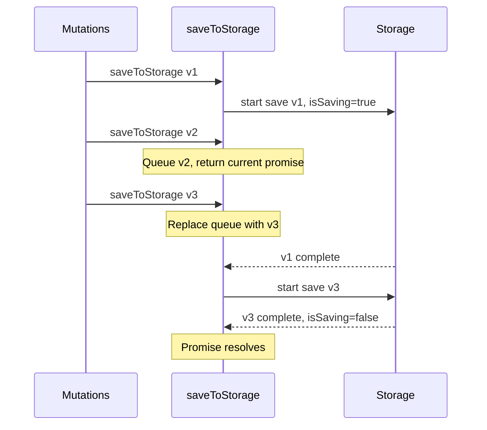

# Coalescing Storage Save Queue Implementation Plan

## Problem Statement

The [`saveToStorage`](web/src/lib/core/sync/createSyncableStore.ts:539) function is called fire-and-forget from mutation methods (`set`, `patch`, `add`, `update`, `remove`). With asynchronous storage like IndexedDB, if a user rapidly mutates data:

1. Save A starts (with state v1)
2. Save B starts (with state v2)
3. Save B completes first
4. Save A completes, **overwriting v2 with stale v1**

Current sync storage (localStorage) is synchronous so this isn't a problem today, but the architecture should support async storage correctly.

## Solution: Coalescing Queue (Size 1)

Implement a coalescing queue that ensures only one save operation is in-flight at a time, with at most one pending save request (the latest state).

**Key simplification**: One function `saveToStorage(account, data)` that returns `Promise<void>`:
- Callers who don't need to wait ignore the promise (mutations)
- Callers who need to wait can await it (sync, initial load)

**Bonus simplification**: Since the coalescing queue ensures at most one save in progress, `pendingSaves` (always 0 or 1) becomes `isSaving: boolean`.



## Current Code Analysis

### Storage Save Locations

There are **3 places** where `storage.save()` is called:

| Location                                                              | Line | Context                        |
| --------------------------------------------------------------------- | ---- | ------------------------------ |
| [`performSync()`](web/src/lib/core/sync/createSyncableStore.ts:460)   | 460  | After merging with server data |
| [`saveToStorage()`](web/src/lib/core/sync/createSyncableStore.ts:547) | 547  | Fire-and-forget from mutations |
| [`setAccount()`](web/src/lib/core/sync/createSyncableStore.ts:635)    | 635  | Initial load cleanup           |

All will use the new unified `saveToStorage(account, data)` function.

### Current `StorageStatus` Interface (types.ts lines 200-212)

```typescript
export interface StorageStatus {
  /** Number of pending saves in queue */
  readonly pendingSaves: number;

  /** Last successful save timestamp */
  readonly lastSavedAt: number | null;

  /** Last storage error, null if healthy */
  readonly storageError: Error | null;

  /** Display state for simple UI: saving > error > idle */
  readonly displayState: "saving" | "error" | "idle";
}
```

### Current `combineStatus` Function (types.ts lines 229-242)

```typescript
export function combineStatus(
  sync: SyncStatus,
  storage: StorageStatus
): {
  hasError: boolean;
  hasUnsavedChanges: boolean;
  isBusy: boolean;
} {
  return {
    hasError: sync.syncError !== null || storage.storageError !== null,
    hasUnsavedChanges: storage.pendingSaves > 0,
    isBusy: sync.isSyncing || storage.pendingSaves > 0,
  };
}
```

## Implementation Plan

### Step 1: Update `StorageStatus` Interface in types.ts

**File**: `web/src/lib/core/sync/types.ts`

Change `pendingSaves: number` to `isSaving: boolean`:

```typescript
/**
 * Storage status - local persistence state.
 */
export interface StorageStatus {
  /** True when a storage save operation is in progress */
  readonly isSaving: boolean;

  /** Last successful save timestamp */
  readonly lastSavedAt: number | null;

  /** Last storage error, null if healthy */
  readonly storageError: Error | null;

  /** Display state for simple UI: saving > error > idle */
  readonly displayState: "saving" | "error" | "idle";
}
```

### Step 2: Update `combineStatus` Function in types.ts

**File**: `web/src/lib/core/sync/types.ts`

Update to use `isSaving` instead of `pendingSaves > 0`:

```typescript
export function combineStatus(
  sync: SyncStatus,
  storage: StorageStatus
): {
  hasError: boolean;
  hasUnsavedChanges: boolean;
  isBusy: boolean;
} {
  return {
    hasError: sync.syncError !== null || storage.storageError !== null,
    hasUnsavedChanges: storage.isSaving,
    isBusy: sync.isSyncing || storage.isSaving,
  };
}
```

### Step 3: Update `MutableStorageStatus` in createSyncableStore.ts

**File**: `web/src/lib/core/sync/createSyncableStore.ts` (around line 250-285)

Update the interface and implementation:

```typescript
// Internal mutable storage status type
interface MutableStorageStatus {
  isSaving: boolean;
  lastSavedAt: number | null;
  storageError: Error | null;
  readonly displayState: "saving" | "error" | "idle";
}

// Mutable storage status (readonly externally via StorageStatus type)
const mutableStorageStatus: MutableStorageStatus = {
  isSaving: false,
  lastSavedAt: null,
  storageError: null,
  get displayState() {
    if (this.isSaving) return "saving";
    if (this.storageError) return "error";
    return "idle";
  },
};
```

### Step 4: Create Storage Queue State Variables

Add new state variables near the existing state section (around line 234-238):

```typescript
// State
let asyncState: AsyncState<DataOf<S>> = { status: "idle", account: undefined };
let internalStorage: InternalStorage<S> | null = null;
let loadGeneration = 0;

// Storage queue state
let storageSavePending: {
  account: `0x${string}`;
  data: InternalStorage<S>;
} | null = null;
let currentSavePromise: Promise<void> | null = null;
```

### Step 5: Create the `doStorageSave` Helper Function

This is the **internal function** that actually performs the storage save:

```typescript
/**
 * Internal: Actually perform the storage save operation.
 * This is called by the queuing logic and should not be called directly.
 */
async function doStorageSave(
  account: `0x${string}`,
  data: InternalStorage<S>
): Promise<void> {
  try {
    await storage.save(storageKey(account), data);
    mutableStorageStatus.lastSavedAt = clock();
    emitStorageEvent({ type: "saved", timestamp: clock() });
  } catch (error) {
    mutableStorageStatus.storageError = error as Error;
    emitStorageEvent({ type: "failed", error: error as Error });
    throw error; // Re-throw so caller knows it failed
  }
}
```

### Step 6: Create `processStorageSave` Queue Processor

```typescript
/**
 * Process the storage save and handle the queue.
 * This runs the save and recursively processes any queued save.
 */
async function processStorageSave(
  account: `0x${string}`,
  data: InternalStorage<S>
): Promise<void> {
  try {
    await doStorageSave(account, data);
  } catch {
    // Error already handled in doStorageSave (status updated, event emitted)
    // Continue to process queue even on error
  }

  // Check if there's a queued save
  if (storageSavePending) {
    const pending = storageSavePending;
    storageSavePending = null;

    // Clear any previous error since we're retrying
    mutableStorageStatus.storageError = null;
    emitStorageEvent({ type: "saving" });

    // Process the queued save (isSaving stays true)
    await processStorageSave(pending.account, pending.data);
  } else {
    // No more saves pending
    mutableStorageStatus.isSaving = false;
  }
}
```

### Step 7: Implement Unified `saveToStorage` Function

Replace the existing `saveToStorage` function with the new unified version that:
- Takes explicit `account` and `data` parameters
- Returns a `Promise<void>` that resolves when all pending saves complete
- Callers can choose to await or ignore the promise

```typescript
/**
 * Save data to storage with coalescing queue.
 * 
 * Uses a coalescing queue (size 1) to ensure:
 * 1. Only one save is in-flight at a time
 * 2. Rapid saves coalesce to save only the latest data
 * 3. Write ordering is preserved (latest data always wins)
 * 
 * @param account - The account to save for
 * @param data - The data to save
 * @returns Promise that resolves when all pending saves complete
 *          (callers who don't need to wait can ignore this)
 */
function saveToStorage(
  account: `0x${string}`,
  data: InternalStorage<S>
): Promise<void> {
  if (mutableStorageStatus.isSaving) {
    // A save is already in progress - queue this one (replacing any previously queued)
    storageSavePending = { account, data };
    // Clear any previous error since we're going to retry
    mutableStorageStatus.storageError = null;
    // Return the current save promise - it will process our queued data
    return currentSavePromise!;
  }

  // No save in progress - start one
  mutableStorageStatus.isSaving = true;
  storageSavePending = null; // Clear any stale pending save (defensive)
  mutableStorageStatus.storageError = null;
  emitStorageEvent({ type: "saving" });

  // Start the save chain and store the promise
  currentSavePromise = processStorageSave(account, data);
  return currentSavePromise;
}
```

### Step 8: Update Call Sites

#### 8a. Mutation Methods (Lines 720, 753, 806, 861, 912)

**Before:**
```typescript
// Save to storage and mark for sync
saveToStorage(asyncState.account);
markDirty();
```

**After:**
```typescript
// Save to storage (fire-and-forget) and mark for sync
saveToStorage(asyncState.account, internalStorage);
markDirty();
```

Note: The promise is intentionally ignored for mutations (fire-and-forget).

#### 8b. In `performSync()` (Line 460)

**Before:**
```typescript
// Step 3: Save merged state to local storage
await storage.save(storageKey(account), cleanedMerged);
```

**After:**
```typescript
// Step 3: Save merged state to local storage
await saveToStorage(account, cleanedMerged);
```

#### 8c. In `setAccount()` (Line 635)

**Before:**
```typescript
// Save cleaned state
await storage.save(storageKey(newAccount), internalStorage);
```

**After:**
```typescript
// Save cleaned state
await saveToStorage(newAccount, internalStorage);
```

### Step 9: Update `flush()` to Use `isSaving`

**Before:**
```typescript
async flush(timeoutMs = 30000): Promise<void> {
    const startTime = clock();
    while (mutableStorageStatus.pendingSaves > 0) {
        if (clock() - startTime > timeoutMs) {
            throw new Error(
                `flush() timed out after ${timeoutMs}ms waiting for ${mutableStorageStatus.pendingSaves} pending saves`,
            );
        }
        await new Promise((r) => setTimeout(r, 10));
    }
}
```

**After:**
```typescript
async flush(timeoutMs = 30000): Promise<void> {
    // TODO: Consider replacing polling with Promise-based waiting for better efficiency.
    // Could use a resolver array that gets called when the storage queue drains.
    const startTime = clock();
    while (mutableStorageStatus.isSaving) {
        if (clock() - startTime > timeoutMs) {
            throw new Error(
                `flush() timed out after ${timeoutMs}ms waiting for storage save to complete`,
            );
        }
        await new Promise((r) => setTimeout(r, 10));
    }
}
```

## Summary of Changes

| File                       | Section                               | Change                                                         |
| -------------------------- | ------------------------------------- | -------------------------------------------------------------- |
| `types.ts`                 | `StorageStatus` interface             | Change `pendingSaves: number` to `isSaving: boolean`           |
| `types.ts`                 | `combineStatus()` function            | Update to use `storage.isSaving`                               |
| `createSyncableStore.ts`   | `MutableStorageStatus`                | Change `pendingSaves: number` to `isSaving: boolean`           |
| `createSyncableStore.ts`   | State variables                       | Add `storageSavePending` and `currentSavePromise`              |
| `createSyncableStore.ts`   | New function                          | Add `doStorageSave()` internal helper                          |
| `createSyncableStore.ts`   | New function                          | Add `processStorageSave()` queue processor                     |
| `createSyncableStore.ts`   | Replace `saveToStorage`               | Unified function with coalescing queue, returns `Promise<void>`|
| `createSyncableStore.ts`   | Mutation methods                      | Pass `internalStorage` to `saveToStorage()`, ignore promise    |
| `createSyncableStore.ts`   | `performSync()`                       | Replace `storage.save()` with `await saveToStorage()`          |
| `createSyncableStore.ts`   | `setAccount()`                        | Replace `storage.save()` with `await saveToStorage()`          |
| `createSyncableStore.ts`   | `flush()`                             | Update to use `isSaving` instead of `pendingSaves > 0`         |

## Key Benefits of This Design

1. **Single function** - No `awaitedStorageSave` needed, just `saveToStorage`
2. **Explicit data** - Always pass data, no implicit `internalStorage` dependency
3. **Optional await** - Callers choose whether to wait or fire-and-forget
4. **Clean semantics** - Promise resolves when all pending saves complete (including queued ones)

## Testing Considerations

1. **Rapid mutations**: Verify that rapid calls to `set/patch/add/update/remove` result in only the final state being persisted
2. **Concurrent sync**: Verify that `performSync()` properly waits for saves to complete
3. **Account switch**: Verify that switching accounts properly handles any pending saves
4. **Error handling**: Verify that storage errors are properly reported and don't break the queue
5. **Flush behavior**: Verify that `flush()` correctly waits for all saves including queued ones
6. **Promise resolution**: Verify that awaited saves resolve only after their data (or newer) is persisted

## Execution Checklist

- [ ] Update `StorageStatus` interface in types.ts (`pendingSaves` → `isSaving`)
- [ ] Update `combineStatus()` function in types.ts
- [ ] Update `MutableStorageStatus` interface in createSyncableStore.ts
- [ ] Add `storageSavePending` and `currentSavePromise` state variables
- [ ] Implement `doStorageSave()` internal helper
- [ ] Implement `processStorageSave()` queue processor
- [ ] Implement unified `saveToStorage(account, data)` function
- [ ] Update mutation methods to pass `internalStorage` to `saveToStorage()`
- [ ] Update `performSync()` to use `await saveToStorage()`
- [ ] Update `setAccount()` to use `await saveToStorage()`
- [ ] Update `flush()` to use `isSaving` + add TODO comment
- [ ] Run TypeScript checks: `cd web && pnpm check`
- [ ] Run tests: `cd web && pnpm test`
- [ ] Manual testing with rapid mutations
