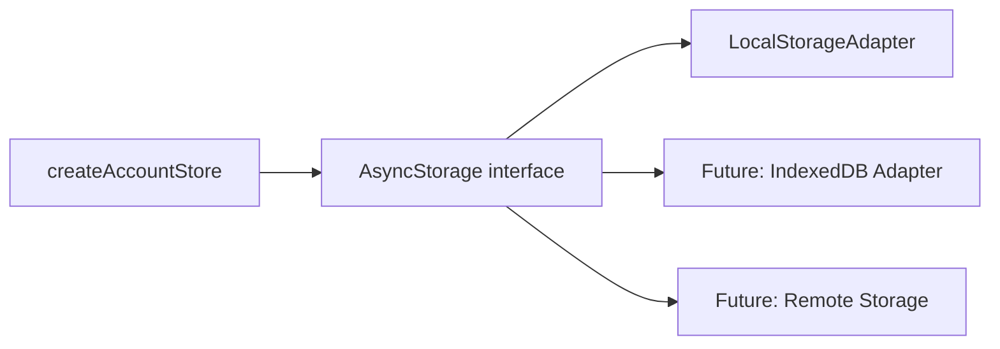
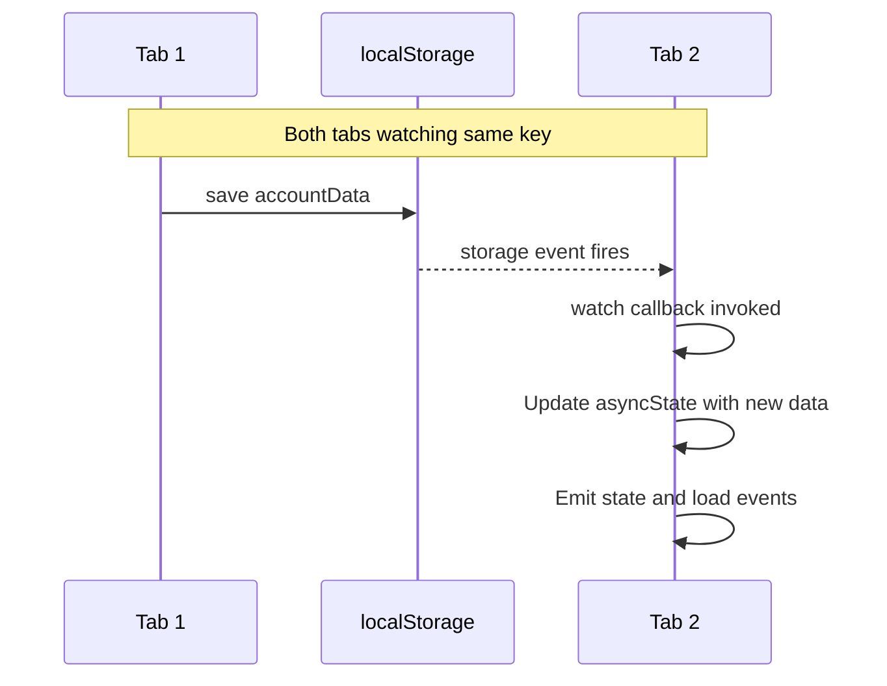

# Cross-Tab Storage Synchronization Design

## Quick Context for Implementation

**Goal**: Enable `createAccountStore` to detect storage changes from other browser tabs and automatically reload data.

**Key Files to Modify**:
1. [`web/src/lib/core/storage/types.ts`](web/src/lib/core/storage/types.ts) - Add `WatchableStorage<T>` interface
2. [`web/src/lib/core/storage/LocalStorageAdapter.ts`](web/src/lib/core/storage/LocalStorageAdapter.ts) - Implement watch using `storage` event
3. [`web/src/lib/core/storage/index.ts`](web/src/lib/core/storage/index.ts) - Export new types
4. [`web/src/lib/core/account/createAccountStore.ts`](web/src/lib/core/account/createAccountStore.ts) - Subscribe to watch events

**Key Design Decisions**:
- Full reload on external change (not delta/diff)
- Last-write-wins (no merge conflict resolution)
- Watch capability is optional (use type guard to detect)
- Only localStorage `storage` event fires for OTHER tabs (same-tab saves won't double-trigger)

**Critical Implementation Details**:
- Storage `storage` event only fires for changes from OTHER documents/tabs
- Must use generation counter pattern (already exists) to handle race conditions
- Watch subscription must be cleaned up on account change and on `stop()`

## Overview

Enable `createAccountStore` to react to storage changes made by other browser tabs. The design maintains storage-agnostic principles, making the watch capability optional for storage adapters that support it.

## Current Architecture



Currently, [`AsyncStorage<T>`](web/src/lib/core/storage/types.ts:5) defines:
- `load(key)` - Load data
- `save(key, data)` - Save data
- `remove(key)` - Remove data
- `exists(key)` - Check existence

## Design Goals

1. **Storage-agnostic**: Not all storage backends support change notifications
2. **Optional watch**: Adapters can optionally implement watch capability
3. **Full reload**: On external change, reload entire data from storage
4. **Last-write-wins**: No merge conflict resolution needed
5. **Type-safe**: Leverage TypeScript for compile-time safety

## Proposed Interface Changes

### Option A: Separate Interface (Recommended)

Create a new interface that extends `AsyncStorage<T>`:

```typescript
// web/src/lib/core/storage/types.ts

/**
 * Callback invoked when storage changes externally.
 * @param key The key that changed
 * @param newValue The new value, or undefined if removed
 */
export type StorageChangeCallback<T> = (
    key: string,
    newValue: T | undefined
) => void;

/**
 * Extended storage interface with watch capability.
 * Adapters that support external change notifications implement this.
 */
export interface WatchableStorage<T> extends AsyncStorage<T> {
    /**
     * Subscribe to external changes for a specific key.
     * @param key The storage key to watch
     * @param callback Called when external changes occur
     * @returns Unsubscribe function
     */
    watch(key: string, callback: StorageChangeCallback<T>): () => void;
}

/**
 * Type guard to check if storage supports watching.
 */
export function isWatchable<T>(
    storage: AsyncStorage<T>
): storage is WatchableStorage<T> {
    return 'watch' in storage && typeof (storage as any).watch === 'function';
}
```

### Option B: Optional Method on AsyncStorage

Add optional watch method directly to `AsyncStorage`:

```typescript
export interface AsyncStorage<T> {
    load(key: string): Promise<T | undefined>;
    save(key: string, data: T): Promise<void>;
    remove(key: string): Promise<void>;
    exists(key: string): Promise<boolean>;
    
    /**
     * Optional: Subscribe to external changes.
     * Not all storage backends support this.
     */
    watch?(key: string, callback: StorageChangeCallback<T>): () => void;
}
```

**Recommendation**: Option A is cleaner as it uses TypeScript's type system properly and makes the capability explicit.

## LocalStorageAdapter Changes

Update [`LocalStorageAdapter`](web/src/lib/core/storage/LocalStorageAdapter.ts) to implement `WatchableStorage<T>`:

```typescript
// web/src/lib/core/storage/LocalStorageAdapter.ts

import type {AsyncStorage, WatchableStorage, StorageChangeCallback} from './types';

export function createLocalStorageAdapter<T>(
    options?: LocalStorageAdapterOptions<T>,
): WatchableStorage<T> {
    const serialize = options?.serialize ?? JSON.stringify;
    const deserialize = (options?.deserialize ?? JSON.parse) as (data: string) => T;
    
    // Map of key -> Set of callbacks
    const watchers = new Map<string, Set<StorageChangeCallback<T>>>();
    
    // Single global listener for the storage event
    let globalListener: ((e: StorageEvent) => void) | null = null;
    
    function ensureGlobalListener() {
        if (globalListener) return;
        
        globalListener = (e: StorageEvent) => {
            // Only handle changes from other tabs/windows
            // Note: localStorage events only fire for changes from OTHER documents
            if (!e.key) return;
            
            const callbacks = watchers.get(e.key);
            if (!callbacks || callbacks.size === 0) return;
            
            // Parse new value
            let newValue: T | undefined;
            if (e.newValue !== null) {
                try {
                    newValue = deserialize(e.newValue);
                } catch {
                    newValue = undefined;
                }
            }
            
            // Notify all watchers for this key
            for (const callback of callbacks) {
                callback(e.key, newValue);
            }
        };
        
        window.addEventListener('storage', globalListener);
    }
    
    function cleanupGlobalListener() {
        if (watchers.size === 0 && globalListener) {
            window.removeEventListener('storage', globalListener);
            globalListener = null;
        }
    }

    return {
        async load(key: string): Promise<T | undefined> {
            try {
                const stored = localStorage.getItem(key);
                return stored ? deserialize(stored) : undefined;
            } catch {
                return undefined;
            }
        },

        async save(key: string, data: T): Promise<void> {
            try {
                localStorage.setItem(key, serialize(data));
            } catch {
                // Silently fail
            }
        },

        async remove(key: string): Promise<void> {
            try {
                localStorage.removeItem(key);
            } catch {
                // Silently fail
            }
        },

        async exists(key: string): Promise<boolean> {
            try {
                return localStorage.getItem(key) !== null;
            } catch {
                return false;
            }
        },
        
        watch(key: string, callback: StorageChangeCallback<T>): () => void {
            ensureGlobalListener();
            
            if (!watchers.has(key)) {
                watchers.set(key, new Set());
            }
            watchers.get(key)!.add(callback);
            
            // Return unsubscribe function
            return () => {
                const callbacks = watchers.get(key);
                if (callbacks) {
                    callbacks.delete(callback);
                    if (callbacks.size === 0) {
                        watchers.delete(key);
                    }
                }
                cleanupGlobalListener();
            };
        },
    };
}
```

## createAccountStore Changes

Update [`createAccountStore`](web/src/lib/core/account/createAccountStore.ts) to optionally subscribe to storage changes:

```typescript
// Changes to createAccountStore.ts

import {isWatchable} from '$lib/core/storage';

// Inside createAccountStore function:

// Track watch unsubscribe
let unwatchStorage: (() => void) | undefined;

// Modified setAccount function
async function setAccount(newAccount?: `0x${string}`): Promise<void> {
    // ... existing logic ...
    
    // Clean up previous watch
    unwatchStorage?.();
    unwatchStorage = undefined;
    
    // If no account, done
    if (!newAccount) {
        // ... existing idle state logic ...
        return;
    }
    
    // ... existing loading/ready state logic ...
    
    // After transitioning to ready state, set up watch if supported
    if (isWatchable(storage)) {
        const key = storageKey(newAccount);
        unwatchStorage = storage.watch(key, async (_, newValue) => {
            // Ensure still on same account
            if (asyncState.status !== 'ready' || asyncState.account !== newAccount) {
                return;
            }
            
            // Reload data
            const reloadedData = newValue ?? defaultData();
            
            // Update state
            asyncState = {status: 'ready', account: newAccount, data: reloadedData};
            emitter.emit('state', asyncState);
            
            // Emit load events for the new data
            _emitLoadEvents(reloadedData);
        });
    }
}

// Updated stop function
const stop = () => {
    unsub?.();
    unwatchStorage?.();
    unwatchStorage = undefined;
};
```

## Flow Diagram



## Implementation Tasks

1. **Update [`types.ts`](web/src/lib/core/storage/types.ts)**
   - Add `StorageChangeCallback<T>` type
   - Add `WatchableStorage<T>` interface
   - Add `isWatchable()` type guard

2. **Update [`LocalStorageAdapter.ts`](web/src/lib/core/storage/LocalStorageAdapter.ts)**
   - Implement `watch()` method
   - Manage global storage event listener
   - Track per-key watchers

3. **Update [`index.ts`](web/src/lib/core/storage/index.ts)**
   - Export new types

4. **Update [`createAccountStore.ts`](web/src/lib/core/account/createAccountStore.ts)**
   - Import `isWatchable`
   - Add storage watch subscription in `setAccount()`
   - Clean up watch on account change and stop

5. **Testing considerations**
   - Test with multiple tabs open
   - Test account switching while watching
   - Test rapid saves from multiple tabs

## Edge Cases

1. **Rapid account switching**: The generation counter already handles this - stale loads are ignored
2. **Same-tab changes**: localStorage `storage` event only fires for OTHER documents, so same-tab saves won't trigger duplicate updates
3. **Storage unavailable**: Gracefully handle when localStorage is unavailable (e.g., private browsing)
4. **Deserialization errors**: Treat corrupt data as undefined, reload defaults

## Future Extensibility

This design allows easy addition of other watchable storage backends:

- **BroadcastChannel**: For same-origin tabs when localStorage isn't suitable
- **SharedWorker**: For more complex cross-tab communication
- **IndexedDB with observer**: Using IDB observers proposal
- **WebSocket/Server-Sent Events**: For cross-device sync

Each would implement `WatchableStorage<T>` with their specific mechanism.
