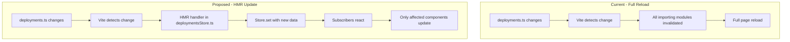

# Deployments HMR Refactor Plan

## Overview

This plan refactors the deployments module to support Hot Module Replacement (HMR) without full page reloads during development. The key change is creating a centralized HMR-aware Svelte store that handles updates to `deployments.ts` reactively.

## Problem Statement

When `deployments.ts` changes during development, the entire app reloads instead of just updating the affected parts. This happens because multiple files directly import the static `deployments.ts` module, creating a dependency cascade that triggers full HMR invalidation.

## Current State Analysis

### Deployments File Structure
The [`deployments.ts`](web/src/lib/deployments.ts) exports a large static object containing:
- Chain configuration (id, name, native currency, RPC URLs, genesis hash)
- Contract definitions (ABIs, addresses, start blocks, linked data)

### Existing Store Pattern
A `DeploymentsStore` already exists in [`remote.ts`](web/src/lib/core/connection/remote.ts:79) but isn't HMR-aware:

```typescript
const deploymentsStore = writable<TypedDeployments>(lastDeployments);

const deployments: DeploymentsStore = {
  subscribe: deploymentsStore.subscribe,
  get current() {
    return lastDeployments;
  },
};
```

### Files with Direct Static Imports

These cause HMR cascade because they import `deployments.ts` at module level:

| File | Usage Pattern | Impact |
|------|---------------|--------|
| [`remote.ts`](web/src/lib/core/connection/remote.ts:1) | Chain info for connection | Critical - creates the store |
| [`types.ts`](web/src/lib/core/connection/types.ts:1) | TypeScript types | Type derivation only |
| [`blockScanner.ts`](web/src/routes/explorer/lib/services/blockScanner.ts:2) | `getChainId()` function | Module-level function |
| [`blockExplorer.ts`](web/src/lib/core/utils/ethereum/blockExplorer.ts:2) | Static chain cast | Module-level constant |
| [`faucet/index.ts`](web/src/lib/core/ui/faucet/index.ts:2) | `getFaucetLink()` function | Module-level function |
| [`transactionDecoder.ts`](web/src/routes/explorer/lib/services/transactionDecoder.ts:8) | Contract lookup | Module-level function |
| [`utils.ts`](web/src/routes/explorer/lib/utils.ts:2) | Contract lookup | Module-level function |
| [`PendingOperationModal.svelte`](web/src/lib/ui/pending-operation/PendingOperationModal.svelte:14) | Chain in tx | Direct usage |
| [`InsufficientFundsModal.svelte`](web/src/lib/core/transaction/InsufficientFundsModal.svelte:10) | Currency symbol | Direct usage |

### Files Using Store Pattern (Already Good)

These access deployments via `getUserContext()` and won't need changes:
- `navbar.svelte`
- `demo/+page.svelte`
- `contracts/+page.svelte`
- `ConfirmCancelDialog.svelte`
- `FaucetButton.svelte`
- `AddressView.svelte`

## Solution Architecture

### Core Concept

Create a single, centralized HMR-aware deployments store at `web/src/lib/deployments-store.ts` that:
1. Holds the current deployment data in a Svelte writable store
2. Accepts HMR updates via `import.meta.hot.accept()`
3. Updates subscribers reactively without full page reload
4. Provides a `deployments.get()` method for synchronous non-reactive access
5. **Triggers full page reload if chain ID changes** (or other critical changes)
6. Centralizes all deployment-related types to avoid type-change HMR cascades

### Architecture Diagram



### New File: `deployments-store.ts`

Location: `web/src/lib/deployments-store.ts`

This single file centralizes:
- All deployment-related types (moved from `types.ts`)
- The HMR-aware Svelte store
- Full reload logic for critical changes (chain ID, etc.)

```typescript
import { writable } from 'svelte/store';
import type { Readable } from 'svelte/store';
import initialDeployments from '$lib/deployments';

// ============================================================================
// Types - Centralized here to avoid HMR cascade from type changes
// ============================================================================

/**
 * The deployment data structure - derived from the static import
 */
export type TypedDeployments = typeof initialDeployments;

/**
 * Chain type derived from deployments
 */
export type ChainInfo = TypedDeployments['chain'];

/**
 * JSON-compatible value types for chain properties
 */
export type JSONValue =
  | string
  | number
  | boolean
  | null
  | JSONValue[]
  | { [key: string]: JSONValue };

/**
 * Known chain properties that can be specified in deployments.
 */
export type KnownChainProperties = {
  averageBlockTimeMs?: number;
  finality?: number;
};

/**
 * Block explorer configuration following viem's Chain format
 */
export type BlockExplorerConfig = {
  name: string;
  url: string;
  apiUrl?: string;
};

/**
 * Block explorers map with default and additional named explorers
 */
export type BlockExplorers = {
  default?: BlockExplorerConfig;
  [key: string]: BlockExplorerConfig | undefined;
};

/**
 * Augments a chain type with optional known properties.
 */
export type AugmentedChain<T> = T & {
  properties?: Record<string, JSONValue> & KnownChainProperties;
  blockExplorers?: BlockExplorers;
};

/**
 * Augmented chain info with optional properties
 */
export type AugmentedChainInfo = AugmentedChain<ChainInfo>;

/**
 * Augmented deployment type with proper chain typing.
 */
export type AugmentedDeployments<T extends { chain: unknown }> = Omit<T, 'chain'> & {
  chain: AugmentedChain<T['chain']>;
};

/**
 * Augmented deployments with access to optional chain properties
 */
export type TypedAugmentedDeployments = AugmentedDeployments<TypedDeployments>;

/**
 * Deployments store interface - Svelte readable with synchronous access
 */
export type DeploymentsStore = Readable<TypedDeployments> & {
  /** Synchronous access to current deployments value */
  get(): TypedDeployments;
};

// ============================================================================
// Store Implementation
// ============================================================================

// Track current deployments for synchronous access
let currentDeployments: TypedDeployments = initialDeployments;

// The writable store holding current deployments
const deploymentsWritable = writable<TypedDeployments>(initialDeployments);

// Update the current value whenever store changes
deploymentsWritable.subscribe((value) => {
  currentDeployments = value;
});

/**
 * The deployments store - reactive with synchronous access via .get()
 *
 * Usage in Svelte components:
 *   $deployments.chain.id  // reactive
 *
 * Usage in non-reactive contexts:
 *   deployments.get().chain.id  // synchronous
 */
export const deployments: DeploymentsStore = {
  subscribe: deploymentsWritable.subscribe,
  get() {
    return currentDeployments;
  },
};

// ============================================================================
// HMR Handling
// ============================================================================

/**
 * Conditions that require a full page reload instead of HMR update.
 * Can be extended with additional checks as needed.
 */
function requiresFullReload(
  oldDeployments: TypedDeployments,
  newDeployments: TypedDeployments,
): boolean {
  // Chain ID change requires full reload - fundamental app state change
  if (oldDeployments.chain.id !== newDeployments.chain.id) {
    console.log('[HMR] Chain ID changed, triggering full reload');
    return true;
  }

  // Genesis hash change means different chain
  if (oldDeployments.chain.genesisHash !== newDeployments.chain.genesisHash) {
    console.log('[HMR] Genesis hash changed, triggering full reload');
    return true;
  }

  // Add more conditions here as needed:
  // - Contract address changes for critical contracts
  // - RPC URL changes
  // etc.

  return false;
}

if (import.meta.hot) {
  // Accept updates to the deployments.ts file
  import.meta.hot.accept('$lib/deployments', (newModule) => {
    if (newModule?.default) {
      const newDeployments = newModule.default as TypedDeployments;

      // Check if we need a full reload
      if (requiresFullReload(currentDeployments, newDeployments)) {
        // Invalidate to trigger full reload
        import.meta.hot?.invalidate();
        return;
      }

      console.log('[HMR] Deployments updated reactively');
      deploymentsWritable.set(newDeployments);
    }
  });

  // Handle self-updates
  import.meta.hot.accept();
}
```

## Refactoring Steps

### Step 1: Create the Deployments Store

Create `web/src/lib/deployments-store.ts` with:
- All deployment-related types (centralized from `types.ts`)
- Writable store initialized from static import
- HMR accept handler for `$lib/deployments` with full reload conditions
- `deployments.get()` method for synchronous access

### Step 2: Update Type Definitions in `types.ts`

Remove deployment types from [`types.ts`](web/src/lib/core/connection/types.ts) and re-export from deployments-store:

```typescript
// Remove these from types.ts:
// - TypedDeployments
// - ChainInfo
// - AugmentedChainInfo
// - DeploymentsStore
// etc.

// Instead, re-export from deployments-store:
export type {
  TypedDeployments,
  ChainInfo,
  AugmentedChainInfo,
  DeploymentsStore,
  // ... etc
} from '$lib/deployments-store';
```

### Step 3: Refactor Static Module-Level Usages

#### Use `deployments.get()` (Recommended for Most Cases)

For files like `blockScanner.ts`:

```typescript
// Before:
import deploymentsFromFiles from '$lib/deployments';

function getChainId(): number {
  return deploymentsFromFiles.chain.id;
}

// After:
import { deployments } from '$lib/deployments-store';

function getChainId(): number {
  return deployments.get().chain.id;
}
```

For files like `faucet/index.ts`:

```typescript
// Before:
import deploymentsFromFiles from '$lib/deployments';

export function getFaucetLink(address: `0x${string}`) {
  return `...chainId=${deploymentsFromFiles.chain.id}...`;
}

// After:
import { deployments } from '$lib/deployments-store';

export function getFaucetLink(address: `0x${string}`) {
  return `...chainId=${deployments.get().chain.id}...`;
}
```

### Step 4: Update `remote.ts`

Modify to use the centralized HMR-aware store instead of creating its own:

```typescript
// Before:
import deploymentsFromFiles from '$lib/deployments';
const deploymentsStore = writable<TypedDeployments>(lastDeployments);

const deployments: DeploymentsStore = {
  subscribe: deploymentsStore.subscribe,
  get current() {
    return lastDeployments;
  },
};

// After:
import { deployments } from '$lib/deployments-store';
// The store is already created, just use it
// Return it in EstablishedConnection
```

### Step 5: Update Svelte Components

For components using direct imports:

```svelte
<!-- Before -->
<script>
  import deploymentsFromFiles from '$lib/deployments';
</script>
{deploymentsFromFiles.chain.nativeCurrency.symbol}

<!-- After: Option 1 - Direct store import -->
<script>
  import { deployments } from '$lib/deployments-store';
</script>
{$deployments.chain.nativeCurrency.symbol}

<!-- After: Option 2 - Via context (preferred if available) -->
<script>
  const { deployments } = getUserContext();
</script>
{$deployments.chain.nativeCurrency.symbol}
```

## Files to Modify

### New Files
1. `web/src/lib/deployments-store.ts` - HMR-aware store with all centralized types

### Modified Files
1. `web/src/lib/core/connection/types.ts` - Remove deployment types, re-export from deployments-store
2. `web/src/lib/core/connection/remote.ts` - Use centralized store from deployments-store
3. `web/src/routes/explorer/lib/services/blockScanner.ts` - Use `deployments.get()`
4. `web/src/routes/explorer/lib/services/transactionDecoder.ts` - Use `deployments.get()`
5. `web/src/routes/explorer/lib/utils.ts` - Use `deployments.get()`
6. `web/src/lib/core/utils/ethereum/blockExplorer.ts` - Use `deployments.get()`
7. `web/src/lib/core/ui/faucet/index.ts` - Use `deployments.get()`
8. `web/src/lib/ui/pending-operation/PendingOperationModal.svelte` - Use store/context
9. `web/src/lib/core/transaction/InsufficientFundsModal.svelte` - Use store/context

## TypeScript Type Handling

Types are centralized in `deployments-store.ts` to avoid any HMR cascade from type changes:

1. `TypedDeployments = typeof initialDeployments` is defined once in `deployments-store.ts`
2. All other files import types from `deployments-store.ts` (not from `deployments.ts`)
3. This means changes to `deployments.ts` only trigger the HMR handler in `deployments-store.ts`
4. `types.ts` will re-export these types for backward compatibility

## Testing the Refactor

### Test 1: HMR Update Without Reload
1. Start the dev server: `pnpm dev`
2. Open the app in browser
3. Make a minor change to `deployments.ts` (e.g., change chain name)
4. Verify: Page should NOT fully reload (check browser console for `[HMR] Deployments updated reactively`)
5. Verify: Components using the store update reactively with new value

### Test 2: Full Reload on Chain ID Change
1. Change the `chain.id` value in `deployments.ts`
2. Verify: Full page reload occurs (check browser console for `[HMR] Chain ID changed, triggering full reload`)
3. Verify: App reinitializes correctly with new chain ID

### Test 3: Full Reload on Genesis Hash Change
1. Change the `chain.genesisHash` value in `deployments.ts`
2. Verify: Full page reload occurs

### Test 4: Contract ABI Update
1. Add or modify a contract ABI in `deployments.ts`
2. Verify: HMR update without full reload
3. Verify: Contract interactions use the new ABI

## API Migration Notes

The API changes from `.current` to `.get()`:

```typescript
// Old API (deprecated):
deployments.current.chain.id

// New API:
deployments.get().chain.id

// Reactive (unchanged):
$deployments.chain.id
```

## Rollback Strategy

If issues arise:
1. All changes are backward compatible
2. Static import still works, just with HMR cascade
3. Can revert individual file changes without breaking functionality

## Benefits

1. **Faster Development**: No full page reloads when contract ABIs or addresses change
2. **State Preservation**: App state maintained during HMR updates
3. **Better DX**: See contract changes reflected immediately
4. **Type Safety**: Maintains full TypeScript type inference
5. **Reactive Updates**: Components automatically re-render with new deployment data

---

## Detailed Implementation Guide

This section provides exact code changes for each file. A fresh context can follow these step-by-step.

### File 1: Create `web/src/lib/deployments-store.ts`

This is the main new file. Create it with the complete code shown in the "New File: deployments-store.ts" section above.

**Key exports:**
- `deployments` - The HMR-aware store with `.get()` method
- All types: `TypedDeployments`, `ChainInfo`, `AugmentedChainInfo`, `DeploymentsStore`, etc.

### File 2: Update `web/src/lib/core/connection/types.ts`

**Current code to remove:**
```typescript
import deploymentsFromFiles from '$lib/deployments';
// ... type definitions using typeof deploymentsFromFiles
export type TypedDeployments = typeof deploymentsFromFiles;
// ... other deployment-related types
```

**Replace with:**
```typescript
// Re-export all deployment-related types from the centralized store
export type {
  TypedDeployments,
  ChainInfo,
  AugmentedChainInfo,
  DeploymentsStore,
  TypedAugmentedDeployments,
  AugmentedDeployments,
  AugmentedChain,
  BlockExplorers,
  BlockExplorerConfig,
  KnownChainProperties,
  JSONValue,
} from '$lib/deployments-store';
```

Keep all non-deployment types in `types.ts` (Signer, Account, ChainConnection, EstablishedConnection, etc.).

### File 3: Update `web/src/lib/core/connection/remote.ts`

**Current imports:**
```typescript
import deploymentsFromFiles from '$lib/deployments';
import { writable } from 'svelte/store';
```

**New imports:**
```typescript
import { deployments } from '$lib/deployments-store';
```

**Remove:** The entire `deploymentsStore` creation logic:
```typescript
// DELETE THIS BLOCK:
let lastDeployments: TypedDeployments = deploymentsFromFiles;

const deploymentsStore = writable<TypedDeployments>(
  lastDeployments,
  (set) => {
    // TODO handle redeployment
  },
);

const deployments: DeploymentsStore = {
  subscribe: deploymentsStore.subscribe,
  get current() {
    return lastDeployments;
  },
};
```

**Update chainInfo creation:** Use `deployments.get()` instead of `deploymentsFromFiles`:
```typescript
const chainInfo: ChainInfo = options?.chainInfoNodeURL
  ? ({
      ...deployments.get().chain,
      rpcUrls: {
        ...deployments.get().chain.rpcUrls,
        default: {
          ...deployments.get().chain.rpcUrls.default,
          http: [options.chainInfoNodeURL],
        },
      },
    } as ChainInfo)
  : deployments.get().chain;
```

**Return statement:** Just return the imported `deployments` store:
```typescript
return {
  connection,
  walletClient,
  publicClient,
  account,
  signer,
  deployments, // Now imported from deployments-store
};
```

### File 4: Update `web/src/routes/explorer/lib/services/blockScanner.ts`

**Current:**
```typescript
import deploymentsFromFiles from '$lib/deployments';

function getChainId(): number {
  return deploymentsFromFiles.chain.id;
}
```

**New:**
```typescript
import { deployments } from '$lib/deployments-store';

function getChainId(): number {
  return deployments.get().chain.id;
}
```

### File 5: Update `web/src/routes/explorer/lib/services/transactionDecoder.ts`

**Current:**
```typescript
import deploymentsFromFiles from '$lib/deployments';

// In findContractByAddress function:
const contracts = deploymentsFromFiles.contracts;
```

**New:**
```typescript
import { deployments } from '$lib/deployments-store';

// In findContractByAddress function:
const contracts = deployments.get().contracts;
```

### File 6: Update `web/src/routes/explorer/lib/utils.ts`

**Current:**
```typescript
import deploymentsFromFiles from '$lib/deployments';

// In findContractByAddress function:
const contracts = deploymentsFromFiles.contracts;
```

**New:**
```typescript
import { deployments } from '$lib/deployments-store';

// In findContractByAddress function:
const contracts = deployments.get().contracts;
```

### File 7: Update `web/src/lib/core/utils/ethereum/blockExplorer.ts`

**Current:**
```typescript
import deploymentsFromFiles from '$lib/deployments';

const chain = deploymentsFromFiles.chain as AugmentedChainInfo;
```

**New:**
```typescript
import { deployments, type AugmentedChainInfo } from '$lib/deployments-store';

// Note: Don't cache at module level - use a getter function
function getChain(): AugmentedChainInfo {
  return deployments.get().chain as AugmentedChainInfo;
}
```

Then update all usages of `chain` to call `getChain()` instead.

### File 8: Update `web/src/lib/core/ui/faucet/index.ts`

**Current:**
```typescript
import deploymentsFromFiles from '$lib/deployments';

export function getFaucetLink(address: `0x${string}`) {
  const separator = PUBLIC_FAUCET_LINK.includes('?') ? '&' : '?';
  return `${PUBLIC_FAUCET_LINK}${separator}chainId=${deploymentsFromFiles.chain.id}&address=${address}`;
}
```

**New:**
```typescript
import { deployments } from '$lib/deployments-store';

export function getFaucetLink(address: `0x${string}`) {
  const separator = PUBLIC_FAUCET_LINK.includes('?') ? '&' : '?';
  return `${PUBLIC_FAUCET_LINK}${separator}chainId=${deployments.get().chain.id}&address=${address}`;
}
```

### File 9: Update `web/src/lib/ui/pending-operation/PendingOperationModal.svelte`

**Current:**
```svelte
<script lang="ts">
  import deployments from '$lib/deployments';
  // ...
  chain: deployments.chain,
</script>
```

**Option A - Use store import:**
```svelte
<script lang="ts">
  import { deployments } from '$lib/deployments-store';
  // ...
  chain: deployments.get().chain,
  // Or reactively: chain: $deployments.chain,
</script>
```

**Option B - Use context (preferred if this component is inside app context):**
```svelte
<script lang="ts">
  import { getUserContext } from '$lib';
  const { deployments } = getUserContext();
  // ...
  chain: $deployments.chain,
</script>
```

### File 10: Update `web/src/lib/core/transaction/InsufficientFundsModal.svelte`

**Current:**
```svelte
<script lang="ts">
  import deployments from '$lib/deployments';
  // ...
  {deployments.chain.nativeCurrency.symbol}
</script>
```

**Option A - Use store import:**
```svelte
<script lang="ts">
  import { deployments } from '$lib/deployments-store';
</script>
<!-- In template -->
{$deployments.chain.nativeCurrency.symbol}
```

**Option B - Use context:**
```svelte
<script lang="ts">
  import { getUserContext } from '$lib';
  const { deployments } = getUserContext();
</script>
<!-- In template -->
{$deployments.chain.nativeCurrency.symbol}
```

---

## Implementation Order

For cleanest implementation, follow this order:

1. **Create `deployments-store.ts`** - The new central store file
2. **Update `types.ts`** - Remove types, re-export from store
3. **Update `remote.ts`** - Use the new store instead of creating one
4. **Update TypeScript service files** - blockScanner, transactionDecoder, utils, blockExplorer, faucet
5. **Update Svelte components** - PendingOperationModal, InsufficientFundsModal
6. **Test HMR** - Verify behavior with various change types

## Notes for Implementation

1. **Import paths**: Use `$lib/deployments-store` consistently (SvelteKit alias)
2. **Type imports**: Use `import type { ... }` when only importing types
3. **Store reactivity**: In Svelte components, use `$deployments` for reactive access
4. **Synchronous access**: Use `deployments.get()` in non-reactive code (event handlers, utility functions)
5. **Context check**: If a component can access `getUserContext()`, prefer that over direct store import for consistency
