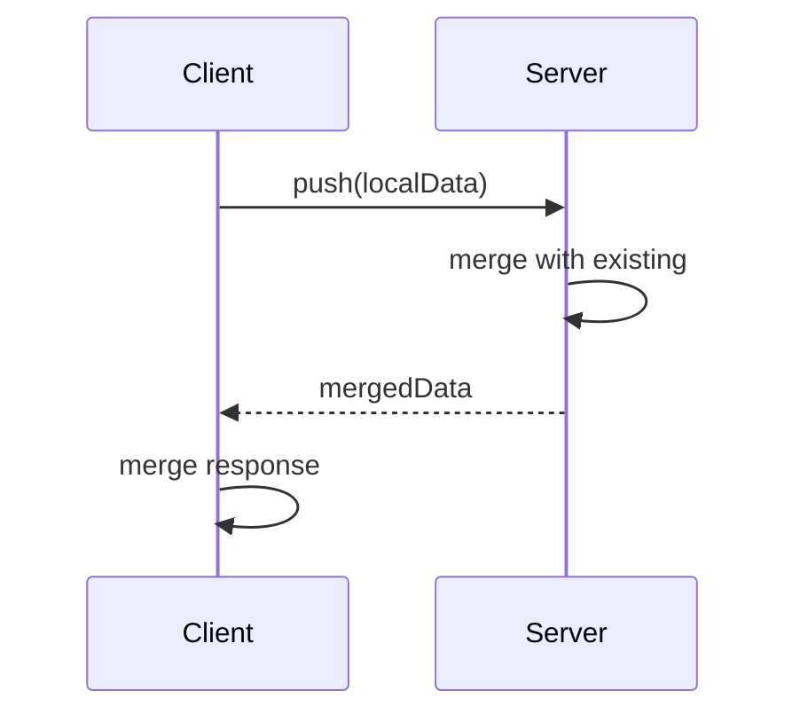
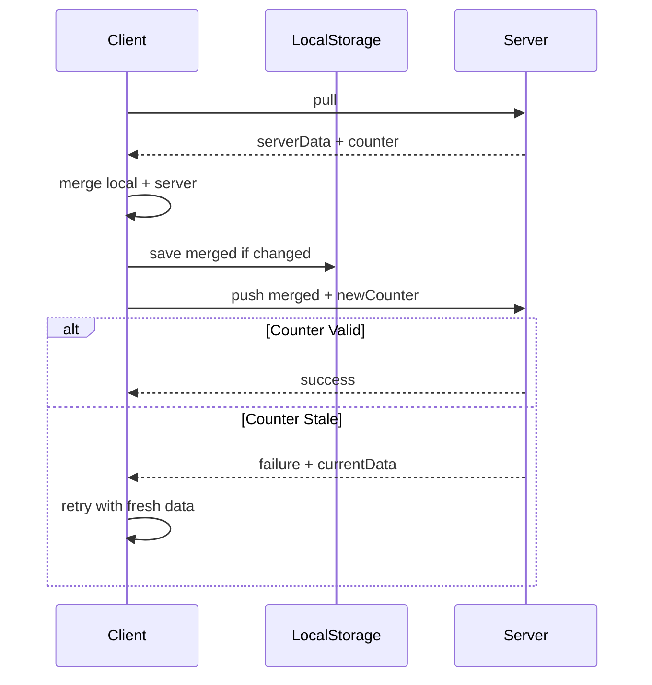

# Dumb Server Sync Refactor Plan

## Overview

This document outlines the changes needed to refactor the sync mechanism to work with a "dumb" server that simply stores and retrieves data, rather than performing server-side merging.

### Problem Statement

The current [`SyncAdapter.push()`](../web/src/lib/core/sync/types.ts:287) interface returns `InternalStorage<S>`, implying the server:
1. Receives local data
2. Merges it with existing server data
3. Returns the merged result

However, our actual server (and intended use with encryption) is "dumb":
- Stores data as-is (opaque blob)
- Uses counter-based optimistic locking
- Returns success/failure, not merged data

### Current Flow (Incorrect)



### Correct Flow (Pull-Merge-Push)



---

## Phase 1: Update SyncAdapter Interface

### 1.1 Modify Pull Response

**File:** [`web/src/lib/core/sync/types.ts`](../web/src/lib/core/sync/types.ts)

```typescript
/**
 * Response from pull operation.
 */
export interface PullResponse<S extends Schema> {
  /** Server data, or null if no data exists */
  data: InternalStorage<S> | null;
  
  /** Server's current counter/version for optimistic locking */
  counter: bigint;
}

/**
 * Response from push operation.
 */
export interface PushResponse {
  /** Whether the push was successful */
  success: boolean;
  
  /** If failed, the server's current counter */
  currentCounter?: bigint;
  
  /** Error message if failed */
  error?: string;
}
```

### 1.2 Update SyncAdapter Interface

```typescript
export interface SyncAdapter<S extends Schema> {
  /**
   * Pull latest state from server.
   * Returns data and counter for optimistic locking.
   */
  pull(account: `0x${string}`): Promise<PullResponse<S>>;

  /**
   * Push local state to server.
   * Server validates counter >= its current counter.
   * 
   * @param account - User account
   * @param data - Data to store
   * @param counter - Counter/version for optimistic locking
   * @returns Success/failure response
   */
  push(
    account: `0x${string}`,
    data: InternalStorage<S>,
    counter: bigint,
  ): Promise<PushResponse>;

  /**
   * Subscribe to real-time updates (optional).
   */
  subscribe?(
    account: `0x${string}`,
    callback: (data: InternalStorage<S>, counter: bigint) => void,
  ): () => void;
}
```

---

## Phase 2: Update createSyncableStore

### 2.1 Track Server Counter

Add state to track the last known server counter:

```typescript
// In createSyncableStore
let serverCounter: bigint = 0n;
```

### 2.2 Rewrite performSyncPush

**Current implementation (incorrect):**
```typescript
async function performSyncPush(): Promise<void> {
  const serverResponse = await syncAdapter.push(account, internalStorage);
  const { merged } = mergeStore(internalStorage, serverResponse, schema);
  // ...
}
```

**New implementation (pull → merge → save → push):**

```typescript
async function performSyncPush(retryCount = 0): Promise<void> {
  if (!syncAdapter || !internalStorage || asyncState.status !== 'ready') return;

  const account = asyncState.account;
  syncDirty = false;

  try {
    (status as { syncState: string }).syncState = 'syncing';
    notifyStatusChange();
    if (retryCount === 0) {
      emitter.emit('sync', { type: 'started' });
    }

    // Step 1: Pull latest from server
    const pullResponse = await syncAdapter.pull(account);
    
    // Step 2: Merge server data with local data (if server has data)
    let dataToSync = internalStorage;
    if (pullResponse.data) {
      const { merged, changes } = mergeStore(internalStorage, pullResponse.data, schema);
      dataToSync = merged;
      
      // Update local state if server had newer data
      if (changes.length > 0) {
        internalStorage = merged;
        asyncState = { ...asyncState, data: merged.data };
        
        // Emit change events for any server-side updates
        // NOTE: We do NOT call notifyStateChange() here - field-level events are sufficient
        // Main subscribe() should only trigger on state transitions (idle/loading/ready)
        for (const change of changes) {
          emitter.emit(
            change.event as keyof StoreEvents<S>,
            change.data as StoreEvents<S>[keyof StoreEvents<S>]
          );
        }
        
        // Step 3: Save merged state to local storage
        await storage.save(storageKey(account), merged);
      }
    }
    
    // Step 4: Push merged data to server with new counter
    const newCounter = BigInt(clock());
    const pushResponse = await syncAdapter.push(account, dataToSync, newCounter);
    
    if (pushResponse.success) {
      // Update server counter tracking
      serverCounter = newCounter;
      
      (status as { lastSyncedAt: number | null }).lastSyncedAt = Date.now();
      (status as { syncError: Error | null }).syncError = null;
      (status as { hasPendingSync: boolean }).hasPendingSync = false;
      emitter.emit('sync', { type: 'completed', timestamp: Date.now() });
      (status as { syncState: string }).syncState = 'idle';
      notifyStatusChange();
    } else {
      // Push was rejected - counter was stale
      // This means another client pushed between our pull and push
      // Retry the entire flow
      if (retryCount < maxRetries) {
        const backoffDelay = retryBackoffMs * Math.pow(2, retryCount);
        setTimeout(() => {
          performSyncPush(retryCount + 1);
        }, backoffDelay);
      } else {
        throw new Error(pushResponse.error || 'Push rejected: counter stale');
      }
    }
  } catch (error) {
    if (retryCount < maxRetries) {
      const backoffDelay = retryBackoffMs * Math.pow(2, retryCount);
      setTimeout(() => {
        performSyncPush(retryCount + 1);
      }, backoffDelay);
    } else {
      (status as { syncError: Error | null }).syncError = error as Error;
      emitter.emit('sync', { type: 'failed', error: error as Error });
      (status as { syncState: string }).syncState = 'idle';
      notifyStatusChange();
    }
  }
}
```

### 2.3 Update performSyncPull

The pull function should also track the counter:

```typescript
async function performSyncPull(account: `0x${string}`): Promise<void> {
  if (!syncAdapter || !internalStorage) return;

  try {
    const pullResponse = await syncAdapter.pull(account);
    
    // Update counter tracking
    serverCounter = pullResponse.counter;

    if (pullResponse.data) {
      const { merged, changes } = mergeStore(internalStorage, pullResponse.data, schema);
      
      if (changes.length > 0) {
        internalStorage = merged;
        
        if (asyncState.status === 'ready') {
          asyncState = { ...asyncState, data: merged.data };
        }

        // Emit field-level change events - no notifyStateChange() needed
        for (const change of changes) {
          emitter.emit(
            change.event as keyof StoreEvents<S>,
            change.data as StoreEvents<S>[keyof StoreEvents<S>]
          );
        }

        await storage.save(storageKey(account), merged);
      }
    }
  } catch (error) {
    console.warn('Failed to pull from server:', error);
  }
}
```

---

## Phase 3: Handle Edge Cases

### 3.1 Race Condition: Concurrent Push

When two clients push simultaneously:
1. Both pull v1 from server
2. Client A pushes v2 (succeeds, counter = 1000)
3. Client B pushes v3 (fails, counter 999 < server's 1000)
4. Client B retries: pulls v2, merges, pushes v4

**Handled by:** Retry loop in `performSyncPush` with exponential backoff.

### 3.2 Offline Mode

When offline:
1. Local mutations continue to work
2. Push attempts fail (network error)
3. `syncOnReconnect` triggers sync when back online

**No changes needed** - current retry logic handles this.

### 3.3 Clock Drift

Counter uses `clock()` (default: `Date.now()`). Server rejects counters in the future.

**Mitigation:** Server allows small tolerance, or we could use server-provided time.

---

## Phase 4: API Changes Summary

### Types to Add

```typescript
// PullResponse and PushResponse (see Phase 1)
```

### SyncAdapter Breaking Changes

| Method | Before | After |
|--------|--------|-------|
| `pull()` | `Promise<InternalStorage<S> \| null>` | `Promise<PullResponse<S>>` |
| `push()` | `Promise<InternalStorage<S>>` | `Promise<PushResponse>` |
| `subscribe()` | `callback: (data: InternalStorage<S>) => void` | `callback: (data: InternalStorage<S>, counter: bigint) => void` |

---

## Phase 5: Testing Requirements

### Unit Tests

| Test Case | Description |
|-----------|-------------|
| Pull-merge-push flow | Verify correct order of operations |
| Push rejected - retry | Counter stale triggers re-pull and retry |
| Max retries exceeded | Error emitted after max retries |
| Merge on pull | Server data merged correctly into local |
| No server data | First push works with empty server |
| Counter tracking | Server counter updated after pull/push |

### Integration Tests

| Test Case | Description |
|-----------|-------------|
| Concurrent pushes | Two clients, one wins, other retries |
| Offline → Online | Pending changes sync on reconnect |
| Cross-tab sync | Changes propagate via storage watch |

---

## Files to Modify

1. **[`web/src/lib/core/sync/types.ts`](../web/src/lib/core/sync/types.ts)**
   - Add `PullResponse<S>` interface
   - Add `PushResponse` interface
   - Update `SyncAdapter<S>` interface

2. **[`web/src/lib/core/sync/createSyncableStore.ts`](../web/src/lib/core/sync/createSyncableStore.ts)**
   - Add `serverCounter` state variable
   - Rewrite `performSyncPush()` to pull-merge-push
   - Update `performSyncPull()` to track counter

3. **[`web/test/lib/core/sync/createSyncableStore.spec.ts`](../web/test/lib/core/sync/createSyncableStore.spec.ts)**
   - Update mock `SyncAdapter` implementation
   - Add new test cases for the sync flow

---

## Migration Notes

This is a **breaking change** for `SyncAdapter` implementations. Existing adapters will need to be updated:

### Before
```typescript
const adapter: SyncAdapter<MySchema> = {
  async pull(account) {
    const data = await fetchFromServer(account);
    return data; // InternalStorage or null
  },
  async push(account, data) {
    await sendToServer(account, data);
    return data; // Echo back
  }
};
```

### After
```typescript
const adapter: SyncAdapter<MySchema> = {
  async pull(account) {
    const { data, counter } = await fetchFromServer(account);
    return { data, counter: BigInt(counter) };
  },
  async push(account, data, counter) {
    const response = await sendToServer(account, data, counter.toString());
    return { 
      success: response.success,
      error: response.error,
      currentCounter: response.currentCounter ? BigInt(response.currentCounter) : undefined
    };
  }
};
```

---

## Related Issues

### notifyStateChange() on Sync Operations

The current implementation incorrectly calls `notifyStateChange()` after sync operations, violating the Phase 6.2.1 design goal that main `subscribe()` should only trigger on state transitions.

This is a **pre-existing issue** that should also be fixed. See: [`plans/fix-notify-state-change-on-sync.md`](./fix-notify-state-change-on-sync.md)

**The new implementation in this plan already omits `notifyStateChange()` calls** - field-level events are sufficient.
