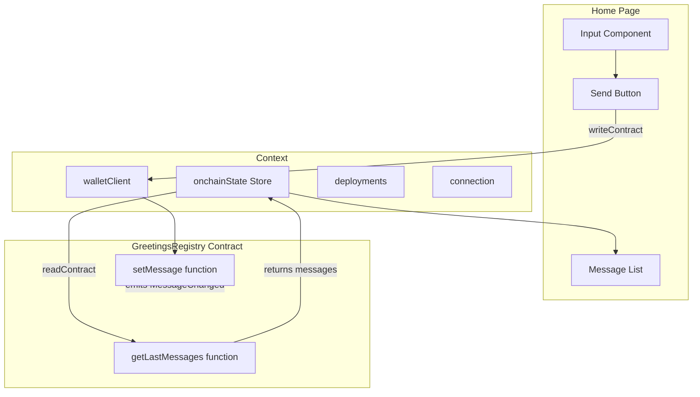

# Home Page Messages Feature Plan

## Overview

Transform the home page from displaying account balance to showing a list of messages from the `onchainState` store, with the ability for users to set their own greeting.

## Current State

The home page ([`web/src/routes/+page.svelte`](../web/src/routes/+page.svelte)) currently:
- Shows the user's ETH balance
- Uses `$balance` store from context
- Has loading and empty states

## Target State

The home page will:
- Display a list of recent messages from the GreetingsRegistry contract
- Provide an input field + button for users to set their greeting
- Use `$onchainState` store from context

## Architecture



## Key Components

### OnchainState Store

**File:** [`web/src/lib/onchain/state.ts`](../web/src/lib/onchain/state.ts)

Already implemented with:
- `Message` type: `{ account: 0x..., message: string, timestamp: number }`
- `subscribe()` - for reactive Svelte store subscription
- `update()` - fetches latest messages from contract

### Contract Interface

**File:** [`contracts/src/GreetingsRegistry/GreetingsRegistry.sol`](../contracts/src/GreetingsRegistry/GreetingsRegistry.sol)

Functions used:
- `setMessage(string calldata message)` - Sets the user's greeting (line 78)
- `getLastMessages(uint256 limit)` - Returns recent messages (line 45)

### Available Shadcn Components

All required components are already installed:
- ✅ `Input` - [`web/src/lib/shadcn/ui/input`](../web/src/lib/shadcn/ui/input/index.ts)
- ✅ `Button` - [`web/src/lib/shadcn/ui/button`](../web/src/lib/shadcn/ui/button/index.ts)
- ✅ `Card` - for message cards
- ✅ `Item` - for message list items
- ✅ `Separator` - for visual separation
- ✅ `Spinner` - for loading states

**No additional shadcn components needed!**

## Implementation Steps

### Step 1: Update Imports

Add the following imports to `+page.svelte`:
- `Input` from shadcn/ui/input
- `MessageSquareIcon` from lucide (replace DollarSignIcon)
- `SendIcon` for the submit button

### Step 2: Extract onchainState from Context

Update the destructuring to include:
```typescript
let {connection, onchainState, walletClient, deployments, account} = $derived(dependencies);
```

### Step 3: Add State Variables

```typescript
let greetingInput = $state('');
let isSubmitting = $state(false);
```

### Step 4: Create setGreeting Function

```typescript
async function setGreeting() {
    if (!greetingInput.trim() || isSubmitting) return;
    
    isSubmitting = true;
    try {
        await walletClient.writeContract({
            ...deployments.current.contracts.GreetingsRegistry,
            functionName: 'setMessage',
            args: [greetingInput],
        });
        greetingInput = '';
        // Refresh messages after a short delay
        setTimeout(() => onchainState.update(), 2000);
    } catch (error) {
        console.error('Failed to set greeting:', error);
    } finally {
        isSubmitting = false;
    }
}
```

### Step 5: Add Effect to Fetch Messages

```typescript
$effect(() => {
    if ($connection.step === connection.targetStep) {
        onchainState.update();
    }
});
```

### Step 6: Update UI Structure

Replace the balance card with:

1. **Header Section**
   - Title: "Greetings Registry"
   - Description: "Share your message with the world"

2. **Input Section** (at top)
   - Text input for greeting message
   - Submit button with loading state

3. **Messages List Section**
   - Card for each message showing:
     - Account address (using Address component)
     - Message text
     - Relative timestamp (e.g., "2 hours ago")

### Step 7: Handle Loading States

- Show spinner while `$onchainState` is loading
- Disable submit button while `isSubmitting`
- Show "No messages yet" when list is empty

## UI Mockup

```
┌─────────────────────────────────────────┐
│           Greetings Registry            │
│     Share your message with the world   │
├─────────────────────────────────────────┤
│ ┌─────────────────────────────┐ ┌─────┐ │
│ │ Enter your greeting...      │ │Send │ │
│ └─────────────────────────────┘ └─────┘ │
├─────────────────────────────────────────┤
│ ┌─────────────────────────────────────┐ │
│ │ 0x1234...5678                       │ │
│ │ Hello World!                        │ │
│ │ 2 hours ago                         │ │
│ └─────────────────────────────────────┘ │
│ ┌─────────────────────────────────────┐ │
│ │ 0xabcd...ef01                       │ │
│ │ GM everyone!                        │ │
│ │ 5 hours ago                         │ │
│ └─────────────────────────────────────┘ │
└─────────────────────────────────────────┘
```

## Files to Modify

| File | Changes |
|------|---------|
| `web/src/routes/+page.svelte` | Complete rewrite of main content |

## Dependencies

All dependencies are already available in the project:
- `@lucide/svelte` - for icons
- Shadcn components - already installed
- Context stores - already configured

## Testing Considerations

1. Test with no messages (empty state)
2. Test message submission flow
3. Test with multiple messages from different accounts
4. Test loading states
5. Test error handling (empty input, transaction failure)
