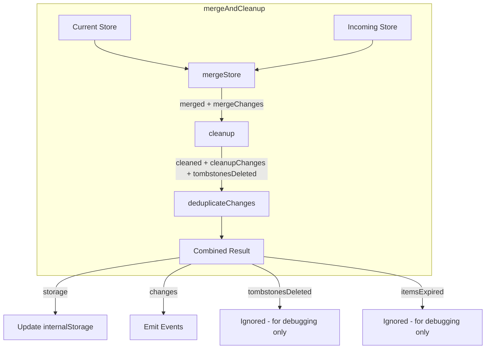

# Merge and Cleanup Refactor Plan

## Summary

Refactor the sync module to combine `merge` and `cleanup` operations into a single `mergeAndCleanup` function that properly emits change events for expired items.

## Problem Statement

Currently, `mergeStore` and `cleanup` are called separately throughout `createSyncableStore.ts`. The issue is:

1. **`cleanup`** removes expired items (where `deleteAt <= now`) but does NOT report these as changes
2. Items that expire during cleanup don't emit `:removed` events
3. Tombstones being cleaned up is invisible to the caller
4. This means subscribers don't get notified when items are removed due to expiration

## Files to Modify

| File | Changes |
|------|---------|
| `web/src/lib/core/sync/cleanup.ts` | Add `CleanupResult` type, modify `cleanup` to return changes |
| `web/src/lib/core/sync/merge.ts` | Add `mergeAndCleanup` function and `MergeAndCleanupResult` type |
| `web/src/lib/core/sync/createSyncableStore.ts` | Replace `mergeStore` + `cleanup` calls with `mergeAndCleanup` |
| `web/src/lib/core/sync/index.ts` | Export new types and `mergeAndCleanup` |

## Detailed Implementation

### 1. Update `cleanup.ts`

**Current signature:**
```typescript
export function cleanup<S extends Schema>(
  storage: InternalStorage<S>,
  schema: S,
  now: number = Date.now(),
): InternalStorage<S>
```

**New signature:**
```typescript
import type {Schema, InternalStorage, DataOf, StoreChange} from './types';

/**
 * Result of cleanup operation.
 */
export interface CleanupResult<S extends Schema> {
  /** Cleaned storage with expired items and tombstones removed */
  storage: InternalStorage<S>;
  
  /** Changes produced by cleanup - expired items become :removed events */
  changes: StoreChange[];
  
  /** True if any tombstones were deleted during cleanup */
  tombstonesDeleted: boolean;
}

export function cleanup<S extends Schema>(
  storage: InternalStorage<S>,
  schema: S,
  now: number = Date.now(),
): CleanupResult<S>
```

**Implementation changes to `cleanup` function:**

1. Add `changes: StoreChange[]` array
2. Add `tombstonesDeleted: boolean` flag
3. When a tombstone is deleted (line ~43-47), set `tombstonesDeleted = true`
4. When an item is deleted due to expiration (line ~62-69), push a `:removed` change:
   ```typescript
   changes.push({
     event: `${field}:removed`,
     data: {key, item}
   });
   ```
5. Return `{storage: result, changes, tombstonesDeleted}` instead of just `result`

**Full updated cleanup function:**

```typescript
export function cleanup<S extends Schema>(
  storage: InternalStorage<S>,
  schema: S,
  now: number = Date.now(),
): CleanupResult<S> {
  const changes: StoreChange[] = [];
  let tombstonesDeleted = false;

  const result: InternalStorage<S> = {
    $version: storage.$version,
    data: {...storage.data} as DataOf<S>,
    $timestamps: {...storage.$timestamps},
    $itemTimestamps: {} as InternalStorage<S>['$itemTimestamps'],
    $tombstones: {} as InternalStorage<S>['$tombstones'],
  };

  for (const field of Object.keys(schema) as (keyof S & string)[]) {
    const fieldDef = schema[field];

    if (fieldDef.__type === 'map') {
      // Copy and filter tombstones
      const tombstones =
        (storage.$tombstones as Record<string, Record<string, number>>)[field] ?? {};
      const cleanedTombstones: Record<string, number> = {};

      for (const [key, deleteAt] of Object.entries(tombstones)) {
        if (deleteAt > now) {
          cleanedTombstones[key] = deleteAt;
        } else {
          tombstonesDeleted = true;
        }
      }

      (result.$tombstones as Record<string, Record<string, number>>)[field] =
        cleanedTombstones;

      // Copy and filter items
      const items = ((storage.data as Record<string, unknown>)[field] ?? {}) as Record<
        string,
        {deleteAt: number}
      >;
      const timestamps =
        (storage.$itemTimestamps as Record<string, Record<string, number>>)[field] ?? {};
      const cleanedItems: Record<string, unknown> = {};
      const cleanedTimestamps: Record<string, number> = {};

      for (const [key, item] of Object.entries(items)) {
        if (item.deleteAt > now) {
          cleanedItems[key] = item;
          if (timestamps[key] !== undefined) {
            cleanedTimestamps[key] = timestamps[key];
          }
        } else {
          // Item expired - emit :removed change
          changes.push({
            event: `${field}:removed`,
            data: {key, item},
          });
        }
      }

      (result.data as Record<string, unknown>)[field] = cleanedItems;
      (result.$itemTimestamps as Record<string, Record<string, number>>)[field] =
        cleanedTimestamps;
    }
    // Permanent fields are never cleaned up - already copied above
  }

  return {storage: result, changes, tombstonesDeleted};
}
```

### 2. Update `merge.ts`

Add at the end of the file:

```typescript
import {cleanup, type CleanupResult} from './cleanup';

/**
 * Result of merge + cleanup operation.
 */
export interface MergeAndCleanupResult<S extends Schema> {
  /** Final storage after merge and cleanup */
  storage: InternalStorage<S>;
  
  /** All changes from both merge AND cleanup combined */
  changes: StoreChange[];
  
  /** True if cleanup deleted any tombstones */
  tombstonesDeleted: boolean;
  
  /** True if cleanup deleted any expired items */
  itemsExpired: boolean;
}

/**
 * Merge two stores and then run cleanup.
 * Returns combined changes from both operations.
 * 
 * Handles deduplication: if an item is added in merge but immediately expires
 * in cleanup, we emit only the final state (removed), not both added then removed.
 */
export function mergeAndCleanup<S extends Schema>(
  current: InternalStorage<S>,
  incoming: InternalStorage<S>,
  schema: S,
  now: number = Date.now(),
): MergeAndCleanupResult<S> {
  // Step 1: Merge
  const {merged, changes: mergeChanges} = mergeStore(current, incoming, schema);
  
  // Step 2: Cleanup
  const {storage: cleaned, changes: cleanupChanges, tombstonesDeleted} = 
    cleanup(merged, schema, now);
  
  // Step 3: Deduplicate changes
  // An item that was :added/:updated in merge but :removed in cleanup
  // should only emit :removed (or nothing if it was :added then :removed)
  const allChanges = deduplicateChanges(mergeChanges, cleanupChanges);
  
  return {
    storage: cleaned,
    changes: allChanges,
    tombstonesDeleted,
    itemsExpired: cleanupChanges.length > 0,
  };
}

/**
 * Deduplicate merge and cleanup changes.
 * 
 * Edge cases:
 * - :added then :removed -> no event (item was added then immediately expired)
 * - :updated then :removed -> :removed only (final state is removed)
 * - :removed (merge) -> :removed (tombstone-based removal from merge, keep it)
 * - :removed (cleanup only) -> :removed (item existed before, now expired)
 */
function deduplicateChanges(
  mergeChanges: StoreChange[],
  cleanupChanges: StoreChange[],
): StoreChange[] {
  const result: StoreChange[] = [];
  
  // Build set of keys that were expired during cleanup
  const expiredKeys = new Set<string>();
  for (const change of cleanupChanges) {
    if (change.event.endsWith(':removed')) {
      const data = change.data as {key: string};
      const fieldName = change.event.split(':')[0];
      expiredKeys.add(`${fieldName}:${data.key}`);
    }
  }
  
  // Build set of keys that were added during merge (to filter out add+remove pairs)
  const addedKeys = new Set<string>();
  for (const change of mergeChanges) {
    if (change.event.endsWith(':added')) {
      const data = change.data as {key: string};
      const fieldName = change.event.split(':')[0];
      addedKeys.add(`${fieldName}:${data.key}`);
    }
  }
  
  // Filter merge changes
  for (const change of mergeChanges) {
    const fieldName = change.event.split(':')[0];
    
    if (change.event.endsWith(':added') || change.event.endsWith(':updated')) {
      const data = change.data as {key: string};
      const keyPath = `${fieldName}:${data.key}`;
      
      if (expiredKeys.has(keyPath)) {
        // Item was added/updated but then expired - skip this change
        continue;
      }
    }
    
    result.push(change);
  }
  
  // Filter cleanup changes - skip :removed for items that were just :added
  // (add+remove = no net change, item was never visible)
  for (const change of cleanupChanges) {
    if (change.event.endsWith(':removed')) {
      const data = change.data as {key: string};
      const fieldName = change.event.split(':')[0];
      const keyPath = `${fieldName}:${data.key}`;
      
      if (addedKeys.has(keyPath)) {
        // Item was added then removed - no net change, skip
        continue;
      }
    }
    
    result.push(change);
  }
  
  return result;
}
```

### 3. Update `createSyncableStore.ts`

#### Change imports (around line 37-39):

**Before:**
```typescript
import {cleanup} from './cleanup';
import {mergeStore} from './merge';
```

**After:**
```typescript
import {cleanup} from './cleanup';
import {mergeStore, mergeAndCleanup} from './merge';
```

#### Location 1: `performSyncPush` (lines 426-453)

**Before:**
```typescript
const {merged, changes} = mergeStore(
  internalStorage,
  pullResponse.data,
  schema,
);

// Run cleanup on merged data to remove expired items
const cleanedMerged = cleanup(merged, schema, clock());
dataToSync = cleanedMerged;

// Update local state if server had newer data
if (changes.length > 0) {
  internalStorage = cleanedMerged;
```

**After:**
```typescript
const {storage: cleanedMerged, changes} = mergeAndCleanup(
  internalStorage,
  pullResponse.data,
  schema,
  clock(),
);
dataToSync = cleanedMerged;

// Update local state if there were any changes (from merge or cleanup)
if (changes.length > 0) {
  internalStorage = cleanedMerged;
```

#### Location 2: `performSyncPull` (lines 519-553)

**Before:**
```typescript
// Merge server data with local state
const {merged, changes} = mergeStore(
  internalStorage,
  pullResponse.data,
  schema,
);

// Run cleanup on merged data to remove expired items
const cleanedMerged = cleanup(merged, schema, clock());

if (changes.length > 0) {
  internalStorage = cleanedMerged;
```

**After:**
```typescript
// Merge server data with local state and cleanup expired items
const {storage: cleanedMerged, changes} = mergeAndCleanup(
  internalStorage,
  pullResponse.data,
  schema,
  clock(),
);

if (changes.length > 0) {
  internalStorage = cleanedMerged;
```

#### Location 3: Storage watch handler (lines 691-719)

**Before:**
```typescript
// Merge with current state
const {merged, changes} = mergeStore(
  internalStorage,
  newValue,
  schema,
);

// Run cleanup on merged data to remove expired items
const cleanedMerged = cleanup(merged, schema, clock());

if (changes.length > 0) {
  internalStorage = cleanedMerged;
```

**After:**
```typescript
// Merge with current state and cleanup expired items
const {storage: cleanedMerged, changes} = mergeAndCleanup(
  internalStorage,
  newValue,
  schema,
  clock(),
);

if (changes.length > 0) {
  internalStorage = cleanedMerged;
```

#### Location 4: Initial load in `setAccount` (lines 663-665)

**Before:**
```typescript
// Cleanup expired items
internalStorage = cleanup(internalStorage, schema, clock());
```

**After:**
```typescript
// Cleanup expired items
// Note: We ignore changes here because the store isn't ready yet.
// Subscribers haven't seen these items, so no need to emit :removed events.
const {storage: cleanedStorage} = cleanup(internalStorage, schema, clock());
internalStorage = cleanedStorage;
```

### 4. Update `index.ts`

**Before (line 59-60):**
```typescript
// Cleanup function
export {cleanup} from './cleanup';
```

**After:**
```typescript
// Cleanup function
export {cleanup, type CleanupResult} from './cleanup';

// Merge and cleanup combined
export {mergeAndCleanup, type MergeAndCleanupResult} from './merge';
```

## Design Decisions

### Initial Load: Don't emit changes

For initial load in `setAccount`, cleanup runs **before** the ready event is emitted:

1. The store hasn't transitioned to `ready` yet
2. Subscribers haven't seen those items yet
3. Emitting `:removed` events for items subscribers never saw would be confusing

**Decision**: On initial load, just call cleanup for its storage-cleaning effect and ignore the changes.

### Handling `tombstonesDeleted` Flag

The `tombstonesDeleted` flag indicates that expired tombstones were removed during cleanup.

**Decision**: We return the flag for observability/debugging, but callers should typically **ignore it**:

```typescript
const {storage, changes, tombstonesDeleted} = mergeAndCleanup(...);

// Only emit/save/sync based on changes, ignore tombstonesDeleted
// Tombstones will be cleaned up on the next regular save/sync anyway
if (changes.length > 0) {
  // emit events, save, sync...
}
```

Reasoning: Tombstones will be cleaned up anyway on the next regular save/sync triggered by actual data changes. The overhead of immediate cleanup isn't worth it.

### Change Deduplication

When combining merge and cleanup changes, we handle edge cases:

| Merge Event | Cleanup Event | Final Result |
|-------------|---------------|--------------|
| `:added` | `:removed` | No event (item was added then immediately expired) |
| `:updated` | `:removed` | `:removed` only (final state is removed) |
| none | `:removed` | `:removed` (item existed before, now expired) |
| `:removed` | none | `:removed` (tombstone-based removal from merge) |

## Data Flow Diagram



## Testing Notes

After implementation, verify:

1. Items that expire during sync emit `:removed` events
2. Initial load does NOT emit `:removed` events for cleaned items
3. Add+remove pairs during merge+cleanup result in no events
4. Update+remove pairs emit only `:removed`
5. Existing merge behavior is unchanged for non-expired items
