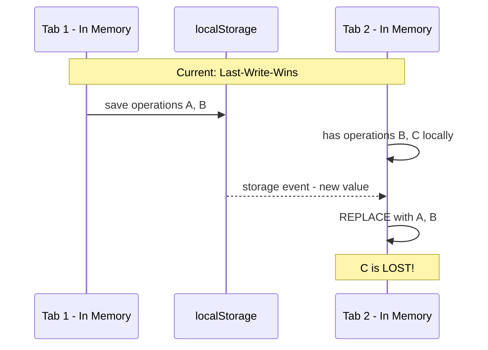
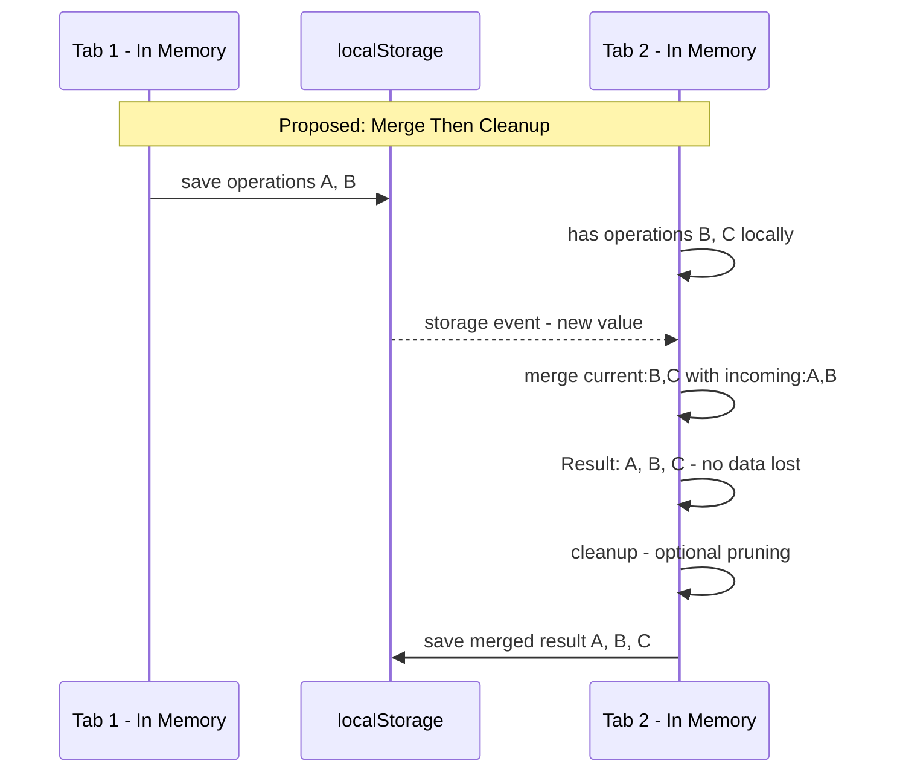
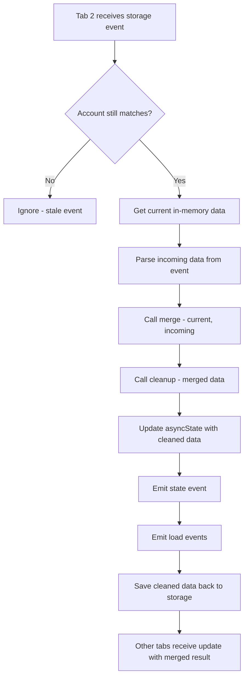
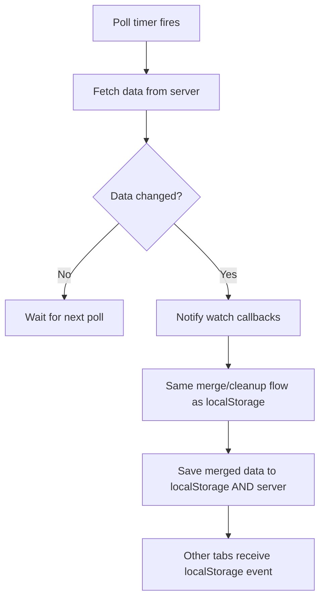

# Merge and Cleanup Sync Design for createAccountStore

## Quick Start for Implementation

**Goal**: Add merge and cleanup functions to `createAccountStore` to prevent data loss during cross-tab sync.

### Files to Modify

1. **[`web/src/lib/core/account/createAccountStore.ts`](../web/src/lib/core/account/createAccountStore.ts)**
   - Add `merge` (required) and `cleanup` (optional) to `AccountStoreConfig` type at line 68
   - Extract them in the config destructuring around line 116
   - Modify the watch callback around line 250-267 to use merge → cleanup → conditional save

2. **[`web/src/lib/account/AccountData.ts`](../web/src/lib/account/AccountData.ts)**
   - Add `mergeAccountData` function (keep current data, add new from incoming)
   - Add `cleanupAccountData` function (no-op for now)
   - Pass them to `createAccountStore` config around line 102

### Key Implementation Details

**Config type changes** (createAccountStore.ts ~line 68):
```typescript
type AccountStoreConfig<D, E, M> = {
    // ... existing fields ...
    merge: (current: D, incoming: D) => D;  // REQUIRED
    cleanup?: (data: D) => D;               // Optional, defaults to no-op
};
```

**Config destructuring** (createAccountStore.ts ~line 116):
```typescript
const {
    // ... existing ...
    merge,  // Required, no default
    cleanup = ((data) => data) as (data: D) => D,  // Default to no-op
} = config;
```

**Watch callback modification** (createAccountStore.ts ~line 250):
```typescript
unwatchStorage = storage.watch(key, async (_, newValue) => {
    if (asyncState.status !== 'ready' || asyncState.account !== newAccount) return;
    
    const currentData = asyncState.data;
    const incomingData = newValue ?? defaultData();
    
    const mergedData = merge(currentData, incomingData);
    const cleanedData = cleanup(mergedData);
    
    asyncState = {status: 'ready', account: newAccount, data: cleanedData};
    emitter.emit('state', asyncState);
    _emitLoadEvents(cleanedData);
    
    // Only save if we contributed new data (prevents save loops)
    const hasLocalChanges = JSON.stringify(cleanedData) !== JSON.stringify(incomingData);
    if (hasLocalChanges) {
        _save(newAccount, cleanedData).catch(() => {});
    }
});
```

**AccountData.ts merge function**:

⚠️ **CRITICAL**: The merge function MUST be **stable/convergent** to prevent infinite sync loops. See "Merge Function Stability Requirements" section for details.

```typescript
/**
 * Stable merge: Union of all operations.
 * - Keeps all operations from current
 * - Adds new operations from incoming (those with IDs not in current)
 * - This is STABLE because after one sync round, all tabs converge to the same data
 */
function mergeAccountData(current: AccountData, incoming: AccountData): AccountData {
    const merged: AccountData = { operations: { ...current.operations } };
    for (const [idStr, operation] of Object.entries(incoming.operations)) {
        const id = Number(idStr);
        if (!(id in merged.operations)) {
            merged.operations[id] = operation;
        }
    }
    return merged;
}

function cleanupAccountData(data: AccountData): AccountData {
    return data;  // No-op for now
}
```

---

## Overview

Extend [`createAccountStore.ts`](../web/src/lib/core/account/createAccountStore.ts) to support robust data synchronization with configurable **merge** and **cleanup** functions. This design enables:

1. **Cross-tab localStorage sync** (current use case) - merge changes from other tabs
2. **Future server sync** - merge changes from remote polling/push
3. **Data integrity** - no data loss during sync operations
4. **Extensibility** - merge/cleanup logic is provided by the consumer

## Current Behavior



## Proposed Behavior



## Interface Design

### New Config Options for createAccountStore

```typescript
type AccountStoreConfig<D, E, M> = {
    // ... existing config ...
    
    /**
     * Merge incoming data with current in-memory data.
     * Called when external changes are detected via watch.
     *
     * REQUIRED - consumers must explicitly define their merge strategy.
     *
     * ⚠️ CRITICAL: The merge function MUST be STABLE/CONVERGENT.
     * See "Merge Function Stability Requirements" section below.
     *
     * @param current - Current in-memory data state
     * @param incoming - Incoming data from storage/remote
     * @returns Merged data combining both sources
     */
    merge: (current: D, incoming: D) => D;
    
    /**
     * Cleanup data after merge - remove tombstones, prune old entries, etc.
     * Called after merge completes.
     *
     * @param data - Merged data to clean up
     * @returns Cleaned data - can be same reference if mutated
     *
     * Default: Returns data unchanged - no cleanup
     */
    cleanup?: (data: D) => D;
};
```

### Default Implementation

```typescript
// merge is REQUIRED - no default provided
// Consumers must explicitly define their merge strategy

// Default cleanup: no-op
const defaultCleanup = <D>(data: D): D => data;
```

## ⚠️ Merge Function Stability Requirements

**CRITICAL**: The merge function MUST be **stable/convergent** to prevent infinite sync loops between tabs.

### What is a Stable Merge?

A merge function is stable when all tabs eventually converge to the same data, regardless of which tab received the event first. Mathematically:

```
After sync completes:
Tab1.data === Tab2.data === Tab3.data === ...
```

### ❌ UNSTABLE Example: "Always Prefer Local"

```typescript
// BAD - DO NOT USE - Causes infinite loops!
function unstableMerge(current: Data, incoming: Data): Data {
    // Always keeps local data, ignores incoming
    return current;
}
```

**Why it fails:**
```
Tab 1 has: {a: 1}      Tab 2 has: {b: 2}
Tab 1 saves {a: 1} → Tab 2 receives, merges to {b: 2}, saves
Tab 2 saves {b: 2} → Tab 1 receives, merges to {a: 1}, saves
Tab 1 saves {a: 1} → Tab 2 receives, merges to {b: 2}, saves
... infinite loop! Data never converges.
```

### ❌ ALSO UNSTABLE: "Current Wins on Conflict"

```typescript
// ALSO BAD - Still causes infinite loops when same key has different values!
function alsoUnstable(current: Data, incoming: Data): Data {
    return {
        operations: {
            ...incoming.operations,  // Take all from incoming
            ...current.operations,   // Current overwrites if same ID
        }
    };
}
```

**Why it fails with conflicting values:**
```
Tab 1 has: {a:1, b:2}      Tab 2 has: {a:1, b:3}

Tab 1 saves {a:1, b:2} → Tab 2 receives
Tab 2 merges: {...{a:1,b:2}, ...{a:1,b:3}} = {a:1, b:3}  // Tab 2's b wins
Tab 2 saves {a:1, b:3} → Tab 1 receives
Tab 1 merges: {...{a:1,b:3}, ...{a:1,b:2}} = {a:1, b:2}  // Tab 1's b wins
... infinite loop! Each tab keeps its own value.
```

### ✅ STABLE Example 1: "Pure Union - No Conflicts"

When keys are guaranteed unique (like timestamp-based IDs), union is stable:

```typescript
// GOOD - Works when IDs are unique across tabs
function stableUnionMerge(current: Data, incoming: Data): Data {
    const merged = { ...current.operations };
    for (const [id, op] of Object.entries(incoming.operations)) {
        if (!(id in merged)) {
            merged[id] = op;  // Add new, never overwrite
        }
        // Same ID = same operation, skip (first-write-wins)
    }
    return { operations: merged };
}
```

**Why it works:**
```
Tab 1 adds op 100: {100: opA}    Tab 2 adds op 200: {200: opB}

Tab 1 saves {100: opA} → Tab 2 receives
Tab 2 merges: adds 100, keeps 200 = {100: opA, 200: opB}, saves
Tab 2 saves {100: opA, 200: opB} → Tab 1 receives
Tab 1 merges: has 100, adds 200 = {100: opA, 200: opB}
JSON.stringify: same data, no save!
... sync complete.
```

### ✅ STABLE Example 2: "Deterministic Tiebreaker"

When conflicts CAN occur, use a deterministic tiebreaker:

```typescript
// GOOD - Uses timestamps for conflict resolution
function stableTimestampMerge(current: Data, incoming: Data): Data {
    const merged = { ...current.operations };
    for (const [id, incomingOp] of Object.entries(incoming.operations)) {
        const currentOp = merged[id];
        if (!currentOp) {
            merged[id] = incomingOp;  // New operation
        } else if (incomingOp.updatedAt > currentOp.updatedAt) {
            merged[id] = incomingOp;  // Incoming is newer
        }
        // else: current is newer or same, keep current
    }
    return { operations: merged };
}
```

### Stability Strategies

| Strategy | Stable? | When to Use |
|----------|---------|-------------|
| Always prefer local | ❌ No | Never |
| Union (no conflicts) | ✅ Yes | Unique IDs guaranteed |
| Timestamp tiebreaker | ✅ Yes | Data has timestamps |
| Version vector | ✅ Yes | Complex conflict resolution |
| CRDT-based | ✅ Yes | Eventually consistent systems |

### Our AccountData Merge is Stable

The `mergeAccountData` function is stable because:
- **Operation IDs are timestamps** (`Date.now()` + increment)
- **IDs are unique per tab** (increment prevents collisions within tab)
- **Cross-tab collisions are extremely rare** (same millisecond + same increment = near impossible)
- **Same ID = same operation** (first-write-wins is acceptable for immutable operations)

```typescript
function mergeAccountData(current: AccountData, incoming: AccountData): AccountData {
    const merged: AccountData = { operations: { ...current.operations } };
    // Add operations from incoming that don't exist in current (pure union)
    for (const [idStr, operation] of Object.entries(incoming.operations)) {
        if (!(Number(idStr) in merged.operations)) {
            merged.operations[Number(idStr)] = operation;
        }
        // Same ID exists: first-write-wins (skip incoming)
        // This is stable because IDs are unique timestamps
    }
    return merged;
}
```

**Important**: This merge assumes operations are **immutable** (created once, never modified). If operations can be updated, add a timestamp field and use timestamp-based tiebreaking.

## Implementation Changes

### 1. Update Config Type

Add `merge` and `cleanup` to [`AccountStoreConfig`](../web/src/lib/core/account/createAccountStore.ts:68):

```typescript
type AccountStoreConfig<D, E, M> = {
    defaultData: () => D;
    mutations: M;
    storage: AsyncStorage<D>;
    storageKey: (account: `0x${string}`) => string;
    account: AccountStore;
    onLoad?: (data: D) => Array<{event: keyof E & string; data: E[keyof E]}>;
    onClear?: () => Array<{event: keyof E & string; data: E[keyof E]}>;
    
    // NEW: Merge is REQUIRED, cleanup is optional
    merge: (current: D, incoming: D) => D;
    cleanup?: (data: D) => D;
};
```

### 2. Modify Watch Callback

Update the watch callback in [`setAccount`](../web/src/lib/core/account/createAccountStore.ts:198) around line 252-267:

```typescript
// Set up watch for external storage changes if supported
if (isWatchable(storage)) {
    const key = storageKey(newAccount);
    unwatchStorage = storage.watch(key, async (_, newValue) => {
        // Ensure still on same account
        if (asyncState.status !== 'ready' || asyncState.account !== newAccount) {
            return;
        }

        // Get current data and incoming data
        const currentData = asyncState.data;
        const incomingData = newValue ?? defaultData();
        
        // MERGE: Combine current and incoming
        const mergedData = merge(currentData, incomingData);
        
        // CLEANUP: Prune old entries, remove tombstones, etc.
        const cleanedData = cleanup(mergedData);

        // Update local state always
        asyncState = {status: 'ready', account: newAccount, data: cleanedData};
        emitter.emit('state', asyncState);

        // Emit load events for the new data
        _emitLoadEvents(cleanedData);
        
        // Only save back if our merge contributed new data
        // This prevents infinite save loops between tabs
        // Using JSON.stringify comparison - efficient enough for typical data sizes
        const hasLocalChanges = JSON.stringify(cleanedData) !== JSON.stringify(incomingData);
        if (hasLocalChanges) {
            _save(newAccount, cleanedData).catch(() => {});
        }
    });
}
```

**Note**: The JSON.stringify comparison is simple and correct. This only runs on external watch events (not every mutation), so performance is not a concern for typical data sizes (<100KB). If profiling shows this is a bottleneck, the merge function interface could be extended to return a `hasChanges` flag.

### 3. Extract Config Values

At the top of createAccountStore function:

```typescript
export function createAccountStore<D, E, M>(config: AccountStoreConfig<D, E, M>) {
    const {
        defaultData,
        mutations,
        storage,
        storageKey,
        account,
        onLoad,
        onClear,
        // REQUIRED: merge function - consumers must provide
        merge,
        // OPTIONAL: cleanup defaults to no-op
        cleanup = ((data) => data) as (data: D) => D,
    } = config;
    
    // ... rest of implementation
}
```

## AccountData.ts Merge Implementation

Example merge implementation for [`AccountData.ts`](../web/src/lib/account/AccountData.ts):

```typescript
/**
 * Merge strategy: Current data takes precedence.
 * Only adds new operation IDs from incoming data.
 * 
 * This preserves any in-flight operations that haven't been saved yet.
 */
function mergeAccountData(current: AccountData, incoming: AccountData): AccountData {
    const merged: AccountData = {
        operations: { ...current.operations },
    };
    
    // Add operations from incoming that don't exist in current
    for (const [idStr, operation] of Object.entries(incoming.operations)) {
        const id = Number(idStr);
        if (!(id in merged.operations)) {
            merged.operations[id] = operation;
        }
    }
    
    return merged;
}

/**
 * Cleanup strategy: No-op for now.
 * Could be extended to:
 * - Remove completed operations older than X days
 * - Remove tombstoned operations
 * - Prune failed operations
 */
function cleanupAccountData(data: AccountData): AccountData {
    // No cleanup for now
    return data;
}

// Usage in createAccountData:
const store = createAccountStore<AccountData, Events, typeof mutations>({
    account,
    storage,
    storageKey: (addr) => `...`,
    defaultData: () => ({operations: {}}),
    onClear: () => [{event: 'operations:cleared', data: undefined}],
    onLoad: (data) => [{event: 'operations:set', data: data.operations}],
    mutations,
    
    // NEW: Provide merge and cleanup
    merge: mergeAccountData,
    cleanup: cleanupAccountData,
});
```

## Future: Server Sync Adapter

The design naturally supports a server sync adapter:

```typescript
/**
 * Future: Remote storage adapter with polling.
 * Implements WatchableStorage<T> interface.
 */
function createRemoteStorageAdapter<T>(options: {
    baseUrl: string;
    pollInterval?: number; // milliseconds, default 30000
}): WatchableStorage<T> {
    const { baseUrl, pollInterval = 30000 } = options;
    
    // Map of key -> { callbacks, timer, lastValue }
    const watchers = new Map<string, {
        callbacks: Set<StorageChangeCallback<T>>;
        timer: ReturnType<typeof setInterval>;
        lastValue: T | undefined;
    }>();
    
    async function fetchData(key: string): Promise<T | undefined> {
        const response = await fetch(`${baseUrl}/${key}`);
        if (!response.ok) return undefined;
        return response.json();
    }
    
    return {
        async load(key: string): Promise<T | undefined> {
            return fetchData(key);
        },
        
        async save(key: string, data: T): Promise<void> {
            await fetch(`${baseUrl}/${key}`, {
                method: 'PUT',
                headers: { 'Content-Type': 'application/json' },
                body: JSON.stringify(data),
            });
        },
        
        async remove(key: string): Promise<void> {
            await fetch(`${baseUrl}/${key}`, { method: 'DELETE' });
        },
        
        async exists(key: string): Promise<boolean> {
            const response = await fetch(`${baseUrl}/${key}`, { method: 'HEAD' });
            return response.ok;
        },
        
        watch(key: string, callback: StorageChangeCallback<T>): () => void {
            let watcher = watchers.get(key);
            
            if (!watcher) {
                // Start polling for this key
                const timer = setInterval(async () => {
                    const newValue = await fetchData(key);
                    const w = watchers.get(key);
                    if (!w) return;
                    
                    // Only notify if value changed
                    if (JSON.stringify(newValue) !== JSON.stringify(w.lastValue)) {
                        w.lastValue = newValue;
                        for (const cb of w.callbacks) {
                            cb(key, newValue);
                        }
                    }
                }, pollInterval);
                
                watcher = {
                    callbacks: new Set(),
                    timer,
                    lastValue: undefined,
                };
                watchers.set(key, watcher);
            }
            
            watcher.callbacks.add(callback);
            
            // Return unsubscribe
            return () => {
                const w = watchers.get(key);
                if (w) {
                    w.callbacks.delete(callback);
                    if (w.callbacks.size === 0) {
                        clearInterval(w.timer);
                        watchers.delete(key);
                    }
                }
            };
        },
    };
}
```

### Combining Multiple Storage Adapters

For bi-directional sync, create a composite adapter:

```typescript
/**
 * Composite storage: localStorage + remote sync.
 * Writes to both, reads from localStorage first.
 */
function createCompositeStorage<T>(
    primary: WatchableStorage<T>,   // localStorage
    secondary: WatchableStorage<T>, // remote
): WatchableStorage<T> {
    return {
        async load(key: string): Promise<T | undefined> {
            // Try primary first, fall back to secondary
            const local = await primary.load(key);
            if (local !== undefined) return local;
            return secondary.load(key);
        },
        
        async save(key: string, data: T): Promise<void> {
            // Save to both
            await Promise.all([
                primary.save(key, data),
                secondary.save(key, data).catch(() => {}), // Don't fail if remote fails
            ]);
        },
        
        async remove(key: string): Promise<void> {
            await Promise.all([
                primary.remove(key),
                secondary.remove(key).catch(() => {}),
            ]);
        },
        
        async exists(key: string): Promise<boolean> {
            return primary.exists(key);
        },
        
        watch(key: string, callback: StorageChangeCallback<T>): () => void {
            // Watch both sources
            const unsub1 = primary.watch(key, callback);
            const unsub2 = secondary.watch(key, callback);
            
            return () => {
                unsub1();
                unsub2();
            };
        },
    };
}
```

## Flow Diagrams

### Cross-Tab Sync Flow



### Future Server Sync Flow



## Implementation Checklist

1. **Update types in createAccountStore.ts**
   - [ ] Add `merge` (required) and `cleanup` (optional) to `AccountStoreConfig` type
   - [ ] Extract merge from config, add default for cleanup only

2. **Modify watch callback**
   - [ ] Get current data before processing incoming
   - [ ] Call merge function
   - [ ] Call cleanup function
   - [ ] Save merged result back to storage

3. **Update AccountData.ts**
   - [ ] Create `mergeAccountData` function
   - [ ] Create `cleanupAccountData` function - can be no-op initially
   - [ ] Pass merge and cleanup to createAccountStore config

4. **Testing**
   - [ ] Test cross-tab sync with merge
   - [ ] Test that in-memory operations are not lost
   - [ ] Test that new operations from other tabs are added
   - [ ] Test cleanup function is called

## Edge Cases

1. **Rapid saves from multiple tabs**: The merge function ensures no data loss. Each tab's unique operations are preserved.

2. **Concurrent modifications to same operation**: Current design keeps the in-memory version. Future enhancement could add timestamps for conflict resolution.

3. **Storage full**: Cleanup function could be used to prune old data when storage is nearly full.

4. **Server offline**: Composite adapter should gracefully handle remote failures and continue with local storage.

## Summary

This design adds merge and cleanup capabilities to `createAccountStore` while:
- **Merge is required** - consumers must explicitly define their merge strategy
- **Cleanup is optional** - defaults to no-op if not provided
- Keeping the store generic - merge/cleanup logic provided by consumer
- Supporting future server sync - same merge/cleanup flow applies
- Preventing data loss - in-memory data is preserved during sync
