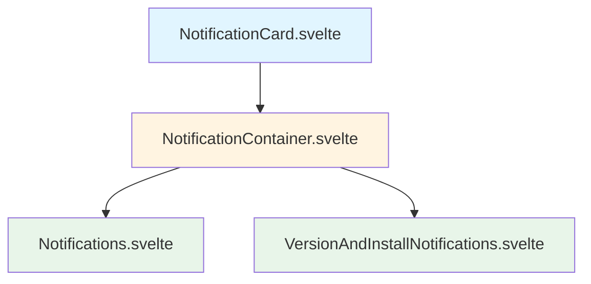

# Notification Components Refactoring Plan

## Overview
Refactor the duplicate notification markup in `Notifications.svelte` and `VersionAndInstallNotfications.svelte` into a reusable component hierarchy.

## Component Hierarchy



## Components to Create

### 1. NotificationCard.svelte
**Location:** `web/src/lib/core/notifications/NotificationCard.svelte`

**Purpose:** Reusable single notification card component

**Props:**
```typescript
interface NotificationCardProps {
  title: string;
  body?: string;
  icon?: string;  // URL to image
  actions?: NotificationAction[];
  onClose?: () => void;
  class?: string;
  classes?: Partial<NotificationClasses>;
}

interface NotificationAction {
  label: string;
  onClick: () => void;
  primary?: boolean;  // If true, uses primaryButton class, otherwise button class
}
```

**Responsibilities:**
- Render the single notification card with icon, title, body, actions, and close button
- Apply styling via `cn()` utility with `classes.*` props
- Use fly transition

---

### 2. NotificationContainer.svelte
**Location:** `web/src/lib/core/notifications/NotificationContainer.svelte`

**Purpose:** Generic container that renders a list of notification cards

**Props:**
```typescript
interface NotificationContainerProps {
  notifications: NotificationItem[];
  class?: string;
  classes?: Partial<NotificationClasses>;
}

interface NotificationItem {
  id: string;
  title: string;
  body?: string;
  icon?: string;
  actions?: NotificationAction[];
  onClose?: () => void;
}
```

**Responsibilities:**
- Render the outer `aria-live="assertive"` container
- Iterate over notifications array
- Render each notification using `NotificationCard`

---

### 3. Notifications.svelte (Refactored)
**Location:** `web/src/lib/core/notifications/Notifications.svelte` (update existing)

**Changes:**
- Remove the duplicate markup
- Transform `$notifications` array into `NotificationItem[]` format
- Pass to `NotificationContainer`

**Example:**
```svelte
<NotificationContainer 
  notifications={$notifications.map(n => ({
    id: n.id,
    title: n.data.title,
    body: n.data.options?.body,
    icon: n.data.options?.icon,
    actions: [
      { label: 'ok', onClick: () => notifications.onClick(n.id) },
      { label: 'dismiss', onClick: () => notifications.remove(n.id) }
    ]
  }))}
  {class}
  {classes}
/>
```

---

### 4. VersionAndInstallNotifications.svelte (Refactored)
**Location:** `web/src/lib/core/service-worker/VersionAndInstallNotfications.svelte` (update existing)

**Changes:**
- Remove the duplicate markup
- Create single `NotificationItem` when SW update is available
- Pass to `NotificationContainer`

**Example:**
```svelte
<NotificationContainer 
  notifications={$serviceWorker.updateAvailable && $serviceWorker.registration ? [{
    id: 'sw-update',
    title: 'A new version is available.',
    body: 'Reload to get the update.',
    icon: src,
    alt: alt,
    actions: [
      { label: 'Reload', onClick: accept, primary: true },
      { label: 'Dismiss', onClick: skip }
    ],
    onClose: skip
  }] : []}
  {class}
  {classes}
/>
```

---

## File Changes Summary

### New Files
- `web/src/lib/core/notifications/NotificationCard.svelte`
- `web/src/lib/core/notifications/NotificationContainer.svelte`

### Modified Files
- `web/src/lib/core/notifications/Notifications.svelte` - Simplify to use `NotificationContainer`
- `web/src/lib/core/service-worker/VersionAndInstallNotfications.svelte` - Simplify to use `NotificationContainer`

### No Changes Needed
- `web/src/lib/core/notifications/types.ts` - Existing `NotificationClasses` interface remains suitable

---

## Benefits

1. **DRY:** Eliminate ~200 lines of duplicate markup
2. **Maintainability:** Changes to notification styling only need to happen in one place
3. **Consistency:** All notifications will have identical look and feel
4. **Extensibility:** Easy to create new notification types using the same components
5. **Type Safety:** Clear interfaces for notification data

---

## Implementation Steps

1. Create `NotificationCard.svelte` with the card markup
2. Create `NotificationContainer.svelte` with the container markup
3. Refactor `Notifications.svelte` to use `NotificationContainer`
4. Refactor `VersionAndInstallNotfications.svelte` to use `NotificationContainer`
5. Test both notification types visually