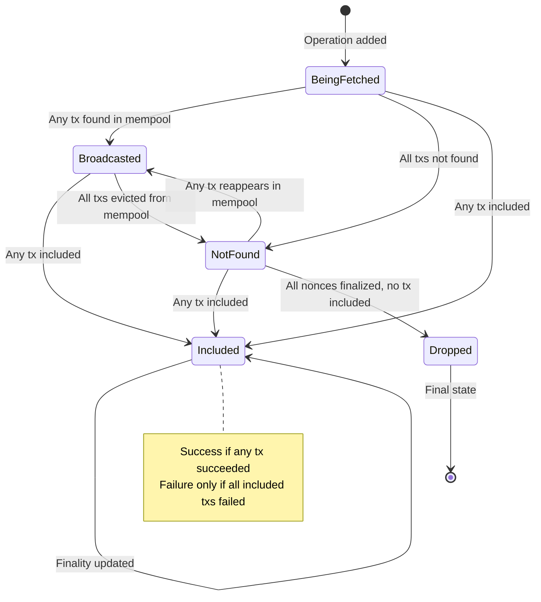

# Operation-Based Transaction Processor Refactoring Plan

## Overview

Refactor [`processor.ts`](web/src/lib/core/transactions/processor.ts) to handle `OnchainOperation` instead of individual `BroadcastedTransaction`. This enables tracking multiple transactions that belong to the same logical operation (e.g., same nonce with different gas prices, or sequential nonces for retries).

## Current State

The current processor:
- Tracks individual `BroadcastedTransaction` objects
- Uses tx hash as the unique identifier
- Emits `transaction` events on status changes
- Has `add(list)`, `remove(hash)`, `clear()`, `process()` methods

## Target State

The refactored processor:
- Tracks `OnchainOperation` objects containing multiple transactions
- Uses operation `id` as the unique identifier
- Emits `operation` events on status changes
- Merges transaction statuses into a unified operation status

---

## Type Changes

### Updated OperationStatus

```typescript
export type OperationStatus =
  | {
      inclusion: 'BeingFetched' | 'Broadcasted' | 'NotFound';
      final: undefined;
      status: undefined;
      txIndex: undefined;
    }
  | {
      inclusion: 'Dropped';
      final?: number;
      status: undefined;
      txIndex: undefined;
    }
  | {
      inclusion: 'Included';
      status: 'Failure' | 'Success';
      final?: number;
      txIndex: number; // index into transactions[] for the winning tx
    };
```

> **Memory optimization**: Using `txIndex` instead of `txHash`. The hash can be retrieved via `operation.transactions[operation.txIndex].hash`.

### OnchainOperation (mostly unchanged)

```typescript
export type OnchainOperation<Metadata extends unknown = unknown> =
  OperationStatus & {
    id: string;
    transactions: BroadcastedTransaction[];
    metadata?: Metadata;
    // expectedUpdate - NOT implemented yet
  };
```

---

## Status Merging Logic

### Priority Order (Highest Wins)

1. **Included** - At least one tx is included in a block
2. **Broadcasted** - At least one tx is active in mempool
3. **BeingFetched** - Still determining status
4. **NotFound** - None visible in mempool
5. **Dropped** - ALL txs are dropped (operation failed)

### Status Combination Rules

```
┌──────────────────────────────────────────────────────────────────────┐
│                    Transaction Status Combinations                   │
├──────────────────────────────────────────────────────────────────────┤
│ If ANY tx is Included                    → Operation: Included       │
│   - If ANY included tx is Success        → status: Success           │
│   - If ALL included txs are Failure      → status: Failure           │
│   - txIndex: index of first Success tx, or first Failure if all fail │
├──────────────────────────────────────────────────────────────────────┤
│ If ANY tx is Broadcasted (none Included) → Operation: Broadcasted    │
├──────────────────────────────────────────────────────────────────────┤
│ If ANY tx is BeingFetched (none above)   → Operation: BeingFetched   │
├──────────────────────────────────────────────────────────────────────┤
│ If ANY tx is NotFound (none above)       → Operation: NotFound       │
├──────────────────────────────────────────────────────────────────────┤
│ If ALL txs are Dropped                   → Operation: Dropped        │
└──────────────────────────────────────────────────────────────────────┘
```

### Finality Logic

- For `Included`: `final` is set when the included tx's block is past finality threshold
- For `Dropped`: `final` is set to the earliest dropped tx's timestamp
- For other states: `final` is undefined

---

## Implementation Details

### Internal Data Structures

```typescript
// Change from:
const $txs: BroadcastedTransaction[] = [];
const map: {[hash: string]: BroadcastedTransaction} = {};

// To:
const $ops: OnchainOperation[] = [];
const opsById: {[id: string]: OnchainOperation} = {};
// Also maintain tx hash lookup for efficient updates
const txToOp: {[txHash: string]: OnchainOperation} = {};
```

### add() Function

```typescript
function add(operations: OnchainOperation[]): void {
  for (const op of operations) {
    if (!opsById[op.id]) {
      opsById[op.id] = op;
      $ops.push(op);
      // Index all tx hashes for this operation
      for (const tx of op.transactions) {
        txToOp[tx.hash] = op;
      }
    } else {
      // Update existing operation - merge transactions
      const existing = opsById[op.id];
      for (const tx of op.transactions) {
        if (!txToOp[tx.hash]) {
          existing.transactions.push(tx);
          txToOp[tx.hash] = existing;
        }
      }
    }
  }
}
```

### remove() Function

```typescript
function remove(operationId: string): void {
  const op = opsById[operationId];
  if (op) {
    const index = $ops.indexOf(op);
    if (index >= 0) {
      $ops.splice(index, 1);
    }
    // Remove tx hash mappings
    for (const tx of op.transactions) {
      delete txToOp[tx.hash];
    }
    delete opsById[operationId];
  }
}
```

### computeOperationStatus() Helper

```typescript
function computeOperationStatus(op: OnchainOperation): OperationStatus {
  const txs = op.transactions;
  
  // Check for any Included txs - find index of first success, or first failure
  let winningIndex = -1;
  let hasSuccess = false;
  
  for (let i = 0; i < txs.length; i++) {
    const tx = txs[i];
    if (tx.inclusion === 'Included') {
      if (tx.status === 'Success') {
        winningIndex = i;
        hasSuccess = true;
        break; // First success wins
      } else if (winningIndex === -1) {
        winningIndex = i; // First failure as fallback
      }
    }
  }
  
  if (winningIndex >= 0) {
    // Determine finality - use the most final timestamp from included txs
    const includedTxs = txs.filter(tx => tx.inclusion === 'Included');
    const finalTimestamp = includedTxs
      .filter(tx => tx.final !== undefined)
      .map(tx => tx.final)
      .reduce((max, val) => Math.max(max!, val!), 0) || undefined;
    
    return {
      inclusion: 'Included',
      status: hasSuccess ? 'Success' : 'Failure',
      final: finalTimestamp,
      txIndex: winningIndex,
    };
  }
  
  // Check for any Broadcasted
  if (txs.some(tx => tx.inclusion === 'Broadcasted')) {
    return { inclusion: 'Broadcasted', final: undefined, status: undefined, txIndex: undefined };
  }
  
  // Check for any BeingFetched
  if (txs.some(tx => tx.inclusion === 'BeingFetched')) {
    return { inclusion: 'BeingFetched', final: undefined, status: undefined, txIndex: undefined };
  }
  
  // Check for any NotFound
  if (txs.some(tx => tx.inclusion === 'NotFound')) {
    return { inclusion: 'NotFound', final: undefined, status: undefined, txIndex: undefined };
  }
  
  // All must be Dropped
  const droppedTimestamp = txs
    .filter(tx => tx.final !== undefined)
    .map(tx => tx.final)
    .reduce((min, val) => Math.min(min!, val!), Infinity);
  
  return {
    inclusion: 'Dropped',
    final: droppedTimestamp === Infinity ? undefined : droppedTimestamp,
    status: undefined,
    txIndex: undefined,
  };
}
```

### processOperation() Function

```typescript
async function processOperation(
  op: OnchainOperation,
  blockContext: BlockContext
): Promise<boolean> {
  let anyTxChanged = false;
  
  // Process each transaction in the operation
  for (const tx of op.transactions) {
    const changed = await processTx(tx, blockContext);
    if (changed) anyTxChanged = true;
  }
  
  if (anyTxChanged) {
    // Recompute operation status from merged tx statuses
    const newStatus = computeOperationStatus(op);
    
    // Update operation status fields
    Object.assign(op, newStatus);
    
    // Emit operation event if still tracked
    if (opsById[op.id]) {
      emitter.emit('operation', op);
    }
  }
  
  return anyTxChanged;
}
```

### Updated Emitter

```typescript
// Change from:
const emitter = new Emitter<{transaction: BroadcastedTransaction}>();

// To:
const emitter = new Emitter<{operation: OnchainOperation}>();
```

### Updated Public API

```typescript
return {
  setProvider(newProvider: EIP1193Provider) { ... },
  
  // Updated to accept operations
  add: (operations: OnchainOperation[]) => void,
  
  // Updated to remove by operation id
  remove: (operationId: string) => void,
  
  clear: () => void,
  process: () => Promise<void>,
  
  // Renamed event handlers
  onOperation: (listener: (operation: OnchainOperation) => () => void) =>
    emitter.on('operation', listener),
  offOperation: (listener: (operation: OnchainOperation) => void) =>
    emitter.off('operation', listener),
};
```

---

## Migration Notes

### Breaking Changes

1. `add()` now accepts `OnchainOperation[]` instead of `BroadcastedTransaction[]`
2. `remove()` now accepts operation `id` instead of tx `hash`
3. Event listeners changed from `onTx`/`offTx` to `onOperation`/`offOperation`
4. Emitted events contain `OnchainOperation` instead of `BroadcastedTransaction`

### Backward Compatibility Options

If needed, a helper to convert single tx to operation:

```typescript
function txToOperation(tx: BroadcastedTransaction): OnchainOperation {
  return {
    id: tx.hash, // Use hash as id for single-tx operations
    transactions: [tx],
    inclusion: tx.inclusion,
    status: tx.status,
    final: tx.final,
    txIndex: tx.inclusion === 'Included' ? 0 : undefined, // Index 0 since single tx
  };
}
```

---

## State Diagram



---

## Files to Modify

1. [`web/src/lib/core/transactions/processor.ts`](web/src/lib/core/transactions/processor.ts) - Main refactoring

## Not Implemented (Future Work)

- `expectedUpdate` field for detecting out-of-band inclusion via events
- Automatic operation removal after finality

