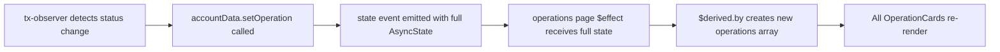
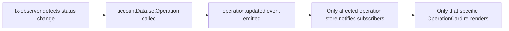

# Operations Page Fine-Grained Reactivity Plan

## Overview

Implement fine-grained reactivity on the operations page so that when a single operation changes, only its corresponding card re-renders instead of the entire list.

## Current Architecture

### Problem
- The operations page subscribes to `accountData.on('state', ...)` which emits the entire `AsyncState<AccountData>` on every change
- Operations are derived via `$derived.by()` from the full state
- When any operation updates (e.g., transaction status changes), the entire `operations` array reference changes
- This causes Svelte to re-render ALL operation cards, not just the one that changed

### Current Flow


## Proposed Architecture

### Goals
1. Add Svelte-compatible `subscribe` method for `AsyncState<AccountData>`
2. Add `getOperationStore(id)` function that returns cached, operation-specific stores
3. Operation stores emit `OnchainOperation | undefined`
4. Create `OperationCard.svelte` component that subscribes to individual operation stores

### New Flow


---

## Current File Contents (Reference)

### `web/src/lib/core/account/createAccountStore.ts`

Key parts of the current implementation:

```typescript
// Lines 125-130: Current emitter and state setup
const emitter = createEmitter<E & {state: AsyncState<D>}>();
let asyncState: AsyncState<D> = {status: 'idle', account: undefined};

// Lines 266-276: Current return object
return {
    /** Current async state (readonly) */
    get state(): Readonly<AsyncState<D>> {
        return asyncState;
    },
    ...wrappedMutations,
    on: emitter.on.bind(emitter),
    off: emitter.off.bind(emitter),
    start,
    stop,
};
```

### `web/src/lib/account/AccountData.ts`

Key parts:

```typescript
// Lines 32-43: Events type with operation:updated
type Events = {
    'operations:added': {id: number; operation: OnchainOperation};
    'operations:removed': {id: number; operation: OnchainOperation};
    'operations:cleared': undefined;
    'operations:set': AccountData['operations'];
    'operation:updated': {id: number; operation: OnchainOperation};
};

// Lines 107-123: createAccountData returns createAccountStore result
export function createAccountData(params: {...}) {
    return createAccountStore<AccountData, Events, typeof mutations>({...});
}

export type AccountDataStore = ReturnType<typeof createAccountData>;
```

### `web/src/routes/operations/+page.svelte`

Current subscription pattern (lines 31-47):

```svelte
<script lang="ts">
    // Reactive state from accountData
    let accountDataState = $state<AsyncState<AccountData>>({
        status: 'idle',
        account: undefined,
    });

    // Subscribe to accountData state changes
    $effect(() => {
        const currentAccountData = accountData;
        accountDataState = currentAccountData.state;
        const unsubscribe = currentAccountData.on('state', (state) => {
            accountDataState = state;
        });
        return unsubscribe;
    });

    // Derive operations from state - THIS IS THE PROBLEM
    let operations = $derived.by(() => {
        if (accountDataState.status === 'ready') {
            return Object.entries(accountDataState.data.operations).map(
                ([id, op]) => ({
                    id: Number(id),
                    operation: op as OnchainOperation,
                }),
            );
        }
        return [];
    });
</script>
```

---

## Implementation Details

### Step 1: Modify `createAccountStore.ts`

**File:** `web/src/lib/core/account/createAccountStore.ts`

Add a Svelte-compatible `subscribe` method to the return object. Insert after line 275 (before the closing brace):

```typescript
// Add Svelte-compatible subscribe method
subscribe(callback: (state: Readonly<AsyncState<D>>) => void): () => void {
    // Call with current state immediately (Svelte store contract requirement)
    callback(asyncState);
    // Subscribe to future updates
    return emitter.on('state', callback);
},
```

**Full return object should become:**

```typescript
return {
    /** Current async state (readonly) */
    get state(): Readonly<AsyncState<D>> {
        return asyncState;
    },
    ...wrappedMutations,
    on: emitter.on.bind(emitter),
    off: emitter.off.bind(emitter),
    start,
    stop,
    /** Svelte-compatible subscribe method */
    subscribe(callback: (state: Readonly<AsyncState<D>>) => void): () => void {
        callback(asyncState);
        return emitter.on('state', callback);
    },
};
```

### Step 2: Modify `AccountData.ts`

**File:** `web/src/lib/account/AccountData.ts`

Replace the entire file with:

```typescript
import {
    createAccountStore,
    createMutations,
} from '$lib/core/account/createAccountStore';
import {createLocalStorageAdapter, type AsyncStorage} from '$lib/core/storage';
import type {AccountStore, TypedDeployments} from '$lib/core/connection/types';
import type {TransactionIntent} from '@etherkit/tx-observer';
import type {PopulatedMetadata} from '@etherkit/viem-tx-tracker';
import type {Readable} from 'svelte/store';

export type OnchainOperationMetadata = PopulatedMetadata;

export type OnchainOperation = {
    metadata: OnchainOperationMetadata;
    transactionIntent: TransactionIntent;
};

/**
 * Data stored per account
 */
export type AccountData = {
    operations: Record<number, OnchainOperation>;
};

/**
 * Event types emitted by the store.
 */
type Events = {
    /** Fires when an operation is added */
    'operations:added': {id: number; operation: OnchainOperation};
    /** Fires when an operation is removed */
    'operations:removed': {id: number; operation: OnchainOperation};
    /** Fires when all operations are cleared (account switch, before loading) */
    'operations:cleared': undefined;
    /** Fires when operations are set (initial load after account switch) */
    'operations:set': AccountData['operations'];
    /** Fires when an existing operation is modified (content changes only) */
    'operation:updated': {id: number; operation: OnchainOperation};
};

/**
 * Pure mutations - just business logic, no async/storage concerns!
 */
const mutations = createMutations<AccountData, Events>()({
    addOperation(
        data,
        transactionIntent: TransactionIntent,
        metadata: OnchainOperationMetadata,
    ) {
        let id = Date.now();
        while (data.operations[id]) id++;
        const operation = {metadata, transactionIntent};
        data.operations[id] = operation;
        return {
            result: id,
            event: 'operations:added',
            eventData: {id, operation},
        };
    },

    setOperation(data, id: number, operation: OnchainOperation) {
        const isNew = !data.operations[id];
        data.operations[id] = operation;
        if (isNew) {
            return {
                result: undefined,
                event: 'operations:added',
                eventData: {id, operation},
            };
        }
        return {
            result: undefined,
            event: 'operation:updated',
            eventData: {id, operation},
        };
    },

    removeOperation(data, id: number) {
        const operation = data.operations[id];
        if (!operation) return {result: false};
        delete data.operations[id];
        return {
            result: true,
            event: 'operations:removed',
            eventData: {id, operation},
        };
    },
});

export function createAccountData(params: {
    account: AccountStore;
    deployments: TypedDeployments;
    storage?: AsyncStorage<AccountData>;
}) {
    const {
        account,
        deployments,
        storage = createLocalStorageAdapter<AccountData>(),
    } = params;

    const store = createAccountStore<AccountData, Events, typeof mutations>({
        account,
        storage,

        storageKey: (addr) =>
            `__private__${deployments.chain.id}_${deployments.chain.genesisHash}_${deployments.contracts.GreetingsRegistry.address}_${addr}`,

        defaultData: () => ({operations: {}}),

        onClear: () => [{event: 'operations:cleared', data: undefined}],

        onLoad: (data) => [{event: 'operations:set', data: data.operations}],

        mutations,
    });

    // Cache for operation-specific stores
    const operationStoreCache = new Map<number, Readable<OnchainOperation | undefined>>();

    /**
     * Get a Svelte-compatible store for a specific operation.
     * Returns a cached store instance for the given ID.
     * The store value is `undefined` when:
     * - Account is not ready (idle/loading)
     * - Operation with given ID doesn't exist
     */
    function getOperationStore(id: number): Readable<OnchainOperation | undefined> {
        // Return cached store if exists
        const cached = operationStoreCache.get(id);
        if (cached) return cached;

        // Helper to get current value
        const getCurrentValue = (): OnchainOperation | undefined => {
            const currentState = store.state;
            if (currentState.status !== 'ready') return undefined;
            return currentState.data.operations[id];
        };

        // Create new store
        const operationStore: Readable<OnchainOperation | undefined> = {
            subscribe(callback: (value: OnchainOperation | undefined) => void) {
                // Call immediately with current value (Svelte store contract)
                callback(getCurrentValue());

                // Subscribe to state changes (account switch, loading, etc.)
                const unsubState = store.on('state', () => {
                    callback(getCurrentValue());
                });

                // Subscribe to specific operation updates
                const unsubUpdated = store.on('operation:updated', (event) => {
                    if (event.id === id) {
                        callback(event.operation);
                    }
                });

                // Subscribe to operation removal
                const unsubRemoved = store.on('operations:removed', (event) => {
                    if (event.id === id) {
                        callback(undefined);
                    }
                });

                // Return unsubscribe function
                return () => {
                    unsubState();
                    unsubUpdated();
                    unsubRemoved();
                };
            },
        };

        operationStoreCache.set(id, operationStore);
        return operationStore;
    }

    // Clear cache on account switch
    store.on('operations:cleared', () => {
        operationStoreCache.clear();
    });

    return {
        ...store,
        getOperationStore,
    };
}

export type AccountDataStore = ReturnType<typeof createAccountData>;
```

### Step 3: Create `OperationCard.svelte`

**File:** `web/src/routes/operations/components/OperationCard.svelte`

Create new directory `web/src/routes/operations/components/` and add this file:

```svelte
<script lang="ts">
    import {route} from '$lib';
    import * as Card from '$lib/shadcn/ui/card';
    import {Badge} from '$lib/shadcn/ui/badge';
    import {Button} from '$lib/shadcn/ui/button';
    import {
        ExternalLinkIcon,
        XIcon,
        ArrowUpIcon,
        ClockIcon,
        CircleCheckIcon,
        TriangleAlertIcon,
        CircleXIcon,
        CircleQuestionMarkIcon,
    } from '@lucide/svelte';
    import type {OnchainOperation} from '$lib/account/AccountData';
    import type {
        TransactionIntent,
        TransactionIntentStatus,
    } from '@etherkit/tx-observer';
    import type {Readable} from 'svelte/store';

    interface Props {
        id: number;
        operationStore: Readable<OnchainOperation | undefined>;
        onDismiss: (id: number) => void;
        onBumpGas: (id: number) => void;
    }

    let {id, operationStore, onDismiss, onBumpGas}: Props = $props();

    // Subscribe to the operation store
    let operation = $derived($operationStore);

    // Helper to get block explorer URL
    function getExplorerTxUrl(hash: string): string {
        return route(`/explorer/tx/${hash}`);
    }

    // Helper to get status info
    function getStatusInfo(intent: TransactionIntent): {
        label: string;
        variant: 'default' | 'secondary' | 'destructive' | 'outline';
        icon: typeof CircleCheckIcon;
    } {
        const state = intent.state;

        if (!state || state.inclusion === 'InMemPool') {
            return {label: 'Pending', variant: 'secondary', icon: ClockIcon};
        }

        if (state.inclusion === 'NotFound') {
            return {label: 'Not Found', variant: 'destructive', icon: CircleQuestionMarkIcon};
        }

        if (state.inclusion === 'Dropped') {
            return {label: 'Dropped', variant: 'destructive', icon: TriangleAlertIcon};
        }

        if (state.inclusion === 'Included') {
            if (state.status === 'Success') {
                return {label: 'Success', variant: 'default', icon: CircleCheckIcon};
            } else {
                return {label: 'Failed', variant: 'destructive', icon: CircleXIcon};
            }
        }

        return {label: 'Unknown', variant: 'outline', icon: CircleQuestionMarkIcon};
    }

    // Get the main transaction hash
    function getMainTxHash(intent: TransactionIntent): string | undefined {
        if (intent.transactions.length === 0) return undefined;

        const state = intent.state;
        if (state?.inclusion === 'Included' && state.attemptIndex !== undefined) {
            return intent.transactions[state.attemptIndex]?.hash;
        }

        return intent.transactions[0]?.hash;
    }

    // Get operation name from metadata
    function getOperationName(op: OnchainOperation): string {
        const metadata = op.metadata;
        if (metadata.type === 'functionCall') {
            return metadata.functionName;
        }
        if (metadata.type === 'unknown') {
            return metadata.name;
        }
        return 'Unknown Operation';
    }

    // Format timestamp
    function formatTimestamp(timestampMs: number): string {
        const date = new Date(timestampMs);
        return date.toLocaleString();
    }

    // Check if transaction needs action
    function needsBumpGas(state: TransactionIntentStatus | undefined): boolean {
        return !state || state.inclusion === 'InMemPool';
    }

    function needsDismiss(state: TransactionIntentStatus | undefined): boolean {
        return state?.inclusion === 'NotFound' || state?.inclusion === 'Dropped';
    }
</script>

{#if operation}
    {@const statusInfo = getStatusInfo(operation.transactionIntent)}
    {@const StatusIcon = statusInfo.icon}
    {@const txHash = getMainTxHash(operation.transactionIntent)}
    {@const state = operation.transactionIntent.state}
    {@const firstTx = operation.transactionIntent.transactions[0]}

    <Card.Root>
        <Card.Header class="pb-2">
            <div class="flex items-center justify-between">
                <div class="flex items-center gap-2">
                    <StatusIcon class="h-5 w-5" />
                    <Card.Title class="text-lg">
                        {getOperationName(operation)}
                    </Card.Title>
                </div>
                <Badge variant={statusInfo.variant}>
                    {statusInfo.label}
                </Badge>
            </div>
            {#if firstTx}
                <Card.Description>
                    {formatTimestamp(firstTx.broadcastTimestampMs)}
                </Card.Description>
            {/if}
        </Card.Header>

        <Card.Content>
            <div class="space-y-3">
                <!-- Transaction Details -->
                {#if operation.transactionIntent.transactions.length === 1 && txHash}
                    <div class="flex items-center gap-2 text-sm">
                        <span class="text-muted-foreground">Transaction:</span>
                        <code class="rounded bg-muted px-2 py-1 font-mono text-xs">
                            {txHash.slice(0, 10)}...{txHash.slice(-8)}
                        </code>
                        {#if state?.inclusion === 'Included'}
                            <a
                                href={getExplorerTxUrl(txHash)}
                                class="inline-flex items-center gap-1 text-primary hover:underline"
                            >
                                <ExternalLinkIcon class="h-4 w-4" />
                                View
                            </a>
                        {/if}
                    </div>
                {:else if operation.transactionIntent.transactions.length > 1}
                    <div class="text-sm text-muted-foreground">
                        {operation.transactionIntent.transactions.length} transaction attempts
                    </div>
                    <div class="space-y-1">
                        {#each operation.transactionIntent.transactions as tx, i}
                            <div class="flex items-center gap-2 text-sm">
                                <span class="text-muted-foreground">#{i + 1}:</span>
                                <code class="rounded bg-muted px-2 py-1 font-mono text-xs">
                                    {tx.hash.slice(0, 10)}...{tx.hash.slice(-8)}
                                </code>
                                {#if state?.inclusion === 'Included' && state.attemptIndex === i}
                                    <Badge variant="default" class="text-xs">Included</Badge>
                                    <a
                                        href={getExplorerTxUrl(tx.hash)}
                                        class="inline-flex items-center gap-1 text-primary hover:underline"
                                    >
                                        <ExternalLinkIcon class="h-4 w-4" />
                                        View
                                    </a>
                                {/if}
                            </div>
                        {/each}
                    </div>
                {/if}

                <!-- Finality info -->
                {#if state?.final !== undefined}
                    <div class="text-sm text-muted-foreground">
                        Finalized at block {state.final}
                    </div>
                {/if}

                <!-- Operation metadata args -->
                {#if operation.metadata.type === 'functionCall' && operation.metadata.args && operation.metadata.args.length > 0}
                    <details class="text-sm">
                        <summary class="cursor-pointer text-muted-foreground hover:text-foreground">
                            Show arguments ({operation.metadata.args.length})
                        </summary>
                        <pre class="mt-2 max-h-40 overflow-auto rounded bg-muted p-2 text-xs">{JSON.stringify(
                            operation.metadata.args,
                            null,
                            2,
                        )}</pre>
                    </details>
                {/if}
            </div>
        </Card.Content>

        {#if needsBumpGas(state) || needsDismiss(state)}
            <Card.Footer class="flex justify-end gap-2">
                {#if needsBumpGas(state)}
                    <Button variant="outline" size="sm" onclick={() => onBumpGas(id)}>
                        <ArrowUpIcon class="mr-1 h-4 w-4" />
                        Bump Gas
                    </Button>
                {/if}
                {#if needsDismiss(state)}
                    <Button variant="destructive" size="sm" onclick={() => onDismiss(id)}>
                        <XIcon class="mr-1 h-4 w-4" />
                        Dismiss
                    </Button>
                {/if}
            </Card.Footer>
        {/if}
    </Card.Root>
{/if}
```

### Step 4: Update Operations Page

**File:** `web/src/routes/operations/+page.svelte`

Replace the entire file with:

```svelte
<script lang="ts">
    import DefaultHead from '$lib/metadata/DefaultHead.svelte';
    import ConnectionFlow from '$lib/core/connection/ConnectionFlow.svelte';
    import {getUserContext} from '$lib';
    import * as Empty from '$lib/shadcn/ui/empty';
    import * as Separator from '$lib/shadcn/ui/separator';
    import {ListIcon} from '@lucide/svelte';
    import OperationCard from './components/OperationCard.svelte';

    const {connection, accountData, account} = getUserContext();

    // Subscribe to accountData state using Svelte store syntax
    // This is now possible because accountData has a subscribe method
    let accountDataState = $derived($accountData);

    // Get current account
    let currentAccount = $derived($account);

    // Get only operation IDs (not full operations) to minimize re-renders
    let operationIds = $derived.by(() => {
        if (accountDataState.status === 'ready') {
            return Object.keys(accountDataState.data.operations).map(Number);
        }
        return [];
    });

    // Dismiss operation
    async function dismissOperation(id: number) {
        if (!currentAccount) return;
        await accountData.removeOperation(currentAccount, id);
    }

    // Bump gas price (placeholder)
    async function bumpGasPrice(id: number) {
        alert('Bump gas price feature coming soon!');
    }
</script>

<DefaultHead title={'Operations'} />

<ConnectionFlow {connection} />

<div class="container mx-auto max-w-5xl px-4 py-8">
    <div class="space-y-6">
        <div class="flex flex-col items-center space-y-2">
            <div class="rounded-full bg-primary/10 p-3">
                <ListIcon class="h-8 w-8 text-primary" />
            </div>
            <h1 class="text-3xl font-bold">Operations</h1>
            <p class="text-muted-foreground">
                Track your pending and completed blockchain operations
            </p>
        </div>

        <Separator.Root />

        {#if accountDataState.status === 'idle'}
            <Empty.Root class="min-h-[400px]">
                <Empty.Header>
                    <Empty.Media variant="icon">
                        <ListIcon />
                    </Empty.Media>
                    <Empty.Title>No Account Connected</Empty.Title>
                    <Empty.Description>
                        Connect your wallet to view your operations.
                    </Empty.Description>
                </Empty.Header>
            </Empty.Root>
        {:else if accountDataState.status === 'loading'}
            <div class="flex flex-col items-center justify-center py-12">
                <div
                    class="h-8 w-8 animate-spin rounded-full border-4 border-primary border-t-transparent"
                ></div>
                <p class="mt-4 text-muted-foreground">Loading operations...</p>
            </div>
        {:else if operationIds.length === 0}
            <Empty.Root class="min-h-[400px]">
                <Empty.Header>
                    <Empty.Media variant="icon">
                        <ListIcon />
                    </Empty.Media>
                    <Empty.Title>No Operations</Empty.Title>
                    <Empty.Description>
                        You haven't performed any operations yet. Once you interact with
                        contracts, your transactions will appear here.
                    </Empty.Description>
                </Empty.Header>
            </Empty.Root>
        {:else}
            <div class="space-y-4">
                {#each operationIds as id (id)}
                    <OperationCard
                        {id}
                        operationStore={accountData.getOperationStore(id)}
                        onDismiss={dismissOperation}
                        onBumpGas={bumpGasPrice}
                    />
                {/each}
            </div>
        {/if}
    </div>
</div>
```

---

## File Changes Summary

| File | Change |
|------|--------|
| `web/src/lib/core/account/createAccountStore.ts` | Add `subscribe` method to return object (lines 266-277) |
| `web/src/lib/account/AccountData.ts` | Add `getOperationStore` function with caching, clear cache on account switch |
| `web/src/routes/operations/components/OperationCard.svelte` | **NEW** - Individual operation card component |
| `web/src/routes/operations/+page.svelte` | Refactor to use `$accountData` syntax and `OperationCard` component |

---

## Benefits

1. **Fine-grained reactivity**: Only changed operations re-render
2. **Better performance**: Fewer DOM updates when operations change frequently
3. **Cleaner separation**: OperationCard is self-contained and reusable
4. **Svelte-idiomatic**: Uses standard Svelte store contract with `$` syntax

## Edge Cases Handled

1. **Account switch**: Operation store cache is cleared, stores return `undefined`
2. **Operation deleted**: Store emits `undefined`, OperationCard hides itself with `{#if operation}`
3. **New operation added**: New ID appears in `operationIds`, new OperationCard created
4. **Multiple rapid updates**: Each store only emits for its specific operation

## Testing the Implementation

1. Connect wallet and create multiple operations
2. Watch console/devtools to verify only individual cards update
3. Test account switching - all operation stores should become undefined
4. Test operation removal - card should disappear without affecting others
5. Test new operation creation - should appear without re-rendering existing cards
