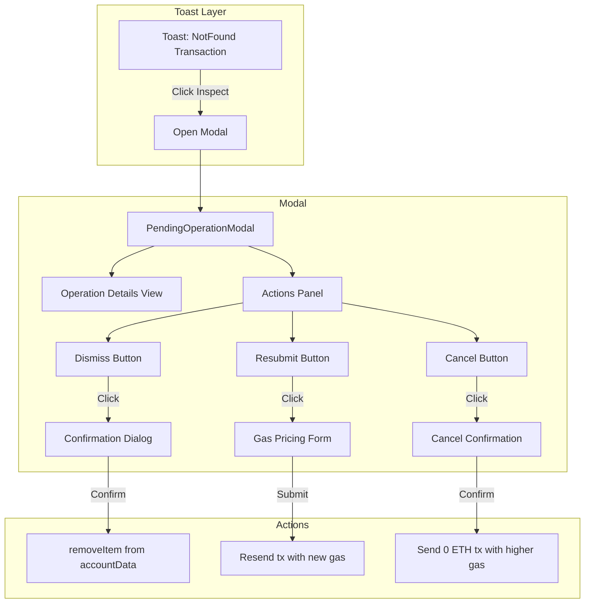

# Pending Operation Modal Feature Plan

## Overview

When a transaction enters the "NotFound" state, users currently see a persistent toast with a "Dismiss" button. This plan enhances the user experience by:

1. Renaming "Dismiss" to "Inspect"
2. Opening a modal with detailed transaction information
3. Providing options to **Dismiss**, **Resubmit**, or **Cancel** the transaction

---

## Architecture



---

## Components to Create/Modify

### 1. New Files

#### `web/src/lib/core/ui/pending-operation/PendingOperationModal.svelte`
Main modal component that displays:
- Operation metadata
- Transaction intent details for multiple txs in intent
- Hash, nonce, from address, broadcast timestamp
- Current state/status
- Action buttons

#### `web/src/lib/core/ui/pending-operation/pending-operation-store.ts`
Shared state for managing:
- Modal visibility
- Currently selected operation key
- Currently selected operation data

#### `web/src/lib/core/ui/pending-operation/index.ts`
Barrel export file

#### `web/src/lib/core/ui/pending-operation/GasPricingForm.svelte`
Form component for selecting gas pricing:
- Slow / Average / Fast presets from gasFee store
- Custom input option
- Show current tx gas price vs new price

#### `web/src/lib/core/ui/pending-operation/ConfirmDismissDialog.svelte`
Confirmation dialog warning:
- Transaction may still be processed
- Cannot be undone
- User must acknowledge the risk

#### `web/src/lib/core/ui/pending-operation/TransactionAttemptsList.svelte`
Expandable list of all transaction attempts:
- Uses Collapsible component from shadcn
- Shows summary: "3 transaction attempts" with expand/collapse button
- Each attempt shows: hash, broadcast time, gas price
- Sorted by gas price descending (highest first)

### 2. Modified Files

#### `web/src/lib/account/toastConnector.ts`
Changes:
- Rename action label from "Dismiss" to "Inspect"
- Change onClick to open the pending operation modal instead of deleting

---

## Detailed Implementation

### Operation Details View

Display the following information:

| Field | Source |
|-------|--------|
| Operation Name | `operation.metadata.functionName` or `operation.metadata.name` |
| Status | `operation.transactionIntent.state?.inclusion` |
| From Address | `operation.metadata.tx.from` |
| Nonce | `operation.metadata.tx.nonce` |
| Broadcast Time | `operation.transactionIntent.transactions[].broadcastTimestampMs` |
| Transaction Hashes | `operation.transactionIntent.transactions[].hash` |
| Function Args | `operation.metadata.args` if available |

**Display Logic for Multiple Transactions:**
- Show the transaction with the **highest gas price** prominently
- Display an indicator like "1 of 3 attempts" if there are multiple transactions
- Allow expanding to see all transaction attempts

### Transaction Attempts List (Expandable)

When an operation has multiple transactions in its intent, display an expandable section:

```svelte
<!-- Using shadcn Collapsible component -->
<Collapsible.Root>
  <Collapsible.Trigger>
    <span>3 transaction attempts</span>
    <ChevronDown />
  </Collapsible.Trigger>
  <Collapsible.Content>
    <!-- List of all tx attempts -->
    {#each sortedTransactions as tx, i}
      <div class="tx-attempt">
        <span class="index">#{i + 1}</span>
        <Address hash={tx.hash} truncate />
        <span class="gas">{formatGwei tx.maxFeePerGas} gwei</span>
        <span class="time">{formatRelativeTime tx.broadcastTimestampMs}</span>
      </div>
    {/each}
  </Collapsible.Content>
</Collapsible.Root>
```

**Sorting Logic:**
```typescript
// Sort transactions by gas price descending, then by broadcast time
const sortedTransactions = [...operation.transactionIntent.transactions].sort((a, b) => {
  const gasA = a.maxFeePerGas || 0n;
  const gasB = b.maxFeePerGas || 0n;
  if (gasB !== gasA) return gasB > gasA ? 1 : -1;
  return (b.broadcastTimestampMs || 0) - (a.broadcastTimestampMs || 0);
});
```

### Actions

#### Dismiss Action
1. Show confirmation dialog with warning message
2. Warning: "This transaction may still be processed by the network. Dismissing it only removes it from your view. Are you sure?"
3. On confirm: `accountData.removeItem('operations', key)`

#### Resubmit Action
1. Show gas pricing form with current network prices
2. User selects slow/average/fast or custom
3. Reconstruct **exact same transaction** using `operation.metadata.tx`:
   - Same `to`, `data`, `value`, `nonce`
   - Only update gas parameters
   - Use `walletClient.sendTransaction` with the reconstructed tx
4. New transaction will be tracked as a new operation

#### Cancel Action
1. Show confirmation dialog explaining:
   - "This will send a 0 ETH transaction to yourself with the same nonce but higher gas"
   - "If successful, the original transaction will be replaced"
2. Get the nonce from `operation.metadata.tx.nonce`
3. Calculate gas price to ensure replacement:
   ```typescript
   // Find highest gas price among all txs in the operation intent
   const highestGasPrice = operation.transactionIntent.transactions.reduce(
     (max, tx) => tx.maxFeePerGas && tx.maxFeePerGas > max ? tx.maxFeePerGas : max,
     0n
   );
   
   // Get current network fast price
   const fastPrice = gasFee.fast.maxFeePerGas;
   
   // Use whichever is higher, ensuring we can replace
   const cancelGasPrice = highestGasPrice >= fastPrice
     ? highestGasPrice + 1n  // Must be higher than existing
     : fastPrice;
   ```
4. Send cancel transaction:
   ```typescript
   walletClient.sendTransaction({
     to: account, // self
     value: 0n,
     nonce: originalNonce,
     maxFeePerGas: cancelGasPrice,
     maxPriorityFeePerGas: cancelGasPrice,
   })
   ```

---

## State Management

### pending-operation-store.ts

```typescript
import { writable } from 'svelte/store';
import type { OnchainOperation } from '$lib/account/AccountData';

type PendingOperationModalState = {
  open: boolean;
  operationKey: string | null;
  operation: OnchainOperation | null;
};

function createPendingOperationStore() {
  const { subscribe, set, update } = writable<PendingOperationModalState>({
    open: false,
    operationKey: null,
    operation: null,
  });

  return {
    subscribe,
    open: (key: string, operation: OnchainOperation) => {
      set({ open: true, operationKey: key, operation });
    },
    close: () => {
      set({ open: false, operationKey: null, operation: null });
    },
  };
}

export const pendingOperationModal = createPendingOperationStore();
```

---

## Complete Component Examples

### PendingOperationModal.svelte (Skeleton)

```svelte
<script lang="ts">
  import { getContext } from 'svelte';
  import type { Context } from '$lib/context/types';
  import * as Modal from '$lib/core/ui/modal/index.js';
  import { Button } from '$lib/shadcn/ui/button/index.js';
  import { Badge } from '$lib/shadcn/ui/badge/index.js';
  import { pendingOperationModal } from './pending-operation-store';
  import OperationDetailsView from './OperationDetailsView.svelte';
  import TransactionAttemptsList from './TransactionAttemptsList.svelte';
  import GasPricingForm from './GasPricingForm.svelte';
  import ConfirmDismissDialog from './ConfirmDismissDialog.svelte';
  
  const { walletClient, accountData, gasFee, account } = getContext<Context>('context');
  
  // Modal state
  let showDismissConfirm = $state(false);
  let showResubmitForm = $state(false);
  let showCancelConfirm = $state(false);
  let isSubmitting = $state(false);
  let errorMessage = $state<string | null>(null);
  
  // Derived from store
  let modalState = $derived($pendingOperationModal);
  let isOpen = $derived(modalState.open);
  let operation = $derived(modalState.operation);
  let operationKey = $derived(modalState.operationKey);
  
  function handleClose() {
    pendingOperationModal.close();
    resetState();
  }
  
  function resetState() {
    showDismissConfirm = false;
    showResubmitForm = false;
    showCancelConfirm = false;
    errorMessage = null;
  }
  
  async function handleDismiss() {
    if (operationKey) {
      const currentAccountData = accountData.get();
      currentAccountData?.removeItem('operations', operationKey);
      handleClose();
    }
  }
  
  async function handleResubmit(gasPrice: { maxFeePerGas: bigint; maxPriorityFeePerGas: bigint }) {
    if (!operation) return;
    
    try {
      isSubmitting = true;
      errorMessage = null;
      
      const originalTx = operation.metadata.tx;
      await walletClient.sendTransaction({
        to: originalTx.to,
        data: originalTx.data,
        value: originalTx.value,
        nonce: originalTx.nonce,
        maxFeePerGas: gasPrice.maxFeePerGas,
        maxPriorityFeePerGas: gasPrice.maxPriorityFeePerGas,
      });
      
      handleClose();
    } catch (err: any) {
      errorMessage = err.message || 'Failed to resubmit transaction';
    } finally {
      isSubmitting = false;
    }
  }
  
  async function handleCancel() {
    if (!operation) return;
    
    try {
      isSubmitting = true;
      errorMessage = null;
      
      // Calculate gas price
      const txs = operation.transactionIntent.transactions;
      const highestGasPrice = txs.reduce(
        (max, tx) => (tx.maxFeePerGas && tx.maxFeePerGas > max) ? tx.maxFeePerGas : max,
        0n
      );
      
      const gasFeeValue = $gasFee;
      const fastPrice = gasFeeValue.step === 'Loaded' ? gasFeeValue.fast.maxFeePerGas : 0n;
      const cancelGasPrice = highestGasPrice >= fastPrice
        ? highestGasPrice + 1n
        : fastPrice;
      
      const currentAccount = $account;
      await walletClient.sendTransaction({
        to: currentAccount,
        value: 0n,
        nonce: operation.metadata.tx.nonce,
        maxFeePerGas: cancelGasPrice,
        maxPriorityFeePerGas: cancelGasPrice,
      });
      
      handleClose();
    } catch (err: any) {
      errorMessage = err.message || 'Failed to cancel transaction';
    } finally {
      isSubmitting = false;
    }
  }
</script>

<Modal.Root openWhen={isOpen} onCancel={handleClose}>
  {#if operation}
    <Modal.Title>
      Pending Transaction
      <Badge variant="destructive">Not Found</Badge>
    </Modal.Title>
    
    <OperationDetailsView {operation} />
    
    <TransactionAttemptsList transactions={operation.transactionIntent.transactions} />
    
    {#if errorMessage}
      <div class="text-red-500 text-sm mt-2">{errorMessage}</div>
    {/if}
    
    <Modal.Footer>
      <Button variant="outline" onclick={() => showDismissConfirm = true}>
        Dismiss
      </Button>
      <Button variant="secondary" onclick={() => showResubmitForm = true}>
        Resubmit
      </Button>
      <Button variant="destructive" onclick={() => showCancelConfirm = true}>
        Cancel Transaction
      </Button>
    </Modal.Footer>
  {/if}
</Modal.Root>

<!-- Sub-dialogs -->
<ConfirmDismissDialog
  open={showDismissConfirm}
  onConfirm={handleDismiss}
  onCancel={() => showDismissConfirm = false}
/>

<GasPricingForm
  open={showResubmitForm}
  onSubmit={handleResubmit}
  onCancel={() => showResubmitForm = false}
  {isSubmitting}
/>
```

### index.ts (Barrel Export)

```typescript
export { pendingOperationModal } from './pending-operation-store';
export { default as PendingOperationModal } from './PendingOperationModal.svelte';
```

---

## Integration Points

### Toast Connector Integration

The toastConnector at `web/src/lib/account/toastConnector.ts` needs these changes:

**1. Add import at top of file:**
```typescript
import { pendingOperationModal } from '$lib/core/ui/pending-operation';
```

**2. Modify the error toast action (around line 126-135):**

```typescript
// BEFORE (lines 126-135):
} else if (statusType === 'error') {
  toast.error(operationName, {
    description: message,
    id: key,
    duration: Infinity,
    action: {
      label: 'Dismiss',
      onClick: () => deleteOperation(key),
    },
  });
}

// AFTER:
} else if (statusType === 'error') {
  toast.error(operationName, {
    description: message,
    id: key,
    duration: Infinity,
    action: {
      label: 'Inspect',
      onClick: () => pendingOperationModal.open(key, operation),
    },
  });
}
```

### Modal Mount Point

The modal should be mounted in `web/src/lib/context/AcrossPages.svelte`:

```svelte
<script lang="ts">
  import { PendingOperationModal } from '$lib/core/ui/pending-operation';
</script>

<!-- Existing content -->
<slot />

<!-- Add the modal -->
<PendingOperationModal />
```

This ensures the modal is available globally when the toast action is clicked.

---

## UI/UX Considerations

1. **Modal Size**: Medium width to accommodate transaction details
2. **Mobile**: Stack actions vertically on mobile
3. **Loading States**: Show loading during transaction submission
4. **Error Handling**: Display errors if resubmit/cancel fails
5. **Success Feedback**: Close modal and show success toast on successful action

---

## Clarified Requirements

| Question | Decision |
|----------|----------|
| Multiple Transactions in Intent | Show tx with highest gas price, indicate count like "1 of 3 attempts" |
| Resubmit Scope | Exact same transaction parameters, only gas pricing changes |
| Cancel Gas Pricing | Use `max(networkFastPrice, highestExistingGasPrice + 1)` |
| History | Not required for initial implementation |

---

## File Structure

```
web/src/lib/core/ui/pending-operation/
├── index.ts
├── pending-operation-store.ts
├── PendingOperationModal.svelte
├── OperationDetailsView.svelte
├── TransactionAttemptsList.svelte
├── GasPricingForm.svelte
└── ConfirmDismissDialog.svelte
```

---

## Implementation Order

1. Create `pending-operation-store.ts` for state management
2. Create `PendingOperationModal.svelte` with basic structure
3. Create `OperationDetailsView.svelte` for displaying transaction info
4. Create `TransactionAttemptsList.svelte` with expandable collapsible
5. Update `toastConnector.ts` to use Inspect action
6. Add `ConfirmDismissDialog.svelte` for dismiss confirmation
7. Add `GasPricingForm.svelte` for resubmit with gas options
8. Implement cancel transaction logic
9. Mount modal in app layout
10. Test all flows

---

## Context for Implementation (Fresh Context Reference)

### Existing Codebase Patterns

#### Modal Pattern
The project uses a custom modal wrapper at `web/src/lib/core/ui/modal/modal.svelte` that wraps shadcn Dialog:
```svelte
<script lang="ts">
  import * as Modal from '$lib/core/ui/modal/index.js';
</script>

<Modal.Root openWhen={isOpen} onCancel={handleClose}>
  <Modal.Title>Title Here</Modal.Title>
  <!-- content -->
  <Modal.Footer>
    <button>Action</button>
  </Modal.Footer>
</Modal.Root>
```

#### Shadcn Components Available
- `$lib/shadcn/ui/dialog/*` - Dialog components
- `$lib/shadcn/ui/button/*` - Button component
- `$lib/shadcn/ui/collapsible/*` - Collapsible for expandable sections
- `$lib/shadcn/ui/card/*` - Card components for layout
- `$lib/shadcn/ui/badge/*` - Badge for status display

#### Context Access Pattern
The app uses Svelte context for accessing shared services:
```svelte
<script lang="ts">
  import { getContext } from 'svelte';
  import type { Context } from '$lib/context/types';
  
  const { walletClient, accountData, gasFee } = getContext<Context>('context');
</script>
```

### Key Type Definitions

#### OnchainOperation (from `web/src/lib/account/AccountData.ts`)
```typescript
export type OnchainOperation = {
  metadata: OnchainOperationMetadata;
  transactionIntent: TransactionIntent;
};

export type OnchainOperationMetadata = TransactionMetadata & {
  tx: Omit<TrackedTransaction<PopulatedMetadata>, 'metadata'>;
};

// TransactionMetadata includes:
// - type: 'functionCall' | 'unknown'
// - functionName?: string (for functionCall type)
// - name?: string (for unknown type)
// - args?: unknown[]
```

#### TransactionIntent (from @etherkit/tx-observer)
```typescript
type TransactionIntent = {
  transactions: Array<{
    hash: string;
    from: string;
    nonce: number;
    broadcastTimestampMs?: number;
    maxFeePerGas?: bigint;
    maxPriorityFeePerGas?: bigint;
  }>;
  state?: {
    inclusion: 'InMemPool' | 'Included' | 'NotFound' | 'Dropped';
    status?: 'Success' | 'Failure';
    final?: boolean;
  };
};
```

#### GasFee Store (from `web/src/lib/core/connection/gasFee.ts`)
```typescript
type GasPriceEstimates = {
  slow: { maxFeePerGas: bigint; maxPriorityFeePerGas: bigint };
  average: { maxFeePerGas: bigint; maxPriorityFeePerGas: bigint };
  fast: { maxFeePerGas: bigint; maxPriorityFeePerGas: bigint };
  higherThanExpected: boolean;
};
```

### Files to Reference

| File | Purpose |
|------|---------|
| `web/src/lib/account/toastConnector.ts` | Current toast implementation - modify this |
| `web/src/lib/account/AccountData.ts` | OnchainOperation type definitions |
| `web/src/lib/core/ui/modal/modal.svelte` | Existing modal component pattern |
| `web/src/lib/core/ui/modal/basic-modal.svelte` | Basic modal with confirm/cancel |
| `web/src/lib/core/connection/gasFee.ts` | Gas pricing store |
| `web/src/lib/context/index.ts` | Context creation with walletClient, accountData |
| `web/src/lib/context/AcrossPages.svelte` | Where to mount the modal |
| `web/src/lib/shadcn/ui/collapsible/*` | Collapsible component for tx list |

### Error Handling

#### For Resubmit/Cancel Actions
```typescript
try {
  // Show loading state
  isSubmitting = true;
  
  // Send transaction
  const hash = await walletClient.sendTransaction({...});
  
  // Success - close modal, toast will show for new tx
  pendingOperationModal.close();
  
} catch (error) {
  // Handle specific errors
  if (error.code === 4001) {
    // User rejected
    errorMessage = 'Transaction rejected by user';
  } else if (error.message?.includes('nonce')) {
    // Nonce issue - tx may have already been processed
    errorMessage = 'Nonce conflict - transaction may have already been processed';
  } else {
    errorMessage = error.message || 'Transaction failed';
  }
} finally {
  isSubmitting = false;
}
```

### Testing Checklist

1. **Toast Behavior**
   - [ ] NotFound transaction shows toast with "Inspect" button
   - [ ] Clicking "Inspect" opens the modal
   - [ ] Toast remains visible after opening modal

2. **Modal Display**
   - [ ] Shows operation name correctly
   - [ ] Shows "NotFound" status badge
   - [ ] Shows from address with formatting
   - [ ] Shows nonce value
   - [ ] Shows broadcast time in human-readable format
   - [ ] Expandable list shows all tx attempts when multiple exist

3. **Dismiss Action**
   - [ ] Shows confirmation dialog with warning
   - [ ] Confirming removes operation from accountData
   - [ ] Modal closes after dismiss
   - [ ] Toast disappears after dismiss

4. **Resubmit Action**
   - [ ] Opens gas pricing form
   - [ ] Shows slow/average/fast options with current prices
   - [ ] Submitting sends exact same tx with new gas
   - [ ] New operation appears in tracking
   - [ ] Modal closes on success

5. **Cancel Action**
   - [ ] Shows confirmation explaining the cancel mechanism
   - [ ] Uses correct gas price calculation
   - [ ] Sends 0 ETH to self with same nonce
   - [ ] Modal closes on success
