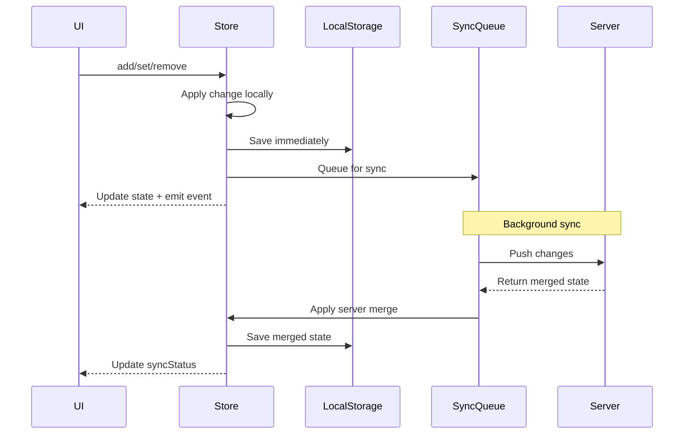
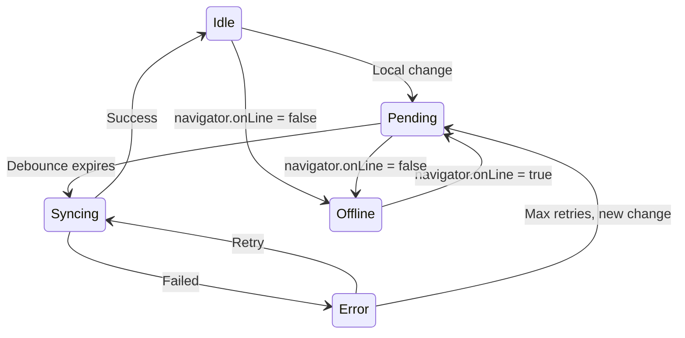

# Simple Syncable Store Design

## Overview

A simplified, type-safe syncable store with **two field types only**, automatic timestamp management, and first-class server sync support. This design prioritizes simplicity over recursive flexibility while maintaining full merge/conflict resolution capabilities.

### Design Philosophy

1. **Two field types, no recursion** - Permanent fields and Map fields only
2. **External timestamps** - Stored separately, keeping user types clean
3. **Automatic timestamp management** - `set`/`add`/`remove` handle timestamps
4. **Server sync as first-class** - Built-in sync status tracking, not bolted on
5. **Type-safe deleteAt** - Compiler enforces `deleteAt` only on map items

---

## Quick Start

```typescript
// Define your schema with permanent fields and maps
const schema = defineSchema({
  // Permanent field - updated as a whole
  settings: permanent<{
    audio: { volume: number; muted: boolean };
    theme: "light" | "dark";
  }>(),

  // Map field - items merged individually, each with deleteAt
  operations: map<{
    tx: string;
    status: "pending" | "confirmed";
  }>(),
});

// Create the store
const store = createSyncableStore({
  schema,
  account,
  storage: localStorage,
  sync: serverSync, // Optional server sync
  storageKey: (addr) => `account-${addr}`,
});

// Usage - timestamps are automatic!
store.set("settings", { audio: { volume: 0.8, muted: false }, theme: "dark" });
store.add(
  "operations",
  "op-123",
  { tx: "0xabc", status: "pending" },
  { deleteAt: Date.now() + 7 * DAY },
);
store.remove("operations", "op-123");

// Store status - reactive for UI (unified sync + storage status)
const { syncState, pendingCount, lastSyncedAt, hasError } = store.status;
```

---

## Core Concepts

### Two Field Types

| Type          | Description                    | Timestamps                     | deleteAt              |
| ------------- | ------------------------------ | ------------------------------ | --------------------- |
| **Permanent** | Single value, updated as whole | One timestamp for entire value | Never - permanent     |
| **Map**       | Key-value collection           | Each item has own timestamp    | Required on each item |

### Why This Simplification Works

The original design supported arbitrary nesting with timestamps at any level. In practice:

- **Settings** are typically updated as a whole unit
- **Collections** need per-item tracking for proper merge

By restricting to these two patterns, we gain:

- Simpler mental model
- No timestamp inheritance complexity
- Cleaner type definitions
- Automatic timestamp management

---

## Type System

### Schema Definition

```typescript
import { defineSchema, permanent, map } from "./syncable-store";

// Field type markers
type PermanentField<T> = { __type: "permanent"; value: T };
type MapField<T> = { __type: "map"; item: T };

// Helper functions to define schema
function permanent<T>(): PermanentField<T> {
  return { __type: "permanent" } as any;
}
function map<T>(): MapField<T> {
  return { __type: "map" } as any;
}

// Schema type - maps field names to field types
type Schema = Record<string, PermanentField<any> | MapField<any>>;

// Extract the user-facing data type from schema
type DataOf<S extends Schema> = {
  [K in keyof S]: S[K] extends PermanentField<infer T>
    ? T
    : S[K] extends MapField<infer T>
      ? Record<string, T & { deleteAt: number }>
      : never;
};
```

### Internal Storage Shape

```typescript
// Timestamps stored externally - not in user data
type InternalStorage<S extends Schema> = {
  // Schema version for migration tracking
  $version: number;

  // User's clean data
  data: DataOf<S>;

  // Timestamps for permanent fields
  $timestamps: {
    [K in PermanentKeys<S>]?: number;
  };

  // Per-item timestamps for map fields
  $itemTimestamps: {
    [K in MapKeys<S>]?: Record<string, number>;
  };

  // Tombstones for deleted map items
  $tombstones: {
    [K in MapKeys<S>]?: Record<string, number>; // deleteAt time
  };
};

// Helper types to extract permanent vs map keys
type PermanentKeys<S extends Schema> = {
  [K in keyof S]: S[K] extends PermanentField<any> ? K : never;
}[keyof S];

type MapKeys<S extends Schema> = {
  [K in keyof S]: S[K] extends MapField<any> ? K : never;
}[keyof S];

// Extract the inner type from a PermanentField
type ExtractPermanent<F> = F extends PermanentField<infer T> ? T : never;

// Extract the item type from a MapField
type ExtractMapItem<F> = F extends MapField<infer T> ? T : never;

// Deep partial type for patch operations
type DeepPartial<T> = T extends object
  ? { [K in keyof T]?: DeepPartial<T[K]> }
  : T;
```

### Example Storage Structure

```typescript
// Schema
const schema = defineSchema({
  settings: permanent<{ volume: number; theme: string }>(),
  operations: map<{ tx: string; status: string }>(),
});

// Stored internally as:
const storage = {
  data: {
    settings: { volume: 0.8, theme: "dark" },
    operations: {
      "op-1": { tx: "0xabc", status: "confirmed", deleteAt: 1735689600000 },
      "op-2": { tx: "0xdef", status: "pending", deleteAt: 1735776000000 },
    },
  },
  $timestamps: {
    settings: 1710000000000, // When settings was last updated
  },
  $itemTimestamps: {
    operations: {
      "op-1": 1710000000000,
      "op-2": 1710100000000,
    },
  },
  $tombstones: {
    operations: {
      "op-old": 1715000000000, // Deleted item, cleanup after this time
    },
  },
};

// External consumers see ONLY clean data:
store.data.settings; // { volume: 0.8, theme: 'dark' }
store.data.operations; // { 'op-1': {...}, 'op-2': {...} }
```

---

## Store API

### Creation

```typescript
interface SyncableStoreConfig<S extends Schema> {
  // Schema definition
  schema: S;

  // Account store to subscribe to
  account: AccountStore;

  // Local storage adapter (localStorage or IndexedDB)
  storage: AsyncStorage<InternalStorage<S>>;

  // Storage key generator
  storageKey: (account: `0x${string}`) => string;

  // Default data factory
  defaultData: () => DataOf<S>;

  // Clock function for timestamps (default: Date.now)
  // Assumed to be synced across devices (e.g., via server-provided time)
  clock?: () => number;

  // Optional: Server sync adapter
  sync?: SyncAdapter<S>;

  // Optional: Sync configuration
  syncConfig?: SyncConfig;
}

interface SyncConfig {
  // Debounce sync after changes (default: 1000ms)
  debounceMs?: number;

  // Periodic sync interval, 0 to disable (default: 30000ms)
  intervalMs?: number;

  // Sync when tab becomes visible (default: true)
  syncOnVisible?: boolean;

  // Sync when browser comes online (default: true)
  syncOnReconnect?: boolean;

  // Max retry attempts (default: 3)
  maxRetries?: number;

  // Retry backoff base (doubles each retry, default: 1000ms)
  retryBackoffMs?: number;
}

function createSyncableStore<S extends Schema>(
  config: SyncableStoreConfig<S>,
): SyncableStore<S>;
```

### Clock Synchronization

The `clock` config option is critical for correct merge behavior across devices. All timestamps must be comparable for "higher timestamp wins" to work correctly.

**Default: `Date.now()`**

If you're only doing cross-tab sync (same device), `Date.now()` is sufficient since all tabs share the same system clock.

**With Server Sync: Use Server-Provided Time**

When syncing across devices, clock drift can cause merge issues:
- Device A's clock is 5 minutes ahead
- Device A makes a change at "10:05" (actually 10:00)
- Device B makes a change at "10:02" (actually 10:02)
- Device A's change wins despite being earlier!

**Solution: Server Clock Offset**

```typescript
// On app startup or login, get server time
const serverTime = await fetch('/api/time').then(r => r.json());
const clockOffset = serverTime - Date.now();

// Use adjusted clock
const store = createSyncableStore({
  // ...
  clock: () => Date.now() + clockOffset,
});

// Periodically refresh offset (e.g., every 5 minutes)
setInterval(async () => {
  const newServerTime = await fetch('/api/time').then(r => r.json());
  clockOffset = newServerTime - Date.now();
}, 5 * 60 * 1000);
```

**Acceptable Clock Drift**

The merge algorithm uses strict timestamp comparison. For most applications:
- **< 1 second drift**: Generally acceptable
- **> 1 second drift**: May cause unexpected merge results

If high precision is needed, consider using Hybrid Logical Clocks (HLC) instead of wall-clock timestamps.

### Store Interface

```typescript
interface SyncableStore<S extends Schema> {
  // === State ===

  /** Current async state - idle/loading/ready */
  readonly state: AsyncState<DataOf<S>>;

  /** Unified status for sync and storage - reactive for UI binding */
  readonly status: StoreStatus;

  // === Permanent Field Operations ===

  /**
   * Set a permanent field value.
   * Timestamp is set automatically using the configured clock.
   */
  set<K extends PermanentKeys<S>>(
    field: K,
    value: ExtractPermanent<S[K]>,
  ): void;

  /**
   * Patch a permanent field with partial updates.
   * Performs deep merge with existing value.
   * Timestamp is set automatically using the configured clock.
   */
  patch<K extends PermanentKeys<S>>(
    field: K,
    value: DeepPartial<ExtractPermanent<S[K]>>,
  ): void;

  // === Map Field Operations ===

  /**
   * Add an item to a map field.
   * Timestamp is set automatically.
   * deleteAt is REQUIRED - enforced at type level.
   */
  add<K extends MapKeys<S>>(
    field: K,
    key: string,
    value: ExtractMapItem<S[K]>,
    options: { deleteAt: number },
  ): void;

  /**
   * Update an existing map item (full replacement).
   * Timestamp is set automatically.
   * Cannot change deleteAt - use remove + add if needed.
   *
   * Note: This replaces the entire item. The full item value is required
   * to make the replacement semantic explicit and avoid confusion about
   * concurrent update behavior.
   */
  update<K extends MapKeys<S>>(
    field: K,
    key: string,
    value: ExtractMapItem<S[K]>,
  ): void;

  /**
   * Remove an item from a map field.
   * Creates a tombstone with the item's deleteAt value.
   */
  remove<K extends MapKeys<S>>(field: K, key: string): void;

  // === Fine-Grained Reactivity ===

  /**
   * Get a Svelte-compatible store for a specific map item.
   * Returns a cached store instance for the given field/key.
   * Enables fine-grained reactivity - only components using this
   * specific item will re-render when it updates.
   */
  getItemStore<K extends MapKeys<S>>(
    field: K,
    key: string,
  ): Readable<ExtractMapItem<S[K]> | undefined>;

  // === Events ===

  /** Subscribe to events */
  on<E extends keyof StoreEvents<S>>(
    event: E,
    callback: (data: StoreEvents<S>[E]) => void,
  ): () => void;

  // === Lifecycle ===

  /** Start watching account changes */
  start(): () => void;

  /** Stop watching */
  stop(): void;

  // === Sync Control ===

  /** Force sync to server now */
  syncNow(): Promise<void>;

  /** Pause server sync */
  pauseSync(): void;

  /** Resume server sync */
  resumeSync(): void;
}
```

### Events

The store emits granular events for each field and operation. Unlike the `state` event (which fires for all state transitions), these events allow **fine-grained subscriptions** for performance optimization.

```typescript
type StoreEvents<S extends Schema> = {
  // State transitions (idle/loading/ready)
  state: AsyncState<DataOf<S>>;

  // Permanent field events - fires when the field is updated
  [(K in PermanentKeys<S>) as `${K}:changed`]: ExtractPermanent<S[K]>;

  // Map field events - fires for individual item operations
  [(K in MapKeys<S>) as `${K}:added`]: {
    key: string;
    item: ExtractMapItem<S[K]>;
  };
  [(K in MapKeys<S>) as `${K}:updated`]: {
    key: string;
    item: ExtractMapItem<S[K]>;
  };
  [(K in MapKeys<S>) as `${K}:removed`]: {
    key: string;
    item: ExtractMapItem<S[K]>;
  };

  // Sync events
  sync: SyncEvent;
};
```

**Note:** We do NOT have `:set` or `:cleared` events for maps - these are redundant with the `state` event which already fires on account switch and initial load.

### Fine-Grained Item Stores

For maps, the store provides a `getItemStore` method that returns a Svelte-compatible readable store for a specific item. This enables **fine-grained reactivity** where only the component displaying that item re-renders on updates.

```typescript
interface SyncableStore<S extends Schema> {
  // ... other methods ...

  /**
   * Get a Svelte-compatible store for a specific map item.
   * Returns a cached store instance for the given field/key.
   * The store value is `undefined` when:
   * - Account is not ready (idle/loading)
   * - Item with given key doesn't exist
   */
  getItemStore<K extends MapKeys<S>>(
    field: K,
    key: string,
  ): Readable<ExtractMapItem<S[K]> | undefined>;
}
```

**Implementation:**

```typescript
function getItemStore<K extends MapKeys<S>>(
  field: K,
  key: string,
): Readable<ExtractMapItem<S[K]> | undefined> {
  // Check cache first
  const cacheKey = `${String(field)}:${key}`;
  const cached = itemStoreCache.get(cacheKey);
  if (cached) return cached;

  // Helper to get current value
  const getCurrentValue = () => {
    if (state.status !== "ready") return undefined;
    return state.data[field]?.[key];
  };

  // Create Svelte-compatible store
  const itemStore: Readable<ExtractMapItem<S[K]> | undefined> = {
    subscribe(callback) {
      // Call immediately with current value (Svelte store contract)
      callback(getCurrentValue());

      // Subscribe to state changes (account switch, loading, etc.)
      const unsubState = on("state", () => callback(getCurrentValue()));

      // Subscribe to specific item updates
      const unsubUpdated = on(`${String(field)}:updated`, (event) => {
        if (event.key === key) callback(event.item);
      });

      // Subscribe to item removal
      const unsubRemoved = on(`${String(field)}:removed`, (event) => {
        if (event.key === key) callback(undefined);
      });

      // Subscribe to item addition (in case it was added after store creation)
      const unsubAdded = on(`${String(field)}:added`, (event) => {
        if (event.key === key) callback(event.item);
      });

      return () => {
        unsubState();
        unsubUpdated();
        unsubRemoved();
        unsubAdded();
      };
    },
  };

  itemStoreCache.set(cacheKey, itemStore);
  return itemStore;
}

// Clear cache on account switch (state goes to idle/loading)
on("state", (newState) => {
  if (newState.status !== "ready") {
    itemStoreCache.clear();
  }
});
```

**Usage in Svelte 5:**

```svelte
<script lang="ts">
  import { getAccountData } from '$lib/context';

  interface Props {
    operationId: string;
  }
  let { operationId }: Props = $props();

  const accountData = getAccountData();

  // Fine-grained store - only this component re-renders on operation updates
  let operationStore = accountData.getItemStore('operations', operationId);
</script>

{#if $operationStore}
  <div class="operation">
    <span>TX: {$operationStore.tx}</span>
    <span>Status: {$operationStore.status}</span>
  </div>
{:else}
  <div class="not-found">Operation not found</div>
{/if}
```

### Svelte-Compatible Subscribe

The main store also implements the Svelte store contract for list-level reactivity:

```typescript
subscribe(callback: (state: AsyncState<DataOf<S>>) => void): () => void {
  // Call immediately (Svelte store contract)
  callback(state);

  // Subscribe to state transitions
  const unsubState = on("state", callback);

  // Subscribe to list-level changes (add/remove) for maps
  const unsubscribers: (() => void)[] = [];
  for (const field of mapFields) {
    unsubscribers.push(on(`${field}:added`, () => callback(state)));
    unsubscribers.push(on(`${field}:removed`, () => callback(state)));
  }
  // Also for permanent field changes
  for (const field of permanentFields) {
    unsubscribers.push(on(`${field}:changed`, () => callback(state)));
  }

  // NOTE: We do NOT subscribe to `:updated` events here.
  // Individual item updates are handled by getItemStore for fine-grained reactivity.
  // This prevents re-rendering the entire list when a single item updates.

  return () => {
    unsubState();
    unsubscribers.forEach((unsub) => unsub());
  };
}
```

---

## Store Status

### Interface

```typescript
/**
 * Unified status for sync and storage operations.
 * Combines both server sync state and local storage state into a single
 * reactive object for simpler UI binding.
 */
interface StoreStatus {
  // === Sync State ===

  // Current sync state with server
  readonly syncState: "idle" | "syncing" | "error" | "offline";

  // Number of changes pending sync to server
  readonly pendingCount: number;

  // Last successful sync timestamp
  readonly lastSyncedAt: number | null;

  // Last sync error, if any
  readonly syncError: Error | null;

  // === Storage State ===

  // Current local storage state
  readonly storageState: "idle" | "saving" | "error";

  // Last successful save timestamp
  readonly lastSavedAt: number | null;

  // Last storage error (e.g., QuotaExceededError)
  readonly storageError: Error | null;

  // Number of pending saves in queue
  readonly pendingSaves: number;

  // === Convenience Getters ===

  // True if any error (sync or storage)
  readonly hasError: boolean;

  // True if there are unsaved local changes
  readonly hasUnsavedChanges: boolean;

  // True if currently syncing or saving
  readonly isBusy: boolean;
}

// Sync events for detailed tracking
type SyncEvent =
  | { type: "started" }
  | { type: "completed"; timestamp: number }
  | { type: "failed"; error: Error }
  | { type: "offline" }
  | { type: "online" };
```

### UI Integration

```svelte
<script>
  const { status } = accountData;
</script>

{#if status.syncState === 'syncing'}
  <span>Syncing {status.pendingCount} changes...</span>
{:else if status.hasError}
  <span class="error">
    {#if status.syncError}
      Sync failed: {status.syncError.message}
    {:else if status.storageError}
      Storage error: {status.storageError.message}
    {/if}
  </span>
{:else if status.syncState === 'offline'}
  <span class="offline">Offline - changes saved locally</span>
{:else if status.pendingCount > 0}
  <span>{status.pendingCount} changes pending</span>
{:else}
  <span>All synced ✓</span>
{/if}
```

---

## Server Sync Architecture

### Design Principles

1. **Local-first** - All operations work offline, sync happens in background
2. **Eventually consistent** - Same merge rules as cross-tab sync
3. **Resilient** - Handles network failures, retries automatically
4. **Observable** - Sync status is always known and reactive

### Sync Adapter Interface

```typescript
interface SyncAdapter<S extends Schema> {
  /**
   * Push local changes to server.
   * Returns merged state from server.
   *
   * Note: On account switch, pending pushes can complete if the data
   * still pertains to the account being pushed. The store tracks
   * the account per-operation.
   */
  push(
    account: `0x${string}`,
    changes: InternalStorage<S>,
  ): Promise<InternalStorage<S>>;

  /**
   * Pull latest state from server.
   *
   * Note: On account switch, in-flight pulls are discarded (via loadGeneration).
   * We don't apply stale data from a previous account.
   */
  pull(account: `0x${string}`): Promise<InternalStorage<S> | null>;

  /**
   * Subscribe to real-time updates from server.
   * Returns unsubscribe function.
   *
   * Lifecycle:
   * - Called when store starts listening for updates
   * - Unsubscribe is called when no subscribers remain
   * - NOT automatically called on account switch (store manages this)
   * - Real-time updates go through the same merge logic as pull
   */
  subscribe?(
    account: `0x${string}`,
    callback: (data: InternalStorage<S>) => void,
  ): () => void;
}
```

### Sync Flow



### Conflict Resolution

When pushing to server:

```typescript
async function syncToServer<S extends Schema>(
  local: InternalStorage<S>,
  syncAdapter: SyncAdapter<S>,
  account: `0x${string}`,
): Promise<InternalStorage<S>> {
  // Push local state, get merged result from server
  const serverMerged = await syncAdapter.push(account, local);

  // Server has applied its merge rules (same as local merge algorithm)
  // We just accept the server's merged result
  return serverMerged;
}
```

The server uses the **same merge algorithm** as local merge, ensuring consistency.

---

## Sync Lifecycle

### When Sync Happens

The store uses **throttling** to batch multiple rapid changes into a single sync operation.
This reduces server load and prevents race conditions from rapid-fire updates.

```typescript
interface SyncConfig {
  // Sync after every change (debounced/throttled)
  debounceMs?: number; // Default: 1000ms

  // Periodic sync interval (0 = disabled)
  intervalMs?: number; // Default: 30000ms (30s)

  // Sync on visibility change (tab becomes visible)
  syncOnVisible?: boolean; // Default: true

  // Sync on reconnect (navigator.onLine)
  syncOnReconnect?: boolean; // Default: true

  // Max retry attempts before giving up
  maxRetries?: number; // Default: 3

  // Retry backoff strategy
  retryBackoffMs?: number; // Default: 1000ms (doubles each retry)

  // Throttle storage saves (default: 100ms)
  // Multiple rapid changes are batched into a single save
  saveThrottleMs?: number;
}
```

> **Future Enhancement:** A `batch()` API could allow grouping multiple
> operations into a single atomic save/sync. For now, the throttle mechanism
> provides sufficient batching for most use cases.

### Sync Lifecycle Flow



### Implementation

```typescript
class SyncManager<S extends Schema> {
  private pendingChanges = false;
  private debounceTimer: number | null = null;
  private intervalTimer: number | null = null;
  private retryCount = 0;

  constructor(
    private store: InternalStore<S>,
    private adapter: SyncAdapter<S>,
    private config: SyncConfig,
  ) {
    // Listen for online/offline
    window.addEventListener("online", () => this.onOnline());
    window.addEventListener("offline", () => this.onOffline());

    // Listen for visibility change
    if (config.syncOnVisible) {
      document.addEventListener("visibilitychange", () => {
        if (document.visibilityState === "visible") {
          this.syncNow();
        }
      });
    }

    // Start periodic sync
    if (config.intervalMs && config.intervalMs > 0) {
      this.intervalTimer = setInterval(() => this.syncNow(), config.intervalMs);
    }
  }

  // Called by store after any mutation
  markDirty(): void {
    this.pendingChanges = true;

    // Debounce sync
    if (this.debounceTimer) {
      clearTimeout(this.debounceTimer);
    }
    this.debounceTimer = setTimeout(
      () => this.syncNow(),
      this.config.debounceMs ?? 1000,
    );
  }

  async syncNow(): Promise<void> {
    if (!navigator.onLine) {
      this.store.setStatus({ syncState: "offline" });
      return;
    }

    // Capture and clear pendingChanges atomically BEFORE the async operation.
    // This prevents race conditions where a mutation between the check and
    // the push would be missed.
    const hadPendingChanges = this.pendingChanges;
    if (!hadPendingChanges && this.retryCount === 0) {
      return; // Nothing to sync
    }

    // Clear pending flag before async operation
    this.pendingChanges = false;

    this.store.setStatus({ syncState: "syncing" });

    try {
      const current = this.store.getInternalStorage();

      // Push local state to server
      const serverState = await this.adapter.push(this.store.account, current);

      // Merge server response with local - changes are returned directly!
      const { merged, changes } = mergeStore(
        current,
        serverState,
        this.store.schema,
      );

      // Apply merged state
      this.store.setInternalStorage(merged);

      // Emit events for changes from server
      for (const change of changes) {
        this.store.emitter.emit(change.event, change.data);
      }

      // Emit state event if anything changed
      if (changes.length > 0) {
        this.store.emitter.emit("state", this.store.getAsyncState());
      }

      // Reset retry count on success
      this.retryCount = 0;

      this.store.setStatus({
        syncState: "idle",
        lastSyncedAt: Date.now(),
        pendingCount: 0,
      });

      // If new changes arrived during the async sync operation, schedule another sync
      if (this.pendingChanges) {
        this.debounceSync();
      }
    } catch (error) {
      // Restore pending flag on failure so we retry these changes
      this.pendingChanges = true;
      this.retryCount++;

      if (this.retryCount >= (this.config.maxRetries ?? 3)) {
        this.store.setStatus({
          syncState: "error",
          syncError: error as Error,
        });
      } else {
        // Schedule retry with backoff
        const backoff =
          (this.config.retryBackoffMs ?? 1000) * Math.pow(2, this.retryCount);
        setTimeout(() => this.syncNow(), backoff);
      }
    }
  }

  // Helper to schedule debounced sync
  private debounceSync(): void {
    if (this.debounceTimer) {
      clearTimeout(this.debounceTimer);
    }
    this.debounceTimer = setTimeout(
      () => this.syncNow(),
      this.config.debounceMs ?? 1000,
    );
  }

  private onOnline(): void {
    this.store.setStatus({ syncState: "idle" });
    this.syncNow();
  }

  private onOffline(): void {
    this.store.setStatus({ syncState: "offline" });
  }

  destroy(): void {
    if (this.debounceTimer) clearTimeout(this.debounceTimer);
    if (this.intervalTimer) clearInterval(this.intervalTimer);
  }
}
```

---

## Cross-Tab Sync

### How It Works

When another tab modifies localStorage, the `storage` event fires. The store:

1. Detects the change via `WatchableStorage.watch()`
2. Loads the new value
3. Merges with current in-memory state
4. Emits appropriate events

```typescript
// In createSyncableStore
if (isWatchable(storage)) {
  const key = storageKey(account);

  unwatchStorage = storage.watch(key, async (_, newValue) => {
    if (!newValue) return;

    // Merge with current state - changes are returned directly!
    const { merged, changes } = mergeStore(internalStorage, newValue, schema);

    // Apply merged state
    internalStorage = merged;

    // Emit events for each change
    for (const change of changes) {
      emitter.emit(change.event, change.data);
    }

    // Emit state event if anything changed
    if (changes.length > 0) {
      emitter.emit("state", getAsyncState());
    }
  });
}
```

### Change Types

```typescript
type StoreChange<S extends Schema> =
  | { event: `${string}:changed`; data: any }
  | { event: `${string}:added`; data: { key: string; item: any } }
  | { event: `${string}:updated`; data: { key: string; item: any } }
  | { event: `${string}:removed`; data: { key: string; item: any } };
```

Since `mergeStore` now returns changes directly, there's no separate `diffStores` function needed.

---

## Initial Load & Account Switch

### Load Order

When an account is set:

1. **Transition to loading state**
2. **Load from localStorage**
3. **Pull from server** (if sync adapter provided)
4. **Merge server with local** (server data may be newer)
5. **Run cleanup** (remove expired items/tombstones)
6. **Save merged state to localStorage**
7. **Transition to ready state**
8. **Emit state event**

```typescript
// Track load generation for race condition handling
let loadGeneration = 0;

async function setAccount(
  newAccount: `0x${string}` | undefined,
): Promise<void> {
  // Same account - no change needed
  if (newAccount === asyncState.account) return;

  // Clean up previous watch
  unwatchStorage?.();
  unwatchStorage = undefined;

  // Remember if we were ready (to emit clear events)
  const wasReady = asyncState.status === "ready";

  // No account - transition to idle
  if (!newAccount) {
    asyncState = { status: "idle", account: undefined };
    emitter.emit("state", asyncState);
    if (wasReady) emitClearEvents();
    return;
  }

  // Transition to loading state
  asyncState = { status: "loading", account: newAccount };
  emitter.emit("state", asyncState);
  if (wasReady) emitClearEvents();

  // Increment generation to handle rapid account switching
  loadGeneration++;
  const currentGeneration = loadGeneration;

  // Load from localStorage
  const localData = await storage.load(storageKey(newAccount));

  // Check if account changed during async load
  if (currentGeneration !== loadGeneration) return;

  let internalStorage = localData ?? createDefaultInternalStorage();

  // Pull from server if adapter provided
  if (syncAdapter) {
    try {
      const serverData = await syncAdapter.pull(newAccount);

      // Check again after async pull
      if (currentGeneration !== loadGeneration) return;

      if (serverData) {
        // Merge: server might have newer data from other devices
        const { merged } = mergeStore(internalStorage, serverData, schema);
        internalStorage = merged;
      }
    } catch (error) {
      // Check if this load is still current
      if (currentGeneration !== loadGeneration) {
        // Stale generation - log for debugging but don't propagate
        console.debug("Error during stale load (generation mismatch):", error);
        return;
      }
      // Re-throw for current generation - caller should handle
      throw error;
    }
  }

  // Final check before applying state
  if (currentGeneration !== loadGeneration) return;

  // Cleanup expired items
  internalStorage = cleanup(internalStorage, schema);

  // Save merged/cleaned state
  await storage.save(storageKey(newAccount), internalStorage);

  // Transition to ready
  asyncState = {
    status: "ready",
    account: newAccount,
    data: internalStorage.data,
  };
  emitter.emit("state", asyncState);
  emitLoadEvents(internalStorage.data);

  // Set up storage watch for cross-tab sync
  if (isWatchable(storage)) {
    unwatchStorage = storage.watch(
      storageKey(newAccount),
      handleExternalChange,
    );
  }
}
```

The `loadGeneration` pattern prevents race conditions when the user rapidly switches accounts. Each async operation checks if it's still the current generation before applying results.

### Helper Functions

The `setAccount` function and other store internals use these helper functions:

```typescript
/**
 * Type guard to check if storage supports cross-tab change detection.
 */
function isWatchable<T>(
  storage: AsyncStorage<T>,
): storage is WatchableStorage<T> {
  return "watch" in storage && typeof (storage as any).watch === "function";
}

/**
 * Emit events when account data is cleared (account switch or disconnect).
 * Called when transitioning away from a ready state.
 */
function emitClearEvents(): void {
  // Emit clear event for each map field
  for (const field of Object.keys(schema)) {
    if (schema[field].__type === "map") {
      // Note: We don't emit individual :removed events here.
      // The state event already indicates the data is gone.
      // Components should handle state.status !== 'ready' appropriately.
    }
  }
  // No explicit :cleared events - the state event is sufficient
}

/**
 * Emit events when account data is loaded (initial load or account switch).
 * Called when transitioning to ready state with data.
 */
function emitLoadEvents<S extends Schema>(data: DataOf<S>): void {
  // Emit :changed for each permanent field with data
  for (const field of Object.keys(schema)) {
    if (schema[field].__type === "permanent") {
      emitter.emit(`${field}:changed`, data[field]);
    } else if (schema[field].__type === "map") {
      // Emit :added for each existing item in maps
      const items = data[field] ?? {};
      for (const [key, item] of Object.entries(items)) {
        emitter.emit(`${field}:added`, { key, item });
      }
    }
  }
}

/**
 * Count total items across all map fields.
 * Used for pendingCount when never synced.
 */
function countAllItems<S extends Schema>(storage: InternalStorage<S>): number {
  let count = 0;
  for (const field of Object.keys(schema)) {
    if (schema[field].__type === "map") {
      const items = storage.data[field] ?? {};
      count += Object.keys(items).length;
    }
    // Permanent fields count as 1 if they have data
    if (schema[field].__type === "permanent") {
      if (storage.data[field] !== undefined) {
        count += 1;
      }
    }
  }
  return count;
}
```

---

## Pending Count Tracking

The `pendingCount` in `SyncStatus` represents changes since last successful sync:

```typescript
// Track last synced state hash
let lastSyncedHash: string | null = null;

function computeHash(storage: InternalStorage<S>): string {
  // Fast hash of timestamps and tombstones
  // Data values don't matter, only timestamps indicate changes
  return JSON.stringify({
    $timestamps: storage.$timestamps,
    $itemTimestamps: storage.$itemTimestamps,
    $tombstones: storage.$tombstones,
  });
}

function updatePendingCount(): void {
  if (lastSyncedHash === null) {
    // Never synced - count all items
    syncStatus.pendingCount = countAllItems(internalStorage);
  } else {
    // Compare with last synced
    const currentHash = computeHash(internalStorage);
    if (currentHash === lastSyncedHash) {
      syncStatus.pendingCount = 0;
    } else {
      // Count changed items (simplified: just count 1 if anything changed)
      syncStatus.pendingCount = 1;
    }
  }
}

// On successful sync
lastSyncedHash = computeHash(internalStorage);
syncStatus.pendingCount = 0;
```

---

## Merge Algorithm

### Simplified Rules

Since we only have two field types, the merge is straightforward:

#### Permanent Fields

```typescript
type PermanentMergeResult<T> = {
  value: T;
  timestamp: number;
  incomingWon: boolean; // True if incoming value was picked
};

function mergePermanent<T>(
  current: { value: T; timestamp: number },
  incoming: { value: T; timestamp: number },
): PermanentMergeResult<T> {
  // Higher timestamp wins
  if (incoming.timestamp > current.timestamp) {
    return { ...incoming, incomingWon: true };
  } else if (current.timestamp > incoming.timestamp) {
    return { ...current, incomingWon: false };
  } else {
    // Same timestamp - deterministic tiebreaker
    const winner = tiebreaker(current, incoming);
    return { ...winner, incomingWon: winner === incoming };
  }
}

function tiebreaker<T>(a: T, b: T): T {
  // Lexicographically smaller JSON wins
  // Stable: same inputs always produce same output
  //
  // CRITICAL: Must use json-stable-stringify (NOT JSON.stringify) to ensure
  // deterministic property order across all JavaScript engines. Standard
  // JSON.stringify does NOT guarantee property order, which would cause
  // different merge results on different browsers/devices.
  //
  // Import (add at top of merge.ts):
  //   import stableStringify from 'json-stable-stringify';
  //
  // Dependencies (add to web/package.json):
  //   pnpm add json-stable-stringify
  //   pnpm add -D @types/json-stable-stringify
  const aStr = stableStringify(a);
  const bStr = stableStringify(b);
  return aStr <= bStr ? a : b;
}
```

#### Map Fields

See [Map Merge (with change tracking)](#map-merge-with-change-tracking) below for the full implementation. The `mergeMap` function merges map items by key, handles tombstones, and returns change events for each modification.

#### Full Store Merge (with built-in diff)

The merge function returns both the merged state AND the changes detected, avoiding a separate diff pass:

```typescript
type MergeResult<S extends Schema> = {
  merged: InternalStorage<S>;
  changes: StoreChange<S>[];
};

function mergeStore<S extends Schema>(
  current: InternalStorage<S>,
  incoming: InternalStorage<S>,
  schema: S,
): MergeResult<S> {
  const result: InternalStorage<S> = {
    $version: Math.max(current.$version ?? 0, incoming.$version ?? 0),
    data: {} as DataOf<S>,
    $timestamps: {},
    $itemTimestamps: {},
    $tombstones: {},
  };
  const changes: StoreChange<S>[] = [];

  for (const field of Object.keys(schema)) {
    if (schema[field].__type === "permanent") {
      const currentTs = current.$timestamps[field] ?? 0;
      const incomingTs = incoming.$timestamps[field] ?? 0;

      // Merge permanent field
      // Merge permanent field - returns winner + whether incoming won
      const mergeResult = mergePermanent(
        { value: current.data[field], timestamp: currentTs },
        { value: incoming.data[field], timestamp: incomingTs },
      );
      result.data[field] = mergeResult.value;
      result.$timestamps[field] = mergeResult.timestamp;

      // Track change if incoming won (timestamp or tiebreaker)
      if (mergeResult.incomingWon) {
        changes.push({ event: `${field}:changed`, data: mergeResult.value });
      }
    } else {
      // Merge map field
      const mapResult = mergeMap(
        {
          items: current.data[field] ?? {},
          timestamps: current.$itemTimestamps[field] ?? {},
          tombstones: current.$tombstones[field] ?? {},
        },
        {
          items: incoming.data[field] ?? {},
          timestamps: incoming.$itemTimestamps[field] ?? {},
          tombstones: incoming.$tombstones[field] ?? {},
        },
        field, // Pass field name for change tracking
      );

      result.data[field] = mapResult.items;
      result.$itemTimestamps[field] = mapResult.timestamps;
      result.$tombstones[field] = mapResult.tombstones;

      // Add map changes
      changes.push(...mapResult.changes);
    }
  }

  return { merged: result, changes };
}
```

#### Map Merge (with change tracking)

```typescript
// NOTE: The changes array uses StoreChange<S> where S is the full schema type.
// However, at the map merge level, we only have the item type T. In practice,
// the field name is passed as a parameter and used to construct event names.
// Type safety is maintained at the mergeStore level where the full schema is known.
type MapMergeResult<T> = {
  items: Record<string, T>;
  timestamps: Record<string, number>;
  tombstones: Record<string, number>;
  // Using string-based event names since field name is a runtime parameter.
  // Full type safety is ensured in mergeStore which has the schema type.
  changes: Array<{
    event: `${string}:added` | `${string}:updated` | `${string}:removed`;
    data: { key: string; item: T };
  }>;
};

function mergeMap<T>(
  current: MapState<T>,
  incoming: MapState<T>,
  fieldName: string,
): MapMergeResult<T> {
  const items: Record<string, T> = {};
  const timestamps: Record<string, number> = {};
  const tombstones: Record<string, number> = {};
  const changes: StoreChange<any>[] = [];

  // Merge tombstones first - later deleteAt wins
  const allTombstoneKeys = new Set([
    ...Object.keys(current.tombstones),
    ...Object.keys(incoming.tombstones),
  ]);

  for (const key of allTombstoneKeys) {
    const ct = current.tombstones[key] ?? 0;
    const it = incoming.tombstones[key] ?? 0;
    if (ct > 0 || it > 0) {
      tombstones[key] = Math.max(ct, it);
    }
  }

  // Merge items - skip tombstoned ones
  const allItemKeys = new Set([
    ...Object.keys(current.items),
    ...Object.keys(incoming.items),
  ]);

  for (const key of allItemKeys) {
    const hadItem = !!current.items[key];
    const isTombstoned = !!tombstones[key];

    if (isTombstoned) {
      // Item was deleted - emit removed if we had it
      if (hadItem) {
        changes.push({
          event: `${fieldName}:removed`,
          data: { key, item: current.items[key] },
        });
      }
      continue;
    }

    const cItem = current.items[key];
    const iItem = incoming.items[key];
    const cTs = current.timestamps[key] ?? 0;
    const iTs = incoming.timestamps[key] ?? 0;

    let winner: T;
    let winnerTs: number;

    if (!cItem && iItem) {
      winner = iItem;
      winnerTs = iTs;
      changes.push({
        event: `${fieldName}:added`,
        data: { key, item: iItem },
      });
    } else if (cItem && !iItem) {
      winner = cItem;
      winnerTs = cTs;
      // No change - we keep current
    } else {
      // Both have item - higher timestamp wins
      if (iTs > cTs) {
        // Incoming has higher timestamp - it wins, emit update
        winner = iItem;
        winnerTs = iTs;
        changes.push({
          event: `${fieldName}:updated`,
          data: { key, item: iItem },
        });
      } else if (cTs > iTs) {
        // Current has higher timestamp - no change
        winner = cItem;
        winnerTs = cTs;
      } else {
        // Same timestamp - deterministic tiebreaker
        const picked = tiebreaker(
          { item: cItem, ts: cTs },
          { item: iItem, ts: iTs },
        );
        winner = picked.item;
        winnerTs = picked.ts;
        // Emit update if incoming won the tiebreaker
        if (winner === iItem) {
          changes.push({
            event: `${fieldName}:updated`,
            data: { key, item: iItem },
          });
        }
      }
    }

    items[key] = winner;
    timestamps[key] = winnerTs;
  }

  return { items, timestamps, tombstones, changes };
}
```

This design is more efficient because:

1. **Single pass** - No need to iterate twice (merge then diff)
2. **Context-aware** - Merge logic knows exactly what changed as it decides
3. **Cleaner code** - Changes are captured where decisions are made

---

## Cleanup Algorithm

### When Cleanup Runs

- On store initialization
- After every merge

### Implementation

```typescript
function cleanup<S extends Schema>(
  storage: InternalStorage<S>,
  schema: S,
  now: number = Date.now(),
): InternalStorage<S> {
  const result: InternalStorage<S> = {
    data: { ...storage.data },
    $timestamps: { ...storage.$timestamps },
    $itemTimestamps: { ...storage.$itemTimestamps },
    $tombstones: { ...storage.$tombstones },
  };

  for (const field of Object.keys(schema)) {
    if (schema[field].__type === "map") {
      // Clean up expired tombstones
      const tombstones = result.$tombstones[field] ?? {};
      for (const [key, deleteAt] of Object.entries(tombstones)) {
        if (deleteAt <= now) {
          delete result.$tombstones[field][key];
        }
      }

      // Clean up expired items
      const items = result.data[field] ?? {};
      for (const [key, item] of Object.entries(items)) {
        if (item.deleteAt <= now) {
          delete result.data[field][key];
          delete result.$itemTimestamps[field]?.[key];
        }
      }
    }
    // Permanent fields are never cleaned up
  }

  return result;
}
```

---

## Zombie Prevention

### The Problem

Without proper handling, deleted items can "resurrect" when an offline client syncs stale data:

```
Timeline:
1. Tab A has item X
2. Tab B deletes item X -> tombstone created
3. 8 days pass, tombstone expires
4. Tab A comes back online with item X
5. Item X reappears! (zombie)
```

### The Solution: Required deleteAt with Absolute Timestamps

By **requiring `deleteAt` at compile time** for all map items, we ensure:

1. Every item has an **absolute expiration timestamp** set at creation time
2. Tombstones inherit the item's `deleteAt` (same absolute timestamp)
3. Both the item and tombstone expire at the same absolute time
4. **The offline client's copy also has the same `deleteAt`** - it will be cleaned up locally regardless of whether the tombstone exists

**Why this prevents zombies:**

```
Timeline (with absolute timestamps):
1. Day 0: Tab A creates item X with deleteAt = Day 7 (absolute)
2. Day 1: Tab B deletes item X -> tombstone with deleteAt = Day 7
3. Day 8: Tombstone expires (Day 7 < Day 8)
4. Day 8: Tab A comes online with item X (deleteAt = Day 7)
5. Day 8: Cleanup runs -> item X is cleaned up because Day 7 < Day 8
6. No zombie! The item's own deleteAt protects against resurrection.
```

The key insight is that `deleteAt` is an **absolute timestamp**, not a relative duration. The offline client's stale data contains the same `deleteAt` value, so it will be cleaned up during the cleanup phase regardless of whether a tombstone exists.

```typescript
// TypeScript enforces deleteAt is required
store.add(
  "operations",
  "op-1",
  { tx: "0x...", status: "pending" },
  { deleteAt: Date.now() + 7 * DAY }, // Required! Absolute timestamp.
);

// Compile error if deleteAt is missing
store.add(
  "operations",
  "op-1",
  { tx: "0x...", status: "pending" },
  // Error: Argument of type '{}' is not assignable to parameter
  //        of type '{ deleteAt: number }'
);
```

---

## Local Storage vs IndexedDB

The store supports both through the `AsyncStorage` interface:

```typescript
// localStorage - synchronous but has size limits
const localStorageAdapter = createLocalStorageAdapter<InternalStorage<S>>();

// IndexedDB - async, larger storage, better for complex data
const indexedDBAdapter = createIndexedDBAdapter<InternalStorage<S>>({
  dbName: "account-data",
  storeName: "accounts",
});

// Both implement the same interface
interface AsyncStorage<T> {
  load(key: string): Promise<T | undefined>;
  save(key: string, data: T): Promise<void>;
  remove(key: string): Promise<void>;
  exists(key: string): Promise<boolean>;
}

/**
 * Extension for cross-tab change detection.
 *
 * Implementation notes:
 * - localStorage: Uses native `storage` event (automatic)
 * - IndexedDB: Must use BroadcastChannel, SharedWorker, or polling
 *   (adapter chooses the mechanism based on browser support)
 */
interface WatchableStorage<T> extends AsyncStorage<T> {
  /**
   * Watch for external changes to the given key.
   * Called when another tab/window modifies the data.
   *
   * @param key - Storage key to watch
   * @param callback - Called with new value when external change detected
   * @returns Unsubscribe function
   */
  watch(
    key: string,
    callback: (key: string, value: T | undefined) => void,
  ): () => void;
}
```

Both are **fire-and-forget** by default - saves don't block the UI. The store handles:

- Queuing saves to prevent races
- Handling save failures gracefully
- Notifying when saves complete (if needed)

---

## Schema Migration

### Why Migration Matters

When the schema changes between app versions, existing stored data may be incompatible:

- **New fields added** - Old data missing the field
- **Field types changed** - e.g., `string` → `{ value: string; label: string }`
- **Fields removed** - Old data has extra fields
- **Item shapes changed** - Map items gain/lose properties

### Migration Strategy

```typescript
interface SyncableStoreConfig<S extends Schema> {
  // ... other config ...

  // Current schema version (increment when schema changes)
  schemaVersion: number;

  // Migration functions keyed by target version
  migrations?: Record<
    number,
    (oldData: InternalStorage<any>) => InternalStorage<S>
  >;
}
```

### Migration Flow

Migration is integrated directly into the main load flow within `setAccount`. This ensures:
- Migration uses the same `loadGeneration` tracking as the rest of the load process
- No race conditions when rapidly switching accounts during migration
- Consistent error handling across the entire load lifecycle

The migration logic is inlined in the load flow (see updated `setAccount` below):

```typescript
// Inside setAccount, after loading from localStorage:
const localData = await storage.load(storageKey(newAccount));

// Check if account changed during async load
if (currentGeneration !== loadGeneration) return;

let internalStorage: InternalStorage<S>;

if (!localData) {
  // No existing data - use defaults with current version
  internalStorage = {
    $version: config.schemaVersion,
    data: defaultData(),
    $timestamps: {},
    $itemTimestamps: {},
    $tombstones: {},
  };
} else {
  // Check version and migrate if needed
  const storedVersion = localData.$version ?? 0;

  if (storedVersion === config.schemaVersion) {
    // Already at current version
    internalStorage = localData;
  } else if (storedVersion > config.schemaVersion) {
    // Future version - app was downgraded, cannot migrate safely
    console.warn(
      `Stored data version (${storedVersion}) is newer than schema (${config.schemaVersion}). ` +
        `Using data as-is, but some fields may be incompatible.`,
    );
    internalStorage = localData;
  } else {
    // Migrate through each version sequentially
    let migrated = localData;
    for (let v = storedVersion + 1; v <= config.schemaVersion; v++) {
      const migration = config.migrations?.[v];
      if (!migration) {
        throw new Error(
          `Missing migration for version ${v}. ` +
            `Add a migration function in config.migrations[${v}].`,
        );
      }
      migrated = migration(migrated);
      migrated.$version = v;
    }
    internalStorage = migrated as InternalStorage<S>;

    // Save migrated data (still within generation check scope)
    await storage.save(storageKey(newAccount), internalStorage);

    // Check generation again after async save
    if (currentGeneration !== loadGeneration) return;
  }
}

// Continue with server pull, merge, cleanup, etc...
```

### Example Migration

```typescript
const accountStore = createSyncableStore({
  schema: accountSchema,
  schemaVersion: 2,
  migrations: {
    // v1 -> v2: Add 'priority' field to operations
    2: (oldData) => ({
      ...oldData,
      data: {
        ...oldData.data,
        operations: Object.fromEntries(
          Object.entries(oldData.data.operations ?? {}).map(
            ([key, op]: [string, any]) => [
              key,
              { ...op, priority: "normal" }, // Add default priority
            ],
          ),
        ),
      },
    }),
  },
  // ... other config
});
```

### Internal Storage with Version

```typescript
type InternalStorage<S extends Schema> = {
  // Schema version for migration tracking
  $version: number;

  // User's clean data
  data: DataOf<S>;

  // Timestamps for permanent fields
  $timestamps: { [K in PermanentKeys<S>]?: number };

  // Per-item timestamps for map fields
  $itemTimestamps: { [K in MapKeys<S>]?: Record<string, number> };

  // Tombstones for deleted map items
  $tombstones: { [K in MapKeys<S>]?: Record<string, number> };
};
```

---

## Usage Example: AccountData

### Schema Definition

```typescript
// types.ts
import { defineSchema, permanent, map } from "$lib/core/sync";

export type OnchainOperation = {
  tx: string;
  status: "pending" | "confirmed" | "failed";
  metadata: Record<string, unknown>;
};

export type UserSettings = {
  audio: { volume: number; muted: boolean };
  notifications: { enabled: boolean; types: string[] };
  theme: "light" | "dark" | "system";
};

export const accountSchema = defineSchema({
  settings: permanent<UserSettings>(),
  operations: map<OnchainOperation>(),
});

export type AccountSchema = typeof accountSchema;
```

### Store Creation

```typescript
// AccountData.ts
import { createSyncableStore } from "$lib/core/sync";
import { accountSchema, type AccountSchema } from "./types";

export function createAccountData(params: {
  account: AccountStore;
  deployments: TypedDeployments;
}) {
  const store = createSyncableStore<AccountSchema>({
    schema: accountSchema,
    account: params.account,
    storage: createLocalStorageAdapter(),
    storageKey: (addr) => `account-${params.deployments.chain.id}-${addr}`,

    defaultData: () => ({
      settings: {
        audio: { volume: 0.8, muted: false },
        notifications: { enabled: true, types: ["all"] },
        theme: "system",
      },
      operations: {},
    }),

    // Optional: server sync
    sync: createServerSyncAdapter({
      endpoint: "/api/sync",
      authToken: () => getAuthToken(),
    }),
  });

  return store;
}
```

### Component Usage (Svelte 5)

```svelte
<script lang="ts">
  import { getAccountData } from '$lib/context';

  const accountData = getAccountData();

  function updateVolume(volume: number) {
    accountData.set('settings', {
      ...accountData.state.data.settings,
      audio: { ...accountData.state.data.settings.audio, volume }
    });
  }

  function addOperation(tx: string) {
    const id = `op-${Date.now()}`;
    accountData.add('operations', id,
      { tx, status: 'pending', metadata: {} },
      { deleteAt: Date.now() + 7 * 24 * 60 * 60 * 1000 }
    );
    return id;
  }

  function confirmOperation(id: string) {
    accountData.update('operations', id, { status: 'confirmed' });
  }
</script>

<!-- Store subscription works the same in Svelte 5 -->
{#if $accountData.state.status === 'ready'}
  <Settings
    settings={$accountData.state.data.settings}
    onVolumeChange={updateVolume}
  />

  <Operations
    operations={$accountData.state.data.operations}
    onConfirm={confirmOperation}
  />

  <StatusIndicator status={$accountData.status} />
{/if}
```

---

## Implementation Plan

### Files to Create

1. **`web/src/lib/core/sync/types.ts`**
   - Schema definition types: `PermanentField`, `MapField`
   - `defineSchema`, `permanent`, `map` helpers
   - `InternalStorage`, `DataOf`, type extractors
   - `StoreStatus`, `SyncEvent` types

2. **`web/src/lib/core/sync/merge.ts`**
   - `mergePermanent` - permanent field merge
   - `mergeMap` - map field merge with tombstones (returns changes)
   - `mergeStore` - full store merge (returns `{ merged, changes }`)
   - `tiebreaker` - deterministic conflict resolution
   - `StoreChange`, `MergeResult` types

3. **`web/src/lib/core/sync/cleanup.ts`**
   - `cleanup` - remove expired items and tombstones

4. **`web/src/lib/core/sync/createSyncableStore.ts`**
   - Main store factory
   - Account subscription handling
   - Local storage integration
   - Event emission
   - Svelte-compatible `subscribe`

5. **`web/src/lib/core/sync/serverSync.ts`**
   - `SyncAdapter` implementation
   - Sync queue management
   - Retry logic
   - Online/offline detection

6. **`web/src/lib/core/sync/index.ts`**
   - Public API exports

### Files to Modify

1. **`web/src/lib/account/AccountData.ts`**
   - Migrate to use `createSyncableStore`
   - Define schema using new type system

---

## Comparison with Original Design

| Aspect           | Original Design        | Simplified Design              |
| ---------------- | ---------------------- | ------------------------------ |
| Field nesting    | Arbitrary depth        | 2 types only                   |
| Timestamps       | In-object              | External storage               |
| deleteAt         | User manages           | Required at add time           |
| Merge complexity | Recursive              | Linear by field                |
| Type cleanliness | Has updatedAt/deleteAt | Clean user types               |
| Server sync      | Treated as storage     | First-class citizen            |
| Sync status      | Not tracked            | Built-in, reactive             |
| API surface      | Generic mutations      | Specific set/add/update/remove |

---

## Testing Plan

### Unit Tests: Merge

| Test                       | Description                                  |
| -------------------------- | -------------------------------------------- |
| `permanent-higher-ts-wins` | Higher timestamp wins for permanent fields   |
| `permanent-tiebreaker`     | Same timestamp uses deterministic comparison |
| `map-item-merge`           | Items merged by key with timestamps          |
| `map-tombstone-wins`       | Tombstone beats live item                    |
| `map-tombstone-merge`      | Later deleteAt wins for tombstones           |
| `full-store-merge`         | Complete store merge with both field types   |

### Unit Tests: Cleanup

| Test                          | Description                           |
| ----------------------------- | ------------------------------------- |
| `cleanup-expired-items`       | Items past deleteAt are removed       |
| `cleanup-expired-tombstones`  | Tombstones past deleteAt are removed  |
| `cleanup-keeps-valid`         | Non-expired items and tombstones kept |
| `cleanup-permanent-untouched` | Permanent fields never cleaned        |

### Integration Tests

| Test                  | Description                          |
| --------------------- | ------------------------------------ |
| `cross-tab-sync`      | Changes in one tab appear in another |
| `server-sync-push`    | Local changes sync to server         |
| `server-sync-pull`    | Server changes sync to local         |
| `offline-resilience`  | Works offline, syncs when online     |
| `conflict-resolution` | Concurrent edits merge correctly     |

---

## Security Considerations

### Data at Rest

- **localStorage/IndexedDB is not encrypted** - Sensitive data (private keys, tokens) should NOT be stored in the syncable store
- **XSS vulnerabilities** - Any XSS attack can read all localStorage data; use Content Security Policy and sanitize inputs
- **Shared computer risk** - Data persists across browser sessions; consider providing a "clear data" option

### Data in Transit

- **Server sync should use HTTPS** - The sync adapter should enforce TLS for all server communication
- **Authentication tokens** - Store tokens separately from user data; refresh tokens should not be in the syncable store
- **Request validation** - Server should validate all incoming data against the schema

### Recommendations

```typescript
// DO: Store non-sensitive, recoverable data
const schema = defineSchema({
  settings: permanent<UserSettings>(), // UI preferences - OK
  operations: map<OnchainOperation>(), // Transaction history - OK (public on-chain anyway)
});

// DON'T: Store sensitive data
// ❌ privateKey: permanent<string>()
// ❌ authToken: permanent<string>()
// ❌ seedPhrase: permanent<string[]>()
```

---

## Performance Characteristics

### Memory Usage

- **In-memory state** - Full data is kept in memory when account is ready
- **Item store cache** - `getItemStore` caches Svelte stores; cleared on account switch
- **Event listeners** - Each subscription adds minimal overhead

### Storage Operations

| Operation | localStorage   | IndexedDB        |
| --------- | -------------- | ---------------- |
| Load      | ~1-5ms (sync)  | ~5-20ms (async)  |
| Save      | ~1-10ms (sync) | ~5-30ms (async)  |
| Watch     | Native event   | BroadcastChannel |

### Sync Operations

- **Debounced saves** - Multiple rapid changes batched into single save (configurable, default 100ms)
- **Debounced sync** - Server sync debounced to prevent rapid-fire requests (default 1000ms)
- **Merge complexity** - O(n) where n is total items across all map fields

### Scalability Limits

| Constraint        | localStorage      | IndexedDB                  |
| ----------------- | ----------------- | -------------------------- |
| Total size        | ~5MB              | ~50MB+ (browser dependent) |
| Items per map     | ~1000 recommended | ~10000+                    |
| Fields per schema | No hard limit     | No hard limit              |

### Optimization Tips

1. **Use `getItemStore`** for individual item reactivity instead of subscribing to full state
2. **Set appropriate `deleteAt`** - shorter retention = less data to merge/sync
3. **Consider IndexedDB** for large datasets (>1MB or >1000 items)
4. **Use `patch`** instead of `set` for partial updates to avoid spreading

---

## Error Recovery

### Storage Errors

```typescript
// Storage errors are tracked in the unified StoreStatus
// storageState: "idle" | "saving" | "error"
// storageError: Error | null  (e.g., QuotaExceededError)
// lastSavedAt: number | null
// pendingSaves: number
```

**QuotaExceededError handling:**

```typescript
// When storage quota is exceeded:
// 1. status.storageError is set
// 2. Data remains in memory (not lost)
// 3. User can be prompted to clear old data

if (status.storageError?.name === "QuotaExceededError") {
  // Option 1: Clear old operations
  for (const [key, op] of Object.entries(store.state.data.operations)) {
    if (op.deleteAt < Date.now() + 1 * DAY) {
      store.remove("operations", key);
    }
  }

  // Option 2: Notify user
  showNotification("Storage full. Some data may not be saved.");
}
```

### Sync Errors

```typescript
// Sync errors are tracked in the unified StoreStatus with automatic retry
// syncState: "idle" | "syncing" | "error" | "offline"
// syncError: Error | null

// Retry behavior:
// 1. First failure: retry after 1s
// 2. Second failure: retry after 2s
// 3. Third failure: stop retrying, set syncState to "error"
// 4. User can manually trigger sync with syncNow()
```

### Corruption Recovery

If stored data becomes corrupted or incompatible:

```typescript
// The store provides a reset mechanism
function resetAccountData(account: `0x${string}`): Promise<void> {
  // 1. Clear local storage for this account
  await storage.remove(storageKey(account));

  // 2. Pull fresh data from server (if available)
  if (syncAdapter) {
    const serverData = await syncAdapter.pull(account);
    if (serverData) {
      await storage.save(storageKey(account), serverData);
    }
  }

  // 3. Reload store
  await setAccount(account);
}
```

### Graceful Degradation

The store is designed to continue working even when:

- **Server is unavailable** - Local operations work; sync resumes when online
- **Storage save fails** - In-memory state remains; user can continue working
- **Migration fails** - Error is thrown; app can show recovery UI
- **Cross-tab sync fails** - Each tab operates independently; manual refresh syncs

---

## Summary

This simplified design provides:

1. **Clean types** - No timestamp fields in user data
2. **Type safety** - `deleteAt` required for map items at compile time
3. **Simple API** - `set`/`add`/`update`/`remove` with automatic timestamps
4. **First-class sync** - Built-in sync status and server integration
5. **Predictable merge** - Simple rules, no recursion complexity
6. **Zombie prevention** - Required `deleteAt` ensures clean expiration

The design trades recursive flexibility for simplicity and better developer experience, while maintaining full conflict resolution capabilities for the two common patterns: settings (permanent) and collections (maps).
