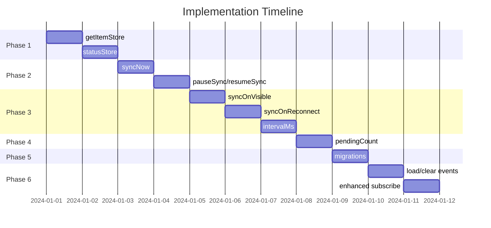

# Syncable Store - Missing Features Implementation Plan

## Overview

This document outlines the implementation plan for features missing from [`createSyncableStore.ts`](../web/src/lib/core/sync/createSyncableStore.ts) as specified in the [Simple Syncable Store Design](./simple-syncable-store-design.md).

---

## Phase 1: Fine-Grained Reactivity (High Priority)

### 1.1 Add `getItemStore()` Method

**Purpose:** Enable fine-grained reactivity where only components displaying a specific map item re-render when that item changes.

**Location:** [`createSyncableStore.ts`](../web/src/lib/core/sync/createSyncableStore.ts)

**Interface:**
```typescript
getItemStore<K extends MapKeys<S>>(
  field: K,
  key: string,
): Readable<(ExtractMapItem<S[K]> & { deleteAt: number }) | undefined>;
```

**Implementation Steps:**

1. Add item store cache inside `createSyncableStore`:
   ```typescript
   const itemStoreCache = new Map<string, Readable<unknown>>();
   ```

2. Implement `getItemStore` method:
   ```typescript
   getItemStore<K extends MapKeys<S>>(
     field: K,
     key: string,
   ): Readable<(ExtractMapItem<S[K]> & { deleteAt: number }) | undefined> {
     const cacheKey = `${String(field)}:${key}`;
     const cached = itemStoreCache.get(cacheKey);
     if (cached) return cached as Readable<...>;

     const getCurrentValue = () => {
       if (asyncState.status !== 'ready') return undefined;
       return (asyncState.data[field] as Record<string, unknown>)?.[key];
     };

     const itemStore: Readable<...> = {
       subscribe(callback) {
         callback(getCurrentValue());
         
         const unsubState = emitter.on('state', () => callback(getCurrentValue()));
         const unsubAdded = emitter.on(`${String(field)}:added`, (e) => {
           if (e.key === key) callback(e.item);
         });
         const unsubUpdated = emitter.on(`${String(field)}:updated`, (e) => {
           if (e.key === key) callback(e.item);
         });
         const unsubRemoved = emitter.on(`${String(field)}:removed`, (e) => {
           if (e.key === key) callback(undefined);
         });

         return () => {
           unsubState();
           unsubAdded();
           unsubUpdated();
           unsubRemoved();
         };
       },
     };

     itemStoreCache.set(cacheKey, itemStore);
     return itemStore;
   }
   ```

3. Clear cache on account switch (add to `setAccount`):
   ```typescript
   // When transitioning away from ready or to a new account
   itemStoreCache.clear();
   ```

4. Update `SyncableStore` interface in the same file to include the method.

---

### 1.2 Add `statusStore` - Reactive Status Store

**Purpose:** Expose `StoreStatus` as a subscribable Svelte store for reactive UI binding.

**Implementation Steps:**

1. Add status subscribers set:
   ```typescript
   const statusSubscribers = new Set<(status: StoreStatus) => void>();
   ```

2. Create `notifyStatusChange` helper:
   ```typescript
   function notifyStatusChange(): void {
     for (const callback of statusSubscribers) {
       callback(status);
     }
   }
   ```

3. Create the status store:
   ```typescript
   const statusStore: Readable<StoreStatus> = {
     subscribe(callback) {
       statusSubscribers.add(callback);
       callback(status);
       return () => statusSubscribers.delete(callback);
     },
   };
   ```

4. Call `notifyStatusChange()` whenever status properties change (in `saveToStorage`, `performSyncPush`, etc.)

5. Add to store interface:
   ```typescript
   /** Subscribe to status changes */
   readonly statusStore: Readable<StoreStatus>;
   ```

---

## Phase 2: Sync Control Methods (Medium Priority)

### 2.1 Add `syncNow()` Method

**Purpose:** Force immediate sync to server, bypassing debounce.

**Implementation:**
```typescript
async syncNow(): Promise<void> {
  if (!syncAdapter || asyncState.status !== 'ready') return;
  
  // Clear any pending debounce
  if (syncDebounceTimer) {
    clearTimeout(syncDebounceTimer);
    syncDebounceTimer = undefined;
  }
  
  await performSyncPush();
}
```

---

### 2.2 Add `pauseSync()` / `resumeSync()` Methods

**Purpose:** Allow pausing server sync (e.g., during batch operations).

**Implementation:**

1. Add state variable:
   ```typescript
   let syncPaused = false;
   ```

2. Implement methods:
   ```typescript
   pauseSync(): void {
     syncPaused = true;
     if (syncDebounceTimer) {
       clearTimeout(syncDebounceTimer);
       syncDebounceTimer = undefined;
     }
   }

   resumeSync(): void {
     syncPaused = false;
     if (syncDirty) {
       scheduleSyncPush();
     }
   }
   ```

3. Update `scheduleSyncPush` to check `syncPaused`:
   ```typescript
   function scheduleSyncPush(): void {
     if (!syncAdapter || !asyncState.account || syncPaused) return;
     // ... rest of implementation
   }
   ```

---

## Phase 3: Sync Lifecycle Features (Medium Priority)

### 3.1 Implement `syncOnVisible`

**Purpose:** Sync when tab becomes visible after being hidden.

**Implementation:**

1. Add visibility change listener in `start()`:
   ```typescript
   let handleVisibilityChange: (() => void) | undefined;
   
   start(): () => void {
     // ... existing account subscription ...
     
     if (syncConfig?.syncOnVisible !== false && typeof document !== 'undefined') {
       handleVisibilityChange = () => {
         if (document.visibilityState === 'visible' && asyncState.status === 'ready') {
           performSyncPull(asyncState.account);
         }
       };
       document.addEventListener('visibilitychange', handleVisibilityChange);
     }
     
     return () => store.stop();
   }
   ```

2. Cleanup in `stop()`:
   ```typescript
   stop(): void {
     // ... existing cleanup ...
     if (handleVisibilityChange) {
       document.removeEventListener('visibilitychange', handleVisibilityChange);
       handleVisibilityChange = undefined;
     }
   }
   ```

---

### 3.2 Implement `syncOnReconnect`

**Purpose:** Sync when browser comes back online.

**Implementation:**

1. Add online/offline listeners:
   ```typescript
   let handleOnline: (() => void) | undefined;
   let handleOffline: (() => void) | undefined;
   
   start(): () => void {
     // ... existing code ...
     
     if (syncConfig?.syncOnReconnect !== false && typeof window !== 'undefined') {
       handleOnline = () => {
         (status as { syncState: string }).syncState = 'idle';
         notifyStatusChange();
         if (asyncState.status === 'ready') {
           performSyncPush();
         }
       };
       handleOffline = () => {
         (status as { syncState: string }).syncState = 'offline';
         notifyStatusChange();
       };
       window.addEventListener('online', handleOnline);
       window.addEventListener('offline', handleOffline);
     }
     
     return () => store.stop();
   }
   ```

2. Cleanup in `stop()`:
   ```typescript
   if (handleOnline) window.removeEventListener('online', handleOnline);
   if (handleOffline) window.removeEventListener('offline', handleOffline);
   ```

---

### 3.3 Implement `intervalMs` - Periodic Sync

**Purpose:** Periodically sync with server even without local changes.

**Implementation:**

1. Add interval timer:
   ```typescript
   let syncIntervalTimer: ReturnType<typeof setInterval> | undefined;
   ```

2. Start interval in `start()`:
   ```typescript
   const intervalMs = syncConfig?.intervalMs ?? 30000;
   if (syncAdapter && intervalMs > 0) {
     syncIntervalTimer = setInterval(() => {
       if (asyncState.status === 'ready' && !syncPaused) {
         performSyncPull(asyncState.account);
       }
     }, intervalMs);
   }
   ```

3. Cleanup in `stop()`:
   ```typescript
   if (syncIntervalTimer) {
     clearInterval(syncIntervalTimer);
     syncIntervalTimer = undefined;
   }
   ```

---

## Phase 4: Status Tracking (Medium Priority)

### 4.1 Implement `pendingCount` Tracking

**Purpose:** Track number of changes pending sync to server.

**Implementation:**

1. Add tracking variables:
   ```typescript
   let lastSyncedTimestampsHash: string | null = null;
   ```

2. Create hash function:
   ```typescript
   function computeTimestampsHash(storage: InternalStorage<S>): string {
     return JSON.stringify({
       $timestamps: storage.$timestamps,
       $itemTimestamps: storage.$itemTimestamps,
       $tombstones: storage.$tombstones,
     });
   }
   ```

3. Update pending count after mutations:
   ```typescript
   function updatePendingCount(): void {
     if (!internalStorage) {
       (status as { pendingCount: number }).pendingCount = 0;
       return;
     }
     
     const currentHash = computeTimestampsHash(internalStorage);
     if (lastSyncedTimestampsHash === null) {
       // Never synced - count all fields
       let count = Object.keys(internalStorage.$timestamps).length;
       for (const field of Object.keys(internalStorage.$itemTimestamps)) {
         count += Object.keys(internalStorage.$itemTimestamps[field] || {}).length;
       }
       (status as { pendingCount: number }).pendingCount = count;
     } else if (currentHash !== lastSyncedTimestampsHash) {
       (status as { pendingCount: number }).pendingCount = 1; // Simplified: just indicate dirty
     } else {
       (status as { pendingCount: number }).pendingCount = 0;
     }
     notifyStatusChange();
   }
   ```

4. Reset on successful sync:
   ```typescript
   // In performSyncPush after success
   lastSyncedTimestampsHash = computeTimestampsHash(internalStorage);
   (status as { pendingCount: number }).pendingCount = 0;
   ```

---

## Phase 5: Schema Migration (Lower Priority)

### 5.1 Add Migration Support

**Purpose:** Support migrating data when schema version changes.

**Implementation:**

1. Update config interface:
   ```typescript
   export interface SyncableStoreConfig<S extends Schema> {
     // ... existing fields ...
     
     /** Migration functions keyed by target version */
     migrations?: Record<number, (oldData: InternalStorage<unknown>) => InternalStorage<S>>;
   }
   ```

2. Add migration logic in `setAccount` after loading from storage:
   ```typescript
   // After: const localData = await storage.load(storageKey(newAccount));
   
   if (localData) {
     const storedVersion = localData.$version ?? 0;
     
     if (storedVersion < schemaVersion) {
       // Run migrations sequentially
       let migrated = localData;
       for (let v = storedVersion + 1; v <= schemaVersion; v++) {
         const migration = config.migrations?.[v];
         if (!migration) {
           throw new Error(`Missing migration for version ${v}`);
         }
         migrated = migration(migrated);
         migrated.$version = v;
       }
       internalStorage = migrated as InternalStorage<S>;
       
       // Save migrated data
       await storage.save(storageKey(newAccount), internalStorage);
       if (currentGeneration !== loadGeneration) return;
     } else {
       internalStorage = localData;
     }
   } else {
     internalStorage = createDefaultInternalStorage();
   }
   ```

---

## Phase 6: Enhanced Event Handling (Lower Priority)

### 6.1 Add Load/Clear Event Helpers

**Purpose:** Emit proper events on account transitions.

**Implementation:**

1. Add `emitLoadEvents` helper:
   ```typescript
   function emitLoadEvents(data: DataOf<S>): void {
     for (const field of Object.keys(schema)) {
       if (schema[field].__type === 'permanent') {
         emitter.emit(`${field}:changed` as keyof StoreEvents<S>, 
           data[field] as StoreEvents<S>[keyof StoreEvents<S>]);
       } else if (schema[field].__type === 'map') {
         const items = (data[field] ?? {}) as Record<string, unknown>;
         for (const [key, item] of Object.entries(items)) {
           emitter.emit(`${field}:added` as keyof StoreEvents<S>, 
             { key, item } as StoreEvents<S>[keyof StoreEvents<S>]);
         }
       }
     }
   }
   ```

2. Call after transitioning to ready state in `setAccount`.

---

### 6.2 Enhance `subscribe()` Behavior

**Purpose:** Make the main store subscription not trigger on individual item updates (leave that to `getItemStore`).

**Current behavior:** Notifies on all state changes.

**Enhanced behavior:** Only notify on:
- State transitions (idle/loading/ready)
- Permanent field changes
- Map add/remove (not update)

This is an **optimization** - the current implementation works but may cause unnecessary re-renders. Consider implementing after `getItemStore` is available and in use.

---

## Implementation Order



---

## Testing Requirements

### Unit Tests

| Feature | Test Cases |
|---------|-----------|
| `getItemStore` | Returns cached store, updates on item change, returns undefined when removed, clears cache on account switch |
| `statusStore` | Notifies on status changes, provides current status on subscribe |
| `syncNow` | Bypasses debounce, handles no sync adapter gracefully |
| `pauseSync/resumeSync` | Pauses scheduled syncs, resumes and syncs if dirty |
| `syncOnVisible` | Triggers pull when tab becomes visible |
| `syncOnReconnect` | Updates status offline/online, syncs on reconnect |
| `intervalMs` | Triggers periodic sync, respects 0 value to disable |
| `pendingCount` | Increments on mutations, resets on sync |
| `migrations` | Runs migrations sequentially, throws on missing migration |

### Integration Tests

| Test | Description |
|------|-------------|
| Fine-grained reactivity | Verify only item store subscribers notified on item update |
| Cross-tab + pending | Verify pending count accurate across tabs |
| Offline → Online | Verify sync resumes with correct state after reconnect |

---

## Files to Modify

1. **`web/src/lib/core/sync/createSyncableStore.ts`** - Main implementation
2. **`web/src/lib/core/sync/types.ts`** - Add `migrations` to config type (if not already)
3. **`web/src/lib/core/sync/index.ts`** - Export new types if needed
4. **`web/test/lib/core/sync/createSyncableStore.spec.ts`** - Add tests

---

## Type Updates Required

```typescript
// In SyncableStore interface, add:
export interface SyncableStore<S extends Schema> {
  // ... existing ...
  
  /** Get a reactive store for a specific map item */
  getItemStore<K extends MapKeys<S>>(
    field: K,
    key: string,
  ): Readable<(ExtractMapItem<S[K]> & { deleteAt: number }) | undefined>;
  
  /** Subscribe to status changes (Svelte store contract) */
  readonly statusStore: Readable<StoreStatus>;
  
  /** Force sync to server now */
  syncNow(): Promise<void>;
  
  /** Pause server sync */
  pauseSync(): void;
  
  /** Resume server sync */
  resumeSync(): void;
}

// In SyncableStoreConfig, add:
export interface SyncableStoreConfig<S extends Schema> {
  // ... existing ...
  
  /** Migration functions keyed by target version */
  migrations?: Record<number, (oldData: InternalStorage<unknown>) => InternalStorage<S>>;
}
```
