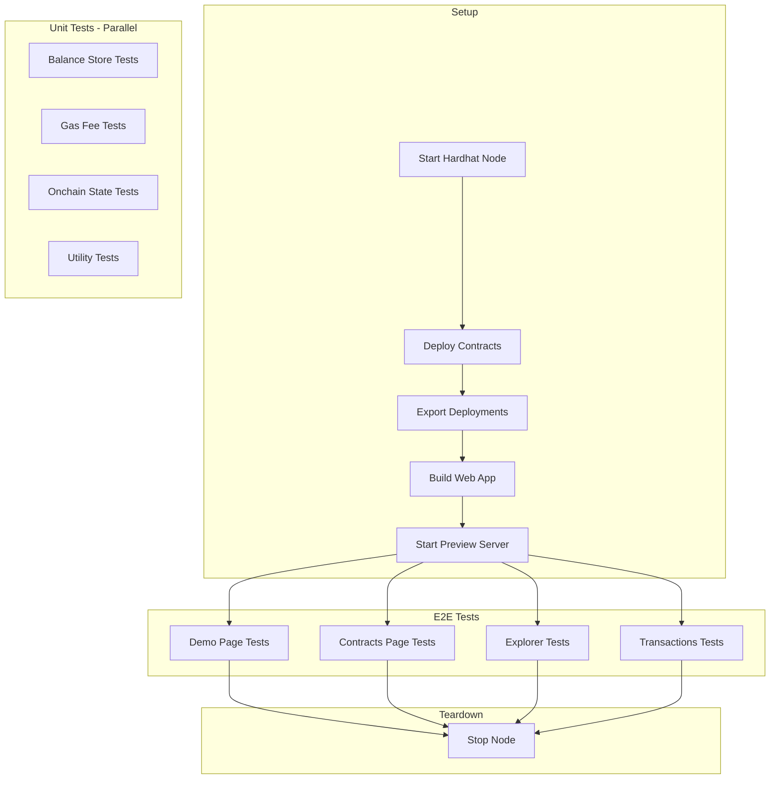

# Comprehensive Testing Plan for Template Onchain App

## Overview

This plan outlines the architecture and implementation steps for adding comprehensive tests to the template-onchain-app, covering both module/unit tests and E2E tests with full blockchain interactions.

## Current Test Setup

### Existing Infrastructure
- **Vitest** for unit/module tests
  - Browser tests: `test/**/*.svelte.{test,spec}.{js,ts}`
  - Server tests: `test/**/*.{test,spec}.{js,ts}`
- **Playwright** for E2E tests
  - Test pattern: `**/*.e2e.{ts,js}`
  - WebServer: `pnpm run build localhost && pnpm run preview` on port 4173
- **Existing tests**:
  - Unit tests: `web/test/lib/core/tab-leader/` (storage-lock, TabLeaderService)
  - E2E tests: `web/src/routes/demo/playwright/page.svelte.e2e.ts` (minimal placeholder)

### Key Commands
```bash
# Start local Ethereum node
pnpm contracts:node:local

# Compile and deploy contracts
pnpm contracts:compile
pnpm contracts:deploy localhost --skip-prompts
pnpm contracts:export localhost --ts ../web/src/lib/deployments.ts

# Build web for localhost
pnpm web:build localhost

# Run tests
pnpm --filter ./web test:unit
pnpm --filter ./web test:e2e
```

---

## Test Architecture

### 1. E2E Test Infrastructure

#### 1.1 Global Setup for E2E Tests

Create a global setup that:
1. Starts a local Ethereum node (hardhat)
2. Deploys contracts
3. Exports deployments to the web app
4. Builds the web app
5. Cleans up after all tests complete

```
web/
├── playwright.config.ts          # Enhanced config with globalSetup
├── e2e/
│   ├── global-setup.ts           # Start node, deploy, build
│   ├── global-teardown.ts        # Stop node
│   ├── fixtures/
│   │   ├── test.ts               # Extended test with wallet fixtures
│   │   └── wallet.ts             # Wallet interaction utilities
│   ├── utils/
│   │   ├── ethereum.ts           # Ethereum interaction helpers
│   │   └── selectors.ts          # Common page selectors
│   └── tests/
│       ├── demo.e2e.ts           # Demo page tests
│       ├── contracts.e2e.ts      # Contracts explorer tests
│       ├── explorer.e2e.ts       # Block explorer tests
│       └── transactions.e2e.ts   # Transactions page tests
```

#### 1.2 Playwright Configuration Enhancement

```typescript
// web/playwright.config.ts
import { defineConfig, devices } from '@playwright/test';

export default defineConfig({
  testDir: './e2e/tests',
  testMatch: '**/*.e2e.ts',
  
  globalSetup: './e2e/global-setup.ts',
  globalTeardown: './e2e/global-teardown.ts',
  
  webServer: {
    command: 'pnpm run preview',  // Build happens in globalSetup
    port: 4173,
    reuseExistingServer: !process.env.CI,
  },
  
  use: {
    baseURL: 'http://localhost:4173',
    trace: 'on-first-retry',
    screenshot: 'only-on-failure',
  },
  
  projects: [
    {
      name: 'chromium',
      use: { ...devices['Desktop Chrome'] },
    },
  ],
  
  // Longer timeout for blockchain operations
  timeout: 60000,
  expect: {
    timeout: 10000,
  },
});
```

#### 1.3 Wallet Test Fixtures

The app uses a Burner Wallet for localhost development, which we can leverage for testing:

```typescript
// web/e2e/fixtures/test.ts
import { test as base, expect } from '@playwright/test';

export const test = base.extend({
  // Auto-connect wallet before each test
  connectedPage: async ({ page }, use) => {
    await page.goto('/demo');
    // Wait for app to initialize
    await page.waitForSelector('input[placeholder="Enter your greeting..."]');
    // Connect using Dev Mode (burner wallet)
    // This will trigger the connection flow automatically
    await use(page);
  },
});

export { expect };
```

---

### 2. Unit/Module Test Structure

#### 2.1 Test Organization

```
web/test/
├── lib/
│   ├── core/
│   │   ├── clock/
│   │   │   └── index.test.ts
│   │   ├── connection/
│   │   │   ├── balance.test.ts
│   │   │   ├── gasFee.test.ts
│   │   │   └── rpcHealth.test.ts
│   │   ├── tab-leader/
│   │   │   ├── storage-lock.test.ts       # Existing
│   │   │   └── TabLeaderService.test.ts   # Existing
│   │   ├── transaction/
│   │   │   ├── balance-check.test.ts
│   │   │   └── user-rejection.test.ts
│   │   └── utils/
│   │       ├── format/balance.test.ts
│   │       └── web/url.test.ts
│   ├── onchain/
│   │   └── state.test.ts
│   └── view/
│       └── index.test.ts
├── components/                  # Svelte component tests
│   └── *.svelte.test.ts
└── setup.ts                     # Global test setup
```

#### 2.2 Mocking Strategies

For unit tests, we need to mock:
- **Viem PublicClient**: Mock contract reads
- **localStorage**: Already done in existing tests
- **Wallet interactions**: Mock writeContract, etc.

```typescript
// web/test/mocks/viem.ts
import { vi } from 'vitest';

export function createMockPublicClient(overrides = {}) {
  return {
    readContract: vi.fn(),
    getBlock: vi.fn(),
    getBalance: vi.fn(),
    estimateGas: vi.fn(),
    ...overrides,
  };
}

export function createMockWalletClient(overrides = {}) {
  return {
    writeContract: vi.fn(),
    account: { address: '0x1234...' as `0x${string}` },
    ...overrides,
  };
}
```

---

### 3. E2E Test Scenarios

#### 3.1 Demo Page Tests (`demo.e2e.ts`)

| Test Case | Description | Steps |
|-----------|-------------|-------|
| Page loads | Verify page renders correctly | Navigate to /demo, check title and input |
| Connect wallet | Test wallet connection flow | Click connect, select Burner Wallet |
| Submit greeting | Submit a new greeting | Connect, enter message, submit, verify |
| View messages | Verify messages load from chain | Wait for messages list, verify content |
| Message appears after submit | New message shows in list | Submit, wait for update, verify position |
| Error handling | Handle contract errors gracefully | Submit empty message, verify error |

```typescript
// web/e2e/tests/demo.e2e.ts
import { test, expect } from '../fixtures/test';

test.describe('Demo Page - Greetings Registry', () => {
  test('should display the page title', async ({ page }) => {
    await page.goto('/demo');
    await expect(page.getByRole('heading', { name: 'Greetings Registry' })).toBeVisible();
  });

  test('should show input field for greeting', async ({ page }) => {
    await page.goto('/demo');
    await expect(page.getByPlaceholder('Enter your greeting...')).toBeVisible();
  });

  test('should connect wallet and submit greeting', async ({ page }) => {
    await page.goto('/demo');
    
    // Enter greeting
    const input = page.getByPlaceholder('Enter your greeting...');
    await input.fill('Hello from E2E test!');
    
    // Click send - this should trigger wallet connection modal
    const sendButton = page.getByRole('button', { name: /send/i });
    await sendButton.click();
    
    // Handle wallet connection (Dev Mode / Burner Wallet)
    const devModeButton = page.getByRole('button', { name: /dev mode/i });
    if (await devModeButton.isVisible({ timeout: 2000 })) {
      await devModeButton.click();
    }
    
    // Wait for transaction to complete
    await expect(page.getByText('Hello from E2E test!')).toBeVisible({ timeout: 30000 });
  });

  test('should display existing messages', async ({ page }) => {
    await page.goto('/demo');
    
    // Wait for messages to load
    await page.waitForSelector('[class*="rounded-lg border"]', { timeout: 10000 });
    
    // Verify message structure
    const messageCards = page.locator('[class*="rounded-lg border px-4 py-3"]');
    const count = await messageCards.count();
    expect(count).toBeGreaterThan(0);
  });
});
```

#### 3.2 Contracts Page Tests (`contracts.e2e.ts`)

| Test Case | Description |
|-----------|-------------|
| Page loads with contracts | Verify contract list displays |
| Contract selection | Switch between contracts |
| Read function execution | Call a view function |
| Write function execution | Submit a transaction |

#### 3.3 Explorer Page Tests (`explorer.e2e.ts`)

| Test Case | Description |
|-----------|-------------|
| Recent transactions display | Verify explorer shows txs |
| Transaction details | Navigate to tx detail page |
| Address lookup | Search for an address |

#### 3.4 Transactions Page Tests (`transactions.e2e.ts`)

| Test Case | Description |
|-----------|-------------|
| Empty state | Show no transactions message |
| Transaction list | Display user's transactions |
| Transaction status | Show pending/confirmed states |

---

### 4. Unit Test Scenarios

#### 4.1 Balance Store (`balance.test.ts`)

```typescript
describe('createBalanceStore', () => {
  it('should fetch balance on subscription');
  it('should update balance periodically');
  it('should handle RPC errors gracefully');
  it('should stop polling when no subscribers');
});
```

#### 4.2 Gas Fee Store (`gasFee.test.ts`)

```typescript
describe('createGasFeeStore', () => {
  it('should estimate gas for contract calls');
  it('should handle estimation errors');
  it('should cache estimates appropriately');
});
```

#### 4.3 Onchain State (`state.test.ts`)

```typescript
describe('createOnchainState', () => {
  it('should fetch messages on start');
  it('should handle fetch errors with retry');
  it('should update lastSuccessfulFetch on success');
  it('should implement exponential backoff on errors');
});
```

#### 4.4 Balance Formatting (`balance.test.ts`)

```typescript
describe('formatBalance', () => {
  it('should format wei to ETH correctly');
  it('should handle very small amounts');
  it('should handle very large amounts');
  it('should respect decimal precision');
});
```

---

### 5. Implementation Steps

#### Phase 1: Infrastructure Setup
1. Create `web/e2e/` directory structure
2. Enhance `playwright.config.ts` with global setup/teardown
3. Create global-setup.ts to start node and deploy contracts
4. Create test fixtures for wallet interactions

#### Phase 2: E2E Test Implementation
1. Write demo page tests (highest priority - main user flow)
2. Write contracts page tests
3. Write explorer page tests
4. Write transactions page tests

#### Phase 3: Unit Test Expansion
1. Create mock utilities for viem clients
2. Write tests for balance store
3. Write tests for gas fee store
4. Write tests for onchain state
5. Write tests for utility functions

#### Phase 4: CI/CD Integration
1. Update package.json with test:integration script
2. Configure GitHub Actions workflow
3. Add test coverage reporting

---

### 6. Package.json Script Updates

```json
{
  "scripts": {
    "test": "npm run test:unit -- --run && npm run test:e2e",
    "test:unit": "vitest",
    "test:e2e": "playwright test",
    "test:e2e:ui": "playwright test --ui",
    "test:e2e:debug": "playwright test --debug",
    "test:integration": "pnpm run test:setup && pnpm run test:e2e",
    "test:setup": "cd ../contracts && pnpm compile && pnpm deploy localhost --skip-prompts && pnpm export localhost --ts ../web/src/lib/deployments.ts && cd ../web && pnpm build localhost"
  }
}
```

---

### 7. Key Considerations

#### Burner Wallet for Testing
The app already includes a Burner Wallet that can be enabled when `PUBLIC_USE_BURNER_WALLET` is set. This provides:
- Instant account creation
- No external wallet needed
- Can be automated in tests
- Pre-funded on localhost

#### Test Data Isolation
- Each E2E test should be isolated
- Consider using unique message prefixes
- Global setup can seed initial data

#### Timing and Waits
- Blockchain operations need longer timeouts
- Use proper wait strategies (not arbitrary delays)
- Wait for specific DOM elements or network idle

#### Error Scenarios
- Test network disconnection handling
- Test RPC errors
- Test user rejection of transactions

---

### 8. Mermaid Diagram: Test Flow



---

## Questions for Clarification

1. **Test Data Seeding**: Should E2E tests start with a clean state or with pre-seeded messages in the registry?

2. **CI Environment**: Will tests run in GitHub Actions? Do you have specific requirements for the CI configuration?

3. **Coverage Targets**: Are there specific code coverage targets you'd like to achieve?

4. **Additional Pages**: Are there any other pages or flows not visible in the routes that should be tested?

5. **Mobile/Responsive Testing**: Should E2E tests cover different viewport sizes?
