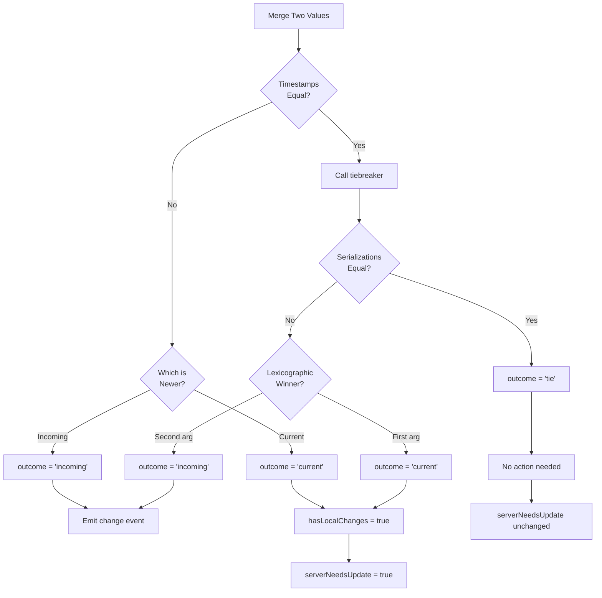

# Tiebreaker Equality Optimization

## Context

**Files involved:**
- [`web/src/lib/core/sync/merge.ts`](../web/src/lib/core/sync/merge.ts) - Core merge algorithm
- [`web/src/lib/core/sync/createSyncableStore.ts`](../web/src/lib/core/sync/createSyncableStore.ts) - Store factory that uses merge

**What this is:** The syncable store uses a Last-Write-Wins (LWW) merge strategy with timestamps. When timestamps are equal, a deterministic tiebreaker picks the lexicographically smaller value.

**Key terminology:**
- `current` - Local client's data
- `incoming` - Data received from server or another tab
- `MergeOutcome` - Discriminated union: `'incoming'` | `'current'` | `'tie'`
- `hasLocalChanges` - Flag indicating local has unpushed changes (replaces old `localWonAny`)
- `serverNeedsUpdate` - Derived from `hasLocalChanges`, triggers push to server

**Sync flow:**
1. Pull from server
2. Merge local with server data (this is where the tiebreaker is used)
3. If `hasLocalChanges = true`, push merged state to server
4. Cross-tab sync uses the same merge but doesn't push to server

## Problem Statement

The current tiebreaker implementation in [`merge.ts`](../web/src/lib/core/sync/merge.ts) uses `<=` comparison which causes both parties to believe they "won" when values are semantically equal. While this doesn't cause data inconsistency, it leads to unnecessary server pushes when `serverNeedsUpdate` is incorrectly set to `true`.

### Current Behavior

```typescript
// merge.ts:21-25
export function tiebreaker<T>(a: T, b: T): T {
  const aStr = stableStringify(a) ?? '';
  const bStr = stableStringify(b) ?? '';
  return aStr <= bStr ? a : b;
}
```

When two clients have semantically equal values (same serialization) with equal timestamps:
- Client A: `tiebreaker(A_current, B_incoming)` → returns `A_current` (first arg wins on `<=` tie)
- Client B: `tiebreaker(B_current, A_incoming)` → returns `B_current` (first arg wins on `<=` tie)

Both clients set `hasLocalChanges = true` → Both trigger `serverNeedsUpdate = true` → Unnecessary server pushes.

### Desired Behavior

When values are semantically equal (same serialization), neither client should believe it "won" with genuinely different data. `serverNeedsUpdate` should only be `true` when local has newer or actually different data.

## Design

### 1. Merge Outcome Type (Discriminated Union)

Using a discriminated union makes the three mutually exclusive outcomes explicit:

**File:** [`web/src/lib/core/sync/merge.ts`](../web/src/lib/core/sync/merge.ts)

```typescript
// NEW: Clear discriminated union for merge outcomes
export type MergeOutcome =
  | 'incoming'  // Incoming value won (emit change, no push)
  | 'current'   // Current value won with different data (need push)
  | 'tie';      // Values semantically equal (no action needed)
```

### 2. Enhanced Tiebreaker Return Type

**File:** [`web/src/lib/core/sync/merge.ts`](../web/src/lib/core/sync/merge.ts)

```typescript
// NEW: Tiebreaker-specific outcome (first/second args, or tie)
export type TiebreakerOutcome = 'first' | 'second' | 'tie';

export interface TiebreakerResult<T> {
  value: T;
  outcome: TiebreakerOutcome;
}

// UPDATED: Returns structured result with clear outcome
export function tiebreaker<T>(a: T, b: T): TiebreakerResult<T> {
  const aStr = stableStringify(a) ?? '';
  const bStr = stableStringify(b) ?? '';
  
  if (aStr === bStr) {
    // Semantically equal - true tie
    return { value: a, outcome: 'tie' };
  }
  
  // Different values - pick lexicographically smaller
  if (aStr < bStr) {
    return { value: a, outcome: 'first' };
  }
  return { value: b, outcome: 'second' };
}
```

### 3. Update PermanentMergeResult

**File:** [`web/src/lib/core/sync/merge.ts`](../web/src/lib/core/sync/merge.ts) (lines 39-47)

```typescript
// UPDATED: Use discriminated union instead of two booleans
export interface PermanentMergeResult<T> {
  value: T;
  timestamp: number;
  /** Clear indication of who won - mutually exclusive states */
  outcome: MergeOutcome;
}
```

### 4. Update mergePermanent Function

**File:** [`web/src/lib/core/sync/merge.ts`](../web/src/lib/core/sync/merge.ts) (lines 53-83)

```typescript
export function mergePermanent<T>(
  current: PermanentMergeInput<T>,
  incoming: PermanentMergeInput<T>,
): PermanentMergeResult<T> {
  // Higher timestamp wins - clear winner
  if (incoming.timestamp > current.timestamp) {
    return {
      value: incoming.value,
      timestamp: incoming.timestamp,
      outcome: 'incoming',
    };
  }

  if (current.timestamp > incoming.timestamp) {
    return {
      value: current.value,
      timestamp: current.timestamp,
      outcome: 'current',
    };
  }

  // Same timestamp - use deterministic tiebreaker
  const result = tiebreaker(current.value, incoming.value);
  
  // Map tiebreaker outcome to merge outcome
  let outcome: MergeOutcome;
  if (result.outcome === 'tie') {
    outcome = 'tie';
  } else if (result.outcome === 'second') {
    outcome = 'incoming';  // Second arg (incoming) won
  } else {
    outcome = 'current';   // First arg (current) won
  }
  
  return {
    value: result.value,
    timestamp: current.timestamp,
    outcome,
  };
}
```

### 5. Update MapMergeResult

**File:** [`web/src/lib/core/sync/merge.ts`](../web/src/lib/core/sync/merge.ts) (lines 109-116)

```typescript
export interface MapMergeResult<T> {
  items: Record<string, T>;
  timestamps: Record<string, number>;
  tombstones: Record<string, number>;
  changes: MapChange<T>[];
  /** Count of items where local had genuinely different/newer data */
  localWonCount: number;
  /** Count of items where timestamps matched AND values were semantically equal */
  tieCount: number;  // NEW
}
```

### 6. Update mergeMap Function

**File:** [`web/src/lib/core/sync/merge.ts`](../web/src/lib/core/sync/merge.ts) (lines 123-232)

Key changes in the merge loop:

```typescript
export function mergeMap<T>(
  current: MapState<T>,
  incoming: MapState<T>,
  fieldName: string,
): MapMergeResult<T> {
  // ... existing setup code ...
  let localWonCount = 0;
  let tieCount = 0;  // NEW

  // ... tombstone merging unchanged ...

  for (const key of allItemKeys) {
    // ... existing tombstone check ...

    const cItem = current.items[key];
    const iItem = incoming.items[key];
    const cTs = current.timestamps[key] ?? 0;
    const iTs = incoming.timestamps[key] ?? 0;

    let winner: T;
    let winnerTs: number;

    if (!cItem && iItem) {
      // New item from incoming - unchanged
      winner = iItem;
      winnerTs = iTs;
      changes.push({ event: `${fieldName}:added`, data: {key, item: iItem} });
    } else if (cItem && !iItem) {
      // Only in current - LOCAL WINS
      winner = cItem;
      winnerTs = cTs;
      localWonCount++;
    } else {
      // Both have item - compare timestamps
      if (iTs > cTs) {
        // Incoming has higher timestamp - unchanged
        winner = iItem;
        winnerTs = iTs;
        changes.push({ event: `${fieldName}:updated`, data: {key, item: iItem} });
      } else if (cTs > iTs) {
        // Current has higher timestamp - LOCAL WINS
        winner = cItem;
        winnerTs = cTs;
        localWonCount++;
      } else {
        // Same timestamp - deterministic tiebreaker
        const picked = tiebreaker(
          {item: cItem, ts: cTs},
          {item: iItem, ts: iTs},
        );
        winner = picked.value.item;
        winnerTs = picked.value.ts;
        
        // UPDATED: Use outcome discriminated union
        switch (picked.outcome) {
          case 'tie':
            tieCount++;  // Values equal, no push needed
            break;
          case 'first':
            localWonCount++;  // Current won with different data
            break;
          case 'second':
            // Incoming won tiebreaker
            changes.push({ event: `${fieldName}:updated`, data: {key, item: iItem} });
            break;
        }
      }
    }

    items[key] = winner;
    timestamps[key] = winnerTs;
  }

  return {items, timestamps, tombstones, changes, localWonCount, tieCount};
}
```

### 7. Update StoreMergeResult

**File:** [`web/src/lib/core/sync/merge.ts`](../web/src/lib/core/sync/merge.ts) (lines 250-255)

```typescript
export interface StoreMergeResult<S extends Schema> {
  merged: InternalStorage<S>;
  changes: StoreChange[];
  /** True if local has changes that need to be pushed to server */
  hasLocalChanges: boolean;
}
```

### 8. Update mergeStore Function

**File:** [`web/src/lib/core/sync/merge.ts`](../web/src/lib/core/sync/merge.ts) (lines 261-361)

Key changes in the permanent field handling - using the outcome discriminated union:

```typescript
// Around lines 298-304 - permanent field handling
switch (mergeResult.outcome) {
  case 'incoming':
    changes.push({event: `${field}:changed`, data: mergeResult.value});
    break;
  case 'current':
    if (currentTs > 0) {
      // Local has changes that need pushing
      hasLocalChanges = true;
    }
    break;
  case 'tie':
    // Values were semantically equal - no action needed
    break;
}
```

Key changes in the map field handling - unchanged logic:

```typescript
// Around lines 354-356 - map field handling
if (mapResult.localWonCount > 0) {
  hasLocalChanges = true;
}
// tieCount doesn't contribute to hasLocalChanges - ties mean equal values
```

### 9. MergeAndCleanupResult - No Changes Needed

The `serverNeedsUpdate` already derives from `hasLocalChanges`:

```typescript
// Line 422 - unchanged, but now more accurate
const serverNeedsUpdate = hasLocalChanges;
```

## Decision Flow Diagram



### Outcome Actions Summary

| Outcome | Change Event | hasLocalChanges | Push to Server |
|---------|--------------|-----------------|----------------|
| `'incoming'` | Yes (`:changed` / `:updated`) | No | No |
| `'current'` | No | Yes | Yes |
| `'tie'` | No | No | No |

## Edge Cases

### 1. Item Only in Current (not in incoming)

This is NOT a tie - local has data that server doesn't have:
- `localWonCount++` 
- `serverNeedsUpdate = true`

### 2. Item Only in Incoming (not in current)

This is NOT a tie - server has new data:
- Emit `:added` event
- No contribution to `hasLocalChanges`

### 3. Tombstones with Equal Timestamps

**Current behavior:** Tombstones store a `deleteAt` timestamp (when the item expires). The merge uses `Math.max(ct, it)` to pick the later expiration time:

```typescript
// merge.ts:140-146
for (const key of allTombstoneKeys) {
    const ct = current.tombstones[key] ?? 0;
    const it = incoming.tombstones[key] ?? 0;
    if (ct > 0 || it > 0) {
        tombstones[key] = Math.max(ct, it);
    }
}
```

**Key observation:** Tombstone merging does NOT contribute to `hasLocalChanges`. This means:
- If a client deletes an item (creates tombstone), the tombstone won't trigger a push
- The tombstone only reaches the server when another change triggers `hasLocalChanges = true`
- If a client only deletes items and never adds/updates, those tombstones may never sync

This is intentional for the current implementation but noted as a potential future extension.

### 4. New Client with Default Data vs Server with No Data

When `pullResponse.data` is `null`, we create synthetic default storage (line 433). If local has default data with timestamp 0 and server has nothing:
- Timestamps are "equal" (both effectively 0 or non-existent)
- Values might serialize the same (both defaults)
- Should be detected as a tie, avoiding unnecessary push

### 5. Concurrent Edits with Same Timestamp but Different Values

This is the legitimate `hasLocalChanges = true` case:
- Same millisecond timestamp
- Different values (different serializations)
- Tiebreaker returns `outcome = 'first'` or `'second'`
- Winner's side gets `hasLocalChanges = true` → push to server

## Implementation Checklist

- [ ] Add `MergeOutcome` type (`'incoming' | 'current' | 'tie'`)
- [ ] Add `TiebreakerOutcome` type (`'first' | 'second' | 'tie'`)
- [ ] Add `TiebreakerResult<T>` interface with `outcome: TiebreakerOutcome`
- [ ] Update `tiebreaker()` function to return `TiebreakerResult`
- [ ] Replace `incomingWon: boolean` with `outcome: MergeOutcome` in `PermanentMergeResult`
- [ ] Update `mergePermanent()` to return `outcome`
- [ ] Add `tieCount` to `MapMergeResult`
- [ ] Update `mergeMap()` to use `switch (picked.outcome)` and track ties
- [ ] Rename `localWonAny` to `hasLocalChanges` in `StoreMergeResult`
- [ ] Update `mergeStore()` to use `switch (mergeResult.outcome)` and set `hasLocalChanges`
- [ ] Update `createSyncableStore.ts` to use `hasLocalChanges` instead of `localWonAny`
- [ ] Add unit tests for tie detection scenarios
- [ ] Verify cross-tab sync still works correctly
- [ ] Verify server sync only triggers when necessary

## Testing Scenarios

### Unit Tests

1. **Permanent field - semantic equality**
   - Same value, same timestamp → `outcome = 'tie'`, no push

2. **Permanent field - different timestamps**
   - Same value, different timestamps → `outcome = 'incoming'` or `'current'`, winner determined by timestamp

3. **Permanent field - same timestamp, different values**
   - Different values, same timestamp → `outcome = 'incoming'` or `'current'`, tiebreaker picks one

4. **Map field - semantic equality**
   - Same item, same timestamp → `tieCount++`, not `localWonCount++`

5. **Map field - item only in local**
   - Item in current but not incoming → `localWonCount++`, push needed

### Integration Tests

1. **Cross-tab sync - no unnecessary storage writes**
   - Tab A saves X → Tab B receives X (already has X) → No state change in B

2. **Server sync - no unnecessary pushes**
   - Client has X, server has X → Pull returns X → Merge is all ties → No push

3. **Server sync - legitimate push**
   - Client has X (newer), server has Y (older) → Merge → Push X to server

## Backward Compatibility

This change is backward compatible:
- No changes to storage format
- No changes to wire protocol
- Only affects internal merge logic and push decision

## Performance Impact

Minimal - we're already computing `stableStringify()` for both values. The additional equality check (`aStr === bStr`) is O(n) string comparison which is fast for typical data sizes.

## Future Extensions

### Tombstone Push Support

Currently, tombstone merging does not contribute to `hasLocalChanges`, meaning deletes don't trigger server pushes on their own. To add tombstone push support:

1. **Track tombstone outcomes** in `mergeMap`:
   ```typescript
   // When current tombstone has later deleteAt than incoming
   if (ct > it) {
     localWonTombstoneCount++;
   }
   ```

2. **Include in `hasLocalChanges` calculation** in `mergeStore`:
   ```typescript
   if (mapResult.localWonCount > 0 || mapResult.localWonTombstoneCount > 0) {
     hasLocalChanges = true;
   }
   ```

3. **Apply same tie detection** - if `ct === it`, it's a tie (no push needed)

This would ensure that deletes propagate to the server immediately rather than waiting for another change to trigger a push.

## Summary of Changes

1. **New types:** `MergeOutcome`, `TiebreakerOutcome`, `TiebreakerResult<T>`
2. **Tiebreaker:** Returns `{ value, outcome }` instead of just the value
3. **mergePermanent:** Returns `outcome: MergeOutcome` instead of `incomingWon: boolean`
4. **mergeMap:** Adds `tieCount` tracking alongside `localWonCount`
5. **mergeStore:** Uses `switch (outcome)` and renames `localWonAny` → `hasLocalChanges`
6. **createSyncableStore:** Uses `hasLocalChanges` from merge result

**Result:** `serverNeedsUpdate` is only `true` when local has genuinely different data, eliminating unnecessary server pushes when values are semantically equal.
