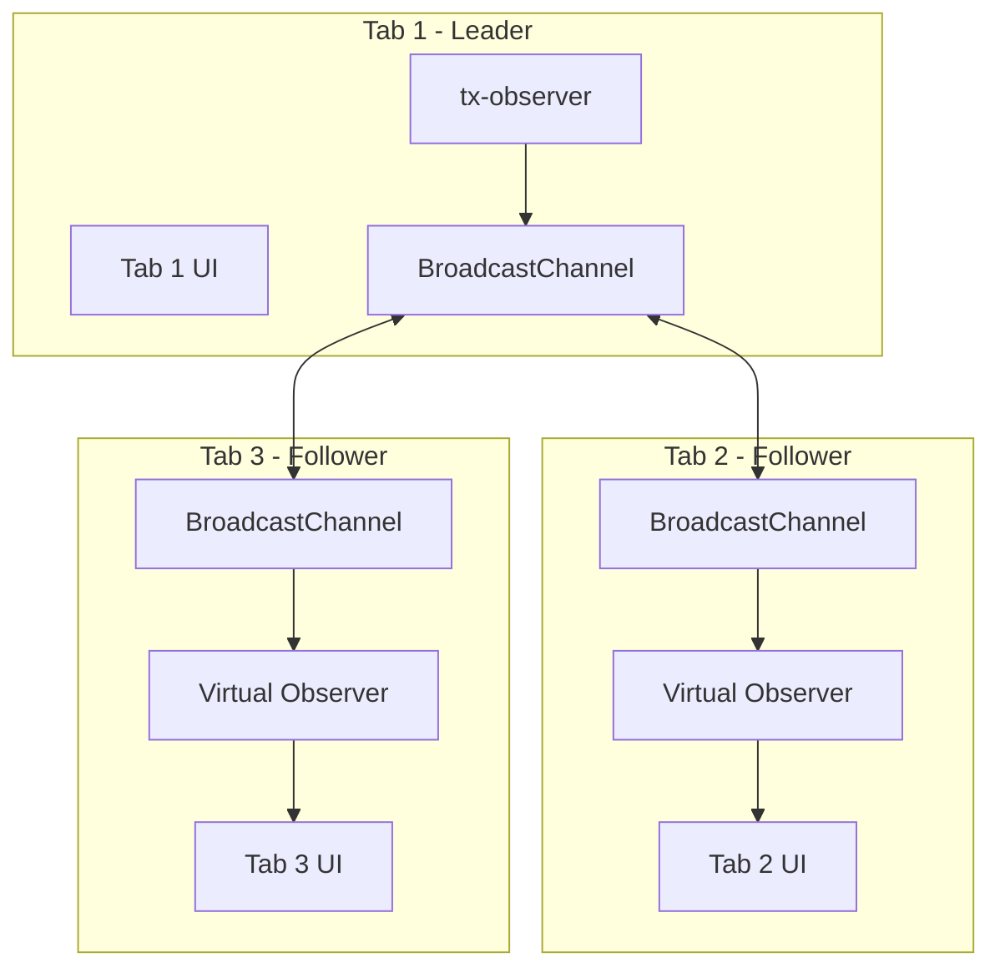
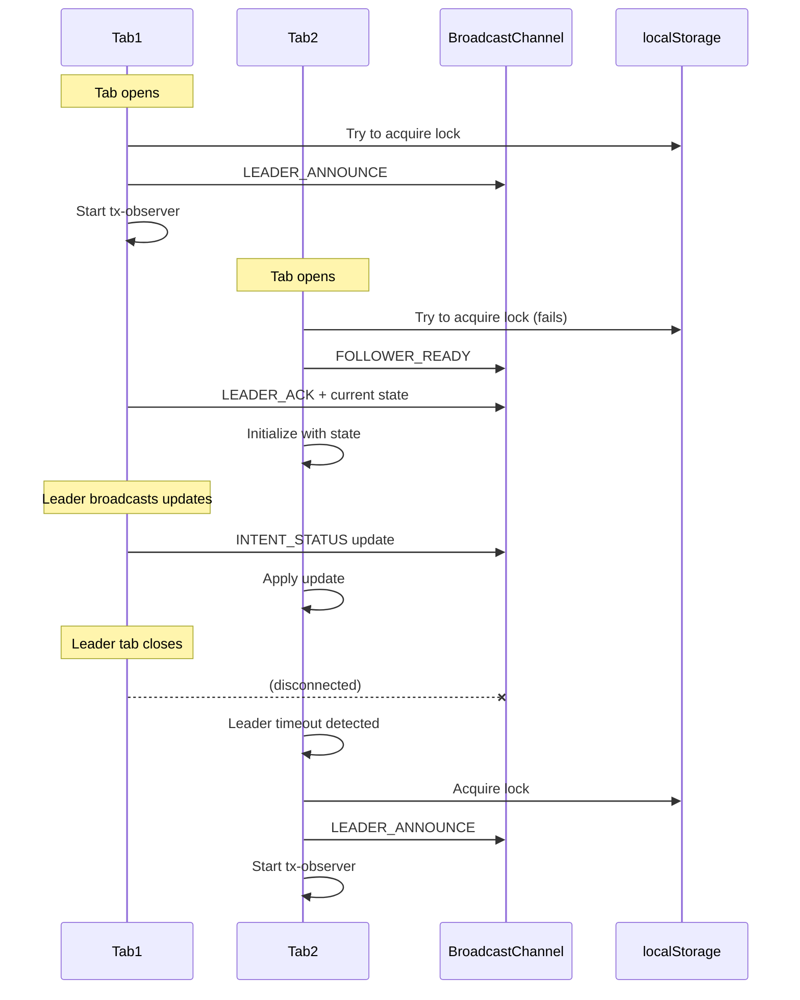

# Leader Election for Single tx-observer Across Browser Tabs

## Overview

When a user has multiple tabs open with the same app, each tab currently runs its own `tx-observer` instance. This causes:
- Redundant RPC calls (each tab polls the blockchain)
- Potential state conflicts when observers have different views of transaction state
- Unnecessary resource usage

This plan describes implementing a **Leader Election** pattern using **BroadcastChannel** to ensure only one tab runs the tx-observer while other tabs receive updates via broadcast.

## Architecture



## Leader Election Protocol



## Components

### 1. TabLeaderService

Core service managing leader election and inter-tab communication.

```typescript
// web/src/lib/core/tab-leader/TabLeaderService.ts

interface TabLeaderService {
  // State
  isLeader: Readable<boolean>;
  leaderId: Readable<string | null>;
  
  // Lifecycle
  start(): void;
  stop(): void;
  
  // For leader: broadcast updates
  broadcast(event: TabMessage): void;
  
  // For followers: receive updates
  onMessage(handler: (event: TabMessage) => void): () => void;
  
  // Force leadership claim (for testing/debugging)
  claimLeadership(): Promise<boolean>;
}

type TabMessage = 
  | { type: 'LEADER_ANNOUNCE'; tabId: string; timestamp: number }
  | { type: 'LEADER_ACK'; tabId: string; state: SerializedObserverState }
  | { type: 'LEADER_HEARTBEAT'; tabId: string; timestamp: number }
  | { type: 'FOLLOWER_READY'; tabId: string }
  | { type: 'INTENT_STATUS'; event: TransactionIntentEvent }
  | { type: 'REQUEST_STATE'; tabId: string }
  | { type: 'STATE_SYNC'; state: SerializedObserverState };
```

### 2. LeaderAwareTxObserver

Wrapper around tx-observer that only runs processing on the leader tab.

```typescript
// web/src/lib/core/tab-leader/LeaderAwareTxObserver.ts

interface LeaderAwareTxObserver {
  // Same interface as TransactionObserver
  add(id: string, intent: TransactionIntent): void;
  remove(id: string): void;
  clear(): void;
  addMultiple(intents: Record<string, TransactionIntent>): void;
  
  // Events
  on(event: 'intent:status', handler: (e: TransactionIntentEvent) => void): () => void;
  
  // Processing (only runs on leader)
  process(): void;
}
```

### 3. VirtualTxObserver

For follower tabs - receives updates via BroadcastChannel instead of polling.

```typescript
// web/src/lib/core/tab-leader/VirtualTxObserver.ts

// Implements same interface as TransactionObserver
// But doesn't poll - just emits events when receiving broadcasts
```

## Implementation Plan

### Phase 1: Core Infrastructure

- [ ] Create `TabLeaderService` with BroadcastChannel communication
- [ ] Implement leader election using localStorage lock + heartbeat
- [ ] Add graceful leader handoff when tab closes
- [ ] Handle edge cases (multiple tabs claiming leadership, network issues)

### Phase 2: Observer Integration

- [ ] Create `LeaderAwareTxObserver` wrapper
- [ ] Create `VirtualTxObserver` for followers
- [ ] Modify `createTransactionObserver` factory to return appropriate type
- [ ] Add state serialization/deserialization for TransactionObserver

### Phase 3: Connector Updates

- [ ] Update `createTransactionObserverConnector` to work with leader-aware observer
- [ ] Ensure AccountData sync works correctly with virtual observer
- [ ] Add reconnection logic when leadership changes

### Phase 4: Testing & Edge Cases

- [ ] Test leader election with multiple tabs
- [ ] Test leadership handoff scenarios
- [ ] Test state synchronization on new tab open
- [ ] Test behavior when BroadcastChannel unavailable (fallback)

## File Structure

```
web/src/lib/core/tab-leader/
├── index.ts                    # Public exports
├── TabLeaderService.ts         # Core leader election
├── LeaderAwareTxObserver.ts    # Leader's observer wrapper
├── VirtualTxObserver.ts        # Follower's virtual observer
├── types.ts                    # Shared types
├── storage-lock.ts             # localStorage-based locking
└── __tests__/
    ├── TabLeaderService.test.ts
    └── integration.test.ts
```

## Key Design Decisions

### 1. Why BroadcastChannel + localStorage?

- **BroadcastChannel**: Fast, reliable inter-tab messaging
- **localStorage**: Persistent lock that survives page refresh, visible to all tabs

### 2. Why not SharedWorker?

- Limited browser support (no Safari until recently)
- More complex lifecycle management
- BroadcastChannel is simpler and sufficient for our needs

### 3. Heartbeat Mechanism

Leaders send heartbeats every 2 seconds. If a follower doesn't receive a heartbeat for 5 seconds, it assumes the leader is gone and initiates election.

```typescript
const HEARTBEAT_INTERVAL = 2000;  // ms
const LEADER_TIMEOUT = 5000;      // ms
```

### 4. State Synchronization

When a new tab opens or leadership changes:
1. New tab/leader requests current state
2. Previous leader (or other tabs with state) respond with serialized observer state
3. New observer is initialized with this state

### 5. Graceful Degradation

If BroadcastChannel is unavailable:
- Each tab runs its own observer (current behavior)
- The merge logic we added protects against conflicts

## Migration Path

1. **Current**: Each tab has its own tx-observer
2. **After Phase 1-2**: Leader election active, single observer
3. **Fallback**: If issues detected, can disable via feature flag

## Configuration

```typescript
// web/src/lib/core/tab-leader/config.ts

export const TAB_LEADER_CONFIG = {
  enabled: true,                    // Feature flag
  channelName: 'tx-observer-leader',
  heartbeatInterval: 2000,
  leaderTimeout: 5000,
  lockKey: 'tx-observer-leader-lock',
  electionDebounce: 100,            // Prevent rapid elections
};
```

## Risks & Mitigations

| Risk | Mitigation |
|------|------------|
| Race condition in election | Use timestamps + tab IDs for deterministic winner |
| Leader crashes without cleanup | Heartbeat timeout triggers re-election |
| State divergence between tabs | Merge logic (Option 2) already implemented |
| BroadcastChannel unavailable | Graceful fallback to per-tab observers |
| Memory leaks from listeners | Proper cleanup on tab close/navigation |

## Success Metrics

- [ ] Only 1 tab makes RPC calls (verify via network tab)
- [ ] All tabs receive transaction updates within 100ms
- [ ] Leadership handoff completes within 5 seconds
- [ ] No transaction state lost during handoff
