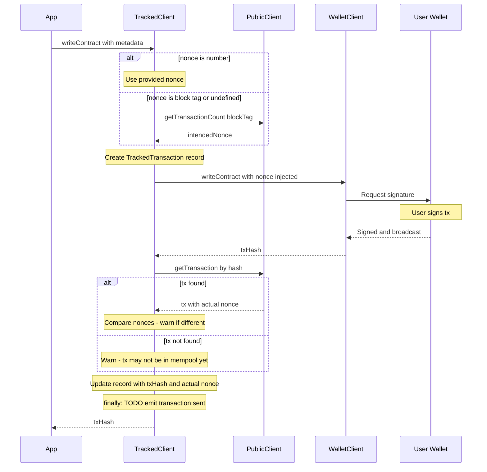

# Tracked Wallet Client - Architecture Plan

## Overview

Create a wrapper around viem's `WalletClient` that captures every transaction intent (even if it doesn't make it to the blockchain), attaches metadata, and adds a `// TODO emit(...)` placeholder for future event emission.

## Problem Statement

Currently, components use `context.walletClient` directly to send transactions. This approach has several limitations:

1. **No metadata attachment** - Cannot attach business logic context (IDs, titles, descriptions, expected events)
2. **No pre-broadcast tracking** - Transactions are only tracked after broadcast
3. **Lost transaction detection** - If a tx gets lost, we cannot correlate it without nonce + from info
4. **Replacement detection** - Cannot detect if a tx was replaced (same nonce, different hash)

## Requirements

### Metadata Structure

```typescript
interface TransactionMetadata {
  // Optional custom ID - if provided, used instead of tx hash for tracking
  id?: string;
  // Human-readable title
  title?: string;
  // Detailed description
  description?: string;
  // Expected event signature/filter for success detection
  // Even if tx hash changes due to replacement, we can detect success
  expectedEvent?: {
    address: `0x${string}`;
    eventName: string;
    args?: Record<string, unknown>;
  };
  // Extensible: user can add any additional fields
  [key: string]: unknown;
}
```

### Tracked Transaction Record

```typescript
interface TrackedTransaction {
  // Tracking ID - either metadata.id or generated UUID
  trackingId: string;
  // The tx hash once known - may change if tx is replaced
  txHash?: `0x${string}`;
  // Sender address - captured before broadcast
  from: `0x${string}`;
  // Nonce - captured/fetched before broadcast
  nonce: number;
  // Chain ID
  chainId: number;
  // The full metadata provided by the caller
  metadata: TransactionMetadata;
  // Timestamp when the transaction was initiated
  initiatedAt: number;
  // The transaction request data
  request: unknown;
}
```

## Chosen Solution: Extended Methods with Metadata Parameter

Extend existing wallet client methods to accept an optional `metadata` field in their parameters.

### API Design

The `TrackedWalletClient` provides the same methods as viem's `WalletClient`, but each transaction method accepts an additional `metadata` field:

```typescript
// Usage - writeContract with metadata
const hash = await trackedClient.writeContract({
  address: contractAddress,
  abi: [...],
  functionName: 'swap',
  args: [...],
  // NEW: Optional metadata field
  metadata: {
    id: 'order-123',
    title: 'Swap ETH for DAI',
    expectedEvent: { address: daiAddress, eventName: 'Transfer' }
  }
});

// Usage - sendTransaction with metadata
const hash = await trackedClient.sendTransaction({
  to: recipient,
  value: parseEther('1'),
  metadata: {
    id: 'payment-456',
    title: 'Send 1 ETH'
  }
});

// Without metadata - still works, auto-generates tracking ID
const hash = await trackedClient.writeContract({
  address: contractAddress,
  abi: [...],
  functionName: 'approve',
  args: [...]
});
```

### Nonce Handling

1. **If nonce is a number**: Use the provided nonce as-is
2. **If nonce is a block tag** (e.g., `'latest'`, `'pending'`): Fetch nonce using that block tag
3. **If nonce is not provided**: Fetch it with `'pending'` block tag (default)

```typescript
// Manual nonce (number) - use as-is
const hash = await trackedClient.sendTransaction({
  to: recipient,
  value: parseEther('1'),
  nonce: 42,  // Exact nonce
  metadata: { id: 'tx-with-manual-nonce' }
});

// Block tag nonce - fetched with specified tag
const hash = await trackedClient.sendTransaction({
  to: recipient,
  value: parseEther('1'),
  nonce: 'latest',  // Fetch using 'latest' block tag
  metadata: { id: 'tx-with-latest-nonce' }
});

// No nonce provided - fetched with 'pending' (default)
const hash = await trackedClient.sendTransaction({
  to: recipient,
  value: parseEther('1'),
  // No nonce provided - will be fetched with 'pending'
  metadata: { id: 'tx-with-auto-nonce' }
});
```

### Nonce Type Extension

```typescript
// Extended nonce type to support block tags
type NonceOption = number | 'latest' | 'pending' | 'earliest' | 'safe' | 'finalized';
```

### Methods to Wrap

The following viem `WalletClient` methods need to be wrapped:

| Method | Description |
|--------|-------------|
| `writeContract` | Call a contract write function |
| `sendTransaction` | Send a transaction |
| `signTransaction` | Sign a transaction (for later broadcast) |
| `prepareTransactionRequest` | Prepare a transaction request |

For synchronous variants if they exist (e.g., `sendRawTransaction`), handle accordingly.

## Implementation Details

### TrackedWalletClient Interface

```typescript
import type {
  WalletClient,
  WriteContractParameters,
  SendTransactionParameters,
  Hash
} from 'viem';

// Extend parameters to include optional metadata
type TrackedWriteContractParameters<
  TAbi extends Abi,
  TFunctionName extends string
> = WriteContractParameters<TAbi, TFunctionName> & {
  metadata?: TransactionMetadata;
};

type TrackedSendTransactionParameters = SendTransactionParameters & {
  metadata?: TransactionMetadata;
};

interface TrackedWalletClient {
  // Same signature as WalletClient but with metadata support
  writeContract<TAbi extends Abi, TFunctionName extends string>(
    args: TrackedWriteContractParameters<TAbi, TFunctionName>
  ): Promise<Hash>;
  
  sendTransaction(
    args: TrackedSendTransactionParameters
  ): Promise<Hash>;
  
  // Access underlying wallet client
  readonly walletClient: WalletClient;
  readonly publicClient: PublicClient;
}
```

### Factory Function

```typescript
function createTrackedWalletClient(
  walletClient: WalletClient,
  publicClient: PublicClient
): TrackedWalletClient {
  return {
    walletClient,
    publicClient,
    
    async writeContract(args) {
      const { metadata, ...writeArgs } = args;
      
      // Get account/from address
      const account = args.account ?? walletClient.account;
      const from = typeof account === 'string' 
        ? account 
        : account?.address;
      
      if (!from) throw new Error('No account available');
      
      // Resolve nonce
      let intendedNonce: number;
      const nonceArg = args.nonce;
      
      if (typeof nonceArg === 'number') {
        // Explicit number - use as-is
        intendedNonce = nonceArg;
      } else {
        // Block tag (string) or undefined - fetch from chain
        const blockTag = nonceArg ?? 'pending';
        intendedNonce = await publicClient.getTransactionCount({
          address: from,
          blockTag
        });
      }
      
      // Prepare tracking record
      const trackingId = metadata?.id ?? crypto.randomUUID();
      let trackedTx: TrackedTransaction = {
        trackingId,
        from,
        nonce: intendedNonce,
        chainId: walletClient.chain?.id ?? 1,
        metadata: metadata ?? {},
        initiatedAt: Date.now(),
        request: writeArgs
      };
      
      let hash: Hash | undefined;
      let actualNonce: number | undefined;
      let error: Error | undefined;
      
      try {
        // Call underlying writeContract with nonce injected
        hash = await walletClient.writeContract({
          ...writeArgs,
          nonce: intendedNonce
        });
        
        // Fetch the transaction to verify/get actual nonce
        try {
          const tx = await publicClient.getTransaction({ hash });
          actualNonce = tx.nonce;
          
          if (actualNonce !== intendedNonce) {
            console.warn(
              `[TrackedWalletClient] Nonce mismatch: intended ${intendedNonce}, actual ${actualNonce}. ` +
              `Wallet may have overridden the nonce.`
            );
          }
        } catch (fetchError) {
          // Transaction not found in mempool/chain yet
          console.warn(
            `[TrackedWalletClient] Could not fetch tx ${hash} after broadcast. ` +
            `It may not be in the mempool yet.`
          );
        }
        
        trackedTx.txHash = hash;
        trackedTx.nonce = actualNonce ?? intendedNonce;
        
      } catch (e) {
        error = e instanceof Error ? e : new Error(String(e));
        throw error;
      }
      
      // Only emit if we have a tx hash
      // TODO: emit('transaction:sent', trackedTx)
      
      return hash;
    },
    
    async sendTransaction(args) {
      // Similar implementation...
    }
  };
}
```

### Flow Diagram



### Integration with Context

The `TrackedWalletClient` is exposed as `walletClient` in the context for drop-in compatibility:

```typescript
// In web/src/lib/context/index.ts
import { createTrackedWalletClient } from '$lib/core/transactions';

export async function createContext(): Promise<Context> {
  const { walletClient: rawWalletClient, publicClient, ... } = await establishRemoteConnection();
  
  // Wrap the raw wallet client with tracking capabilities
  const walletClient = createTrackedWalletClient(rawWalletClient, publicClient);
  
  return {
    walletClient,  // TrackedWalletClient (backwards compatible)
    publicClient,
    // ...
  };
}

// In web/src/lib/context/types.ts
import type { TrackedWalletClient } from '$lib/core/transactions';

export type Context = {
  /**
   * Tracked wallet client that wraps the underlying viem WalletClient.
   * Supports optional `metadata` field on writeContract/sendTransaction.
   * Access underlying WalletClient via walletClient.walletClient if needed.
   */
  walletClient: TrackedWalletClient;
  // ...
};
```

### File Structure

```
web/src/lib/core/transactions/
├── index.ts                     # Public exports
├── types.ts                     # TransactionMetadata, TrackedTransaction
└── TrackedWalletClient.ts       # createTrackedWalletClient factory
```

## Usage Example in Component

```svelte
<!-- ContractFunction.svelte -->
<script lang="ts">
  // ...existing imports...
  
  async function handleExecute() {
    // ...validation...
    
    const currentConnection = await connection.ensureConnected();
    
    // walletClient is now TrackedWalletClient - same API, optional metadata
    const hash = await walletClient.writeContract({
      address: contractAddress as `0x${string}`,
      abi: [abiItem],
      functionName: abiItem.name,
      args: args as any,
      account: currentConnection.account.address,
      chain: null as any,
      // Optional: Add metadata for tracking
      metadata: {
        title: `Execute ${abiItem.name}`,
        description: `Called ${abiItem.name} on ${contractAddress}`
      }
    });
    
    transactionHash = hash;
  }
</script>
```

## Key Design Decisions

| Decision | Rationale |
|----------|-----------|
| Single-step API | Simpler, familiar pattern - just add `metadata` field |
| No event emission (TODO only) | Client has no responsibility to store/emit - that's for the consumer |
| No persistence | Client only tracks for the duration of the call |
| Nonce with `pending` by default | Gets next available nonce accounting for mempool |
| Nonce can be block tag | `'latest'`, `'pending'`, etc. - fetches using that tag |
| Manual nonce override | User can still provide numeric nonce if needed |
| Metadata is optional | Works as drop-in replacement for walletClient |
| Post-broadcast tx fetch | Verify/retrieve actual nonce after broadcast |
| Emit only on success | Only emit when we have a tx hash |
| Warn on nonce mismatch | Logs warning if wallet overrode the nonce |

## Considerations

### Hardware Wallet Nonce Override

Some hardware wallets may override the nonce. The client handles this by:

1. Capturing the nonce we *intend* to use before broadcast
2. After broadcast, fetching the transaction by hash to verify/retrieve actual nonce
3. If the transaction cannot be found, logging a warning (it may not be in mempool yet)
4. If the actual nonce differs from intended, logging a warning about the override
5. The emitted record contains the actual nonce (or intended if fetch failed)

### Type Safety

The wrapper maintains viem's type safety by extending the original parameter types with the `metadata` field. This ensures:

- All existing type inference works
- IDE autocomplete for contract methods
- ABI type checking for args

## Summary

The `TrackedWalletClient`:

1. Extends viem's `WalletClient` methods with optional `metadata` field
2. Supports nonce as number (exact), block tag (fetch with tag), or undefined (fetch with `'pending'`)
3. Captures `from` address before wallet interaction
4. After broadcast, fetches the transaction to verify/retrieve actual nonce
5. Warns if nonce was overridden by wallet or if tx not found in mempool
6. Creates a `TrackedTransaction` record with all relevant info
7. Only emits when we have a tx hash (successful broadcast)
8. Adds `// TODO: emit(...)` placeholders for future event emission
9. Works as a drop-in replacement when metadata is not needed
