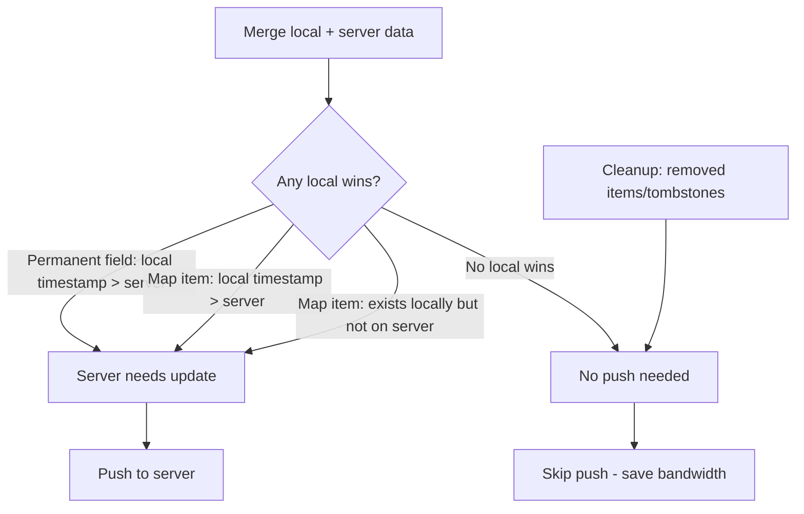

# Unified Sync with Server Needs Update Flag

## Overview

Refactor the sync logic in `createSyncableStore.ts` to consolidate `performSyncPull` and `performSyncPush` into a single `performSync` function, with intelligent push decisions based on whether the server actually needs updating.

## Files Involved

- `web/src/lib/core/sync/merge.ts` - Merge algorithms (to be enhanced)
- `web/src/lib/core/sync/cleanup.ts` - Cleanup function (read-only reference)
- `web/src/lib/core/sync/createSyncableStore.ts` - Main store (sync functions to refactor)

## Problem Statement

### Current Architecture

1. **`performSyncPull`** (lines 513-560):
   - Pull from server
   - Merge with local using `mergeAndCleanup`
   - Save to local storage
   - No push to server

2. **`performSyncPush`** (lines 408-510):
   - Pull from server
   - Merge with local using `mergeAndCleanup`
   - Save to local storage
   - **Always** push to server

### Issues

1. **Code Duplication**: `performSyncPush` contains all the logic of `performSyncPull` plus the push step
2. **Unnecessary Pushes**: After merge, even if local state had no winning data, we still push
3. **Wasted Bandwidth**: Pushing unchanged data wastes network resources
4. **Counter Conflicts**: Unnecessary pushes can cause more counter conflicts requiring retries

## Proposed Solution

### Core Idea

The `mergeAndCleanup` function should return additional information about whether the **server is missing data** that the local client has. This allows the sync function to make an intelligent decision about whether to push.

### When Does Server Need an Update?



**Note**: Cleanup (expired items, deleted tombstones) does NOT trigger a push. These will be cleaned up on each client independently, and eventually propagate to server when other changes cause a push.

## Implementation Plan

### Design Note: Why No `forcePush` Flag

Initially, we considered adding a `forcePush` option to override the `serverNeedsUpdate` decision. After analysis, this is **not needed** because:

1. **After local mutation**: The store sets a new timestamp on the modified data. When syncing, merge compares timestamps and correctly sets `serverNeedsUpdate = true` because local timestamp > server timestamp.

2. **Reconnect after offline**: Any pending local changes have newer timestamps than what server has, so merge detects this automatically.

3. **Explicit `syncNow()`**: Same logic - if there are local changes, merge detects them. If not, there's nothing to push.

4. **Server has no data**: This is handled explicitly with `shouldPush = true` when `pullResponse.data` is null.

The `serverNeedsUpdate` flag from merge correctly captures all cases where a push is needed.

### Phase 1: Enhance Merge Functions

#### 1.1 Update `MapMergeResult` in `merge.ts`

Add a `localWonCount` field to track when local data wins:

```typescript
export interface MapMergeResult<T> {
  items: Record<string, T>;
  timestamps: Record<string, number>;
  tombstones: Record<string, number>;
  changes: MapChange<T>[];
  localWonCount: number;  // NEW: count of items where local had newer data
}
```

#### 1.2 Update `mergeMap` function

Track local wins in the merge loop:
- When `cItem && !iItem` (local has item server doesn't) → increment `localWonCount`
- When `cTs > iTs` (local timestamp wins) → increment `localWonCount`
- When tiebreaker picks local → increment `localWonCount`

#### 1.3 Update `StoreMergeResult` in `merge.ts`

Add aggregate tracking:

```typescript
export interface StoreMergeResult<S extends Schema> {
  merged: InternalStorage<S>;
  changes: StoreChange[];
  localWonAny: boolean;  // NEW: true if local won any field/item
}
```

#### 1.4 Update `mergeStore` function

Aggregate the `localWon` information:
- For permanent fields: track when `!incomingWon`
- For map fields: track when `localWonCount > 0`

### Phase 2: Enhance MergeAndCleanup

#### 2.1 Update `MergeAndCleanupResult`

```typescript
export interface MergeAndCleanupResult<S extends Schema> {
  storage: InternalStorage<S>;
  changes: StoreChange[];
  tombstonesDeleted: boolean;
  itemsExpired: boolean;
  serverNeedsUpdate: boolean;  // NEW: true if server should receive a push
}
```

#### 2.2 Update `mergeAndCleanup` function

Compute `serverNeedsUpdate` as:

```typescript
const serverNeedsUpdate = localWonAny;  // Local had newer data than server
```

**Note on cleanup**: We intentionally **do not** push just because `tombstonesDeleted` or `itemsExpired` is true. The reasoning:

1. **Eventual consistency**: Expired items and tombstones will be cleaned up on all clients when they sync and run their own cleanup
2. **Minimal overhead**: Keeping a few expired items/tombstones temporarily has negligible storage cost
3. **Bandwidth efficiency**: Avoids unnecessary pushes - the cleanup will piggyback on the next actual data change

The `tombstonesDeleted` and `itemsExpired` flags are kept in the return type for observability/debugging purposes, but they don't trigger pushes.

### Phase 3: Refactor Sync Functions

#### 3.1 Create unified `performSync` function

Replace both `performSyncPull` and `performSyncPush` with a single function. **No `forcePush` flag is needed** because:

- After a local mutation, local data gets a new timestamp
- When syncing, the merge detects local timestamp > server timestamp
- `serverNeedsUpdate = true` is set automatically
- Push happens as needed

```typescript
async function performSync(retryCount = 0): Promise<void> {
  if (!syncAdapter || !internalStorage || asyncState.status !== 'ready') return;

  const account = asyncState.account;

  try {
    mutableSyncStatus.isSyncing = true;
    mutableSyncStatus.syncError = null;
    if (retryCount === 0) {
      emitSyncEvent({type: 'started'});
    }

    // Step 1: Pull latest from server
    const pullResponse = await syncAdapter.pull(account);

    // Step 2: Merge server data with local data
    let dataToSync = internalStorage;
    let shouldPush = false;

    if (pullResponse.data) {
      const { storage: merged, changes, serverNeedsUpdate } = mergeAndCleanup(
        internalStorage,
        pullResponse.data,
        schema,
        clock()
      );
      dataToSync = merged;
      shouldPush = serverNeedsUpdate;

      // Update local state if there were changes
      if (changes.length > 0) {
        internalStorage = merged;
        asyncState = {...asyncState, data: merged.data};

        for (const change of changes) {
          emitter.emit(change.event, change.data);
        }

        await storage.save(storageKey(account), merged);
      }
    } else {
      // No server data - server definitely needs our data
      shouldPush = true;
    }

    // Step 3: Push if needed
    if (shouldPush) {
      const clockBigInt = BigInt(clock());
      const newCounter = clockBigInt > pullResponse.counter 
        ? clockBigInt 
        : pullResponse.counter + 1n;
      
      const pushResponse = await syncAdapter.push(account, dataToSync, newCounter);

      if (!pushResponse.success) {
        // Handle retry logic...
      }
    }

    // Success
    syncDirty = false;
    mutableSyncStatus.lastSyncedAt = clock();
    mutableSyncStatus.syncError = null;
    mutableSyncStatus.hasPendingSync = false;
    mutableSyncStatus.isSyncing = false;
    emitSyncEvent({type: 'completed', timestamp: clock()});

  } catch (error) {
    // Handle retry logic...
  }
}
```

#### 3.2 Update callers

Replace all calls to `performSyncPull` and `performSyncPush` with `performSync()`:

| Current Call | New Call |
|--------------|----------|
| `performSyncPull(account)` | `performSync()` |
| `performSyncPush()` | `performSync()` |
| `performSyncPush(retryCount)` | `performSync(retryCount)` |

#### 3.3 Update `markDirty` and `scheduleSyncPush`

These should schedule `performSync()`. The merge will automatically detect that local data has newer timestamps and set `serverNeedsUpdate = true`.

### Phase 4: Cleanup

#### 4.1 Remove `performSyncPull` function

Delete lines 513-560.

#### 4.2 Rename internal function

Consider renaming `scheduleSyncPush` to `scheduleSync` for clarity.

## Files to Modify

1. **`web/src/lib/core/sync/merge.ts`**
   - Add `localWonCount` to `MapMergeResult`
   - Add `localWonAny` to `StoreMergeResult`
   - Add `serverNeedsUpdate` to `MergeAndCleanupResult`
   - Update `mergeMap` to track local wins
   - Update `mergeStore` to aggregate local wins
   - Update `mergeAndCleanup` to compute `serverNeedsUpdate`

2. **`web/src/lib/core/sync/createSyncableStore.ts`**
   - Replace `performSyncPull` and `performSyncPush` with unified `performSync`
   - Update all callers
   - Optionally rename `scheduleSyncPush` to `scheduleSync`

## Testing Considerations

### Unit Tests for Merge

- Test that `localWonCount` is correctly incremented when local timestamp > incoming
- Test that `localWonCount` is correctly incremented when local has item incoming doesn't
- Test that `serverNeedsUpdate` is true when `localWonAny` is true
- Test that `serverNeedsUpdate` is false when incoming wins everything
- Test that `serverNeedsUpdate` is false even when `tombstonesDeleted` is true (cleanup doesn't trigger push)
- Test that `serverNeedsUpdate` is false even when `itemsExpired` is true (cleanup doesn't trigger push)

### Integration Tests for Sync

- Test that sync without local changes doesn't trigger push (`serverNeedsUpdate = false`)
- Test that sync with local changes triggers push (`serverNeedsUpdate = true`)
- Test that sync with empty server always pushes (server data is null)
- Test that visibility change triggers sync
- Test that reconnect triggers sync

## Design Note: Server-Side Cleanup Not Possible

The server is intentionally "dumb" - it only stores and retrieves encrypted data blobs. It cannot perform cleanup because:

1. Data is end-to-end encrypted - server cannot read item timestamps or tombstones
2. Server only knows counters for conflict resolution, not data structure

Cleanup happens exclusively on clients:
- Each client runs cleanup after merge
- Cleaned data eventually reaches server when a client pushes for other reasons
- This is acceptable because:
  - Storage overhead is minimal (tombstones are just `{key: deleteAt}` mappings)
  - Cleanup piggybacks on normal data sync operations
  - Maintains privacy guarantees of encrypted storage

## Summary

| Aspect | Before | After |
|--------|--------|-------|
| Sync functions | `performSyncPull` + `performSyncPush` | Single `performSync` |
| Push decision | Always push after merge | Only push if `serverNeedsUpdate` |
| Merge return | `changes` only | `changes` + `serverNeedsUpdate` |
| Code duplication | Pull logic duplicated in push | Single implementation |
| Bandwidth usage | Pushes even when unnecessary | Only pushes when needed |

---

## Appendix A: Current Code Reference

### A.1 Current `MapMergeResult` interface (merge.ts, lines 106-114)

```typescript
export interface MapMergeResult<T> {
  items: Record<string, T>;
  timestamps: Record<string, number>;
  tombstones: Record<string, number>;
  changes: MapChange<T>[];
}
```

**Change needed**: Add `localWonCount: number` field.

### A.2 Current `mergeMap` function logic (merge.ts, lines 121-224)

The key decision points where we need to track local wins are in the item merge loop:

```typescript
if (!cItem && iItem) {
  // New item from incoming - incoming wins
  winner = iItem;
  // ... changes.push added event
} else if (cItem && !iItem) {
  // Only in current - LOCAL WINS (track this!)
  winner = cItem;
} else {
  // Both have item
  if (iTs > cTs) {
    // Incoming has higher timestamp - incoming wins
    winner = iItem;
  } else if (cTs > iTs) {
    // Current has higher timestamp - LOCAL WINS (track this!)
    winner = cItem;
  } else {
    // Same timestamp - tiebreaker
    const picked = tiebreaker(...);
    // If current wins tiebreaker - LOCAL WINS (track this!)
  }
}
```

### A.3 Current `StoreMergeResult` interface (merge.ts, lines 242-246)

```typescript
export interface StoreMergeResult<S extends Schema> {
  merged: InternalStorage<S>;
  changes: StoreChange[];
}
```

**Change needed**: Add `localWonAny: boolean` field.

### A.4 Current `MergeAndCleanupResult` interface (merge.ts, lines 352-365)

```typescript
export interface MergeAndCleanupResult<S extends Schema> {
  storage: InternalStorage<S>;
  changes: StoreChange[];
  tombstonesDeleted: boolean;
  itemsExpired: boolean;
}
```

**Change needed**: Add `serverNeedsUpdate: boolean` field.

### A.5 Current `mergeAndCleanup` function (merge.ts, lines 373-400)

```typescript
export function mergeAndCleanup<S extends Schema>(
  current: InternalStorage<S>,
  incoming: InternalStorage<S>,
  schema: S,
  now: number = Date.now(),
): MergeAndCleanupResult<S> {
  // Step 1: Merge
  const {merged, changes: mergeChanges} = mergeStore(current, incoming, schema);

  // Step 2: Cleanup
  const {storage: cleaned, changes: cleanupChanges, tombstonesDeleted} = cleanup(merged, schema, now);

  // Step 3: Deduplicate changes
  const allChanges = deduplicateChanges(mergeChanges, cleanupChanges);

  return {
    storage: cleaned,
    changes: allChanges,
    tombstonesDeleted,
    itemsExpired: cleanupChanges.length > 0,
  };
}
```

**Change needed**:
1. Get `localWonAny` from `mergeStore` result
2. Compute and return `serverNeedsUpdate`

---

## Appendix B: Sync Function Callers in createSyncableStore.ts

### B.1 `performSyncPull` is called from:

1. **Line 685**: After loading account data (initial sync)
   ```typescript
   if (syncAdapter) {
     performSyncPull(newAccount);
   }
   ```
   **New**: `performSync()`

2. **Line 977**: Visibility change handler
   ```typescript
   handleVisibilityChange = () => {
     if (document.visibilityState === 'visible' && asyncState.status === 'ready') {
       performSyncPull(asyncState.account);
     }
   };
   ```
   **New**: `performSync()`

3. **Line 1007**: Periodic sync interval
   ```typescript
   syncIntervalTimer = setInterval(() => {
     if (asyncState.status === 'ready' && !syncPaused) {
       performSyncPull(asyncState.account);
     }
   }, intervalMs);
   ```
   **New**: `performSync()`

### B.2 `performSyncPush` is called from:

1. **Line 401-403**: `scheduleSyncPush` debounce timer
   ```typescript
   syncDebounceTimer = setTimeout(() => {
     performSyncPush();
   }, debounceMs);
   ```
   **New**: `performSync()` - merge will detect local has newer timestamps and push

2. **Line 991-993**: Online handler (reconnect)
   ```typescript
   handleOnline = () => {
     // ...
     if (asyncState.status === 'ready') {
       performSyncPush();
     }
   };
   ```
   **New**: `performSync()` - merge will detect any pending local changes

3. **Line 1218**: `syncNow()` method
   ```typescript
   async syncNow(): Promise<void> {
     // ...
     await performSyncPush();
   }
   ```
   **New**: `performSync()`

### B.3 Self-recursive retry calls:

Both functions call themselves for retries:
- `performSyncPush(retryCount + 1)` at lines 486, 500
- These become `performSync(retryCount + 1)`

---

## Appendix C: Implementation Checklist

### In merge.ts:

- [ ] Add `localWonCount: number` to `MapMergeResult` interface
- [ ] Update `mergeMap` to track and return `localWonCount`
- [ ] Add `localWonAny: boolean` to `StoreMergeResult` interface
- [ ] Update `mergeStore` to track and return `localWonAny`
- [ ] Add `serverNeedsUpdate: boolean` to `MergeAndCleanupResult` interface
- [ ] Update `mergeAndCleanup` to compute `serverNeedsUpdate = localWonAny` (cleanup flags ignored)

### In createSyncableStore.ts:

- [ ] Create new `performSync(retryCount?: number)` function
- [ ] Update line 401-403: `scheduleSyncPush` timeout to call `performSync()`
- [ ] Update line 685: initial sync call to `performSync()`
- [ ] Update line 977: visibility handler to call `performSync()`
- [ ] Update line 991-993: online handler to call `performSync()`
- [ ] Update line 1007: periodic sync to call `performSync()`
- [ ] Update line 1218: `syncNow()` to call `performSync()`
- [ ] Delete old `performSyncPull` function (lines 513-560)
- [ ] Delete old `performSyncPush` function (lines 408-510)
- [ ] Optionally rename `scheduleSyncPush` to `scheduleSync`

---

## Appendix D: Edge Cases

### D.1 First sync with empty server

When `pullResponse.data` is `null`/`undefined`, we should always push:

```typescript
if (pullResponse.data) {
  // ... merge logic ...
} else {
  // No server data - server definitely needs our data
  shouldPush = true;
}
```

### D.2 Retry handling

When push fails due to stale counter:
- `pushResponse.success === false`
- Should retry the ENTIRE flow (pull → merge → push)
- NOT just retry the push with same data

The unified `performSync` handles this naturally by re-calling itself.

### D.3 Cleanup during sync

When cleanup runs after merge:
- `tombstonesDeleted` or `itemsExpired` flags indicate cleanup occurred
- These flags do NOT trigger a push - cleanup is not considered a "data change"
- Each client runs its own cleanup, so server data will eventually be cleaned when a client pushes for other reasons
- The `tombstonesDeleted` and `itemsExpired` flags are kept for observability/debugging, not for sync decisions

### D.4 Concurrent mutations during sync

If local mutations occur while sync is in progress:
- `syncDirty` should remain true (not cleared until successful push)
- After current sync completes, another sync should be scheduled
- The `markDirty()` function already handles this by setting `syncDirty = true`
